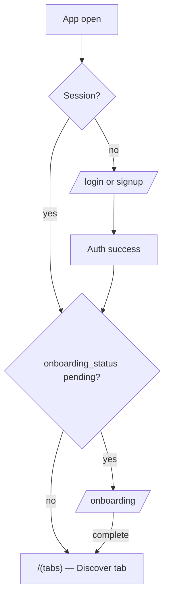
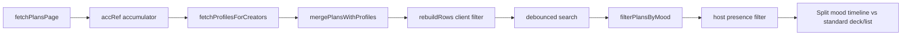
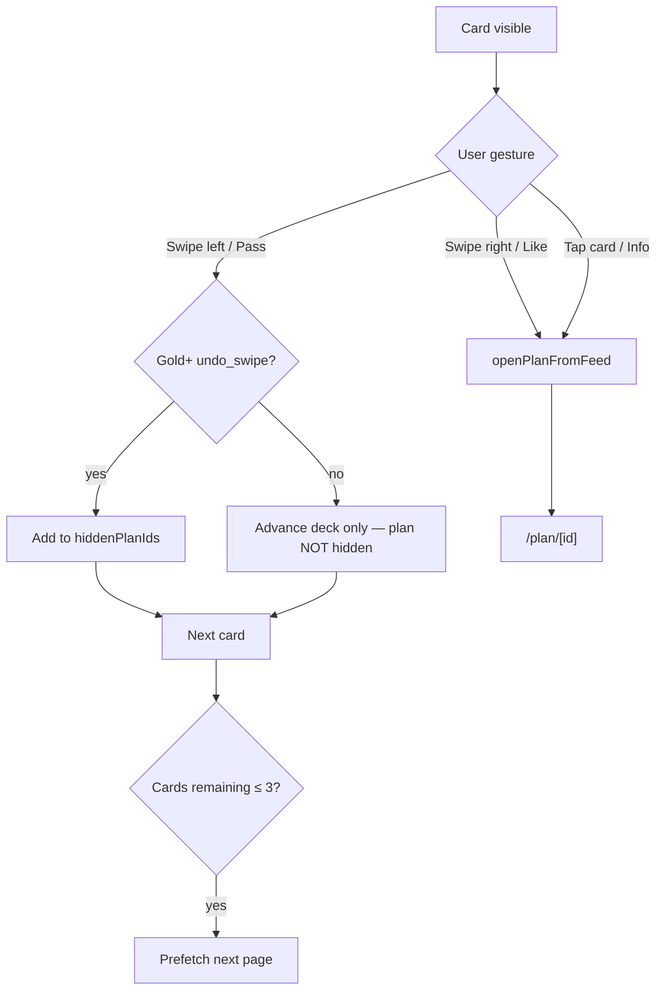
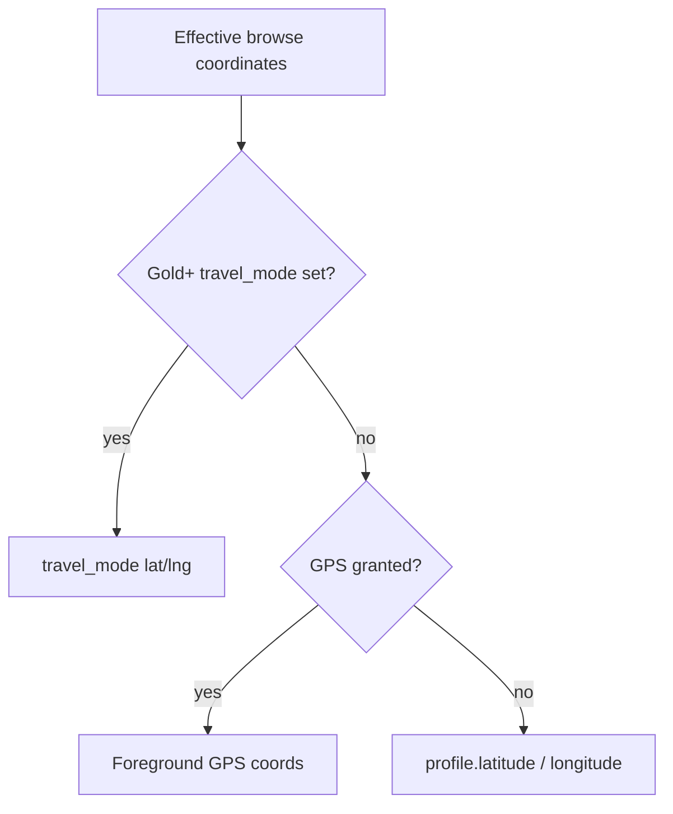
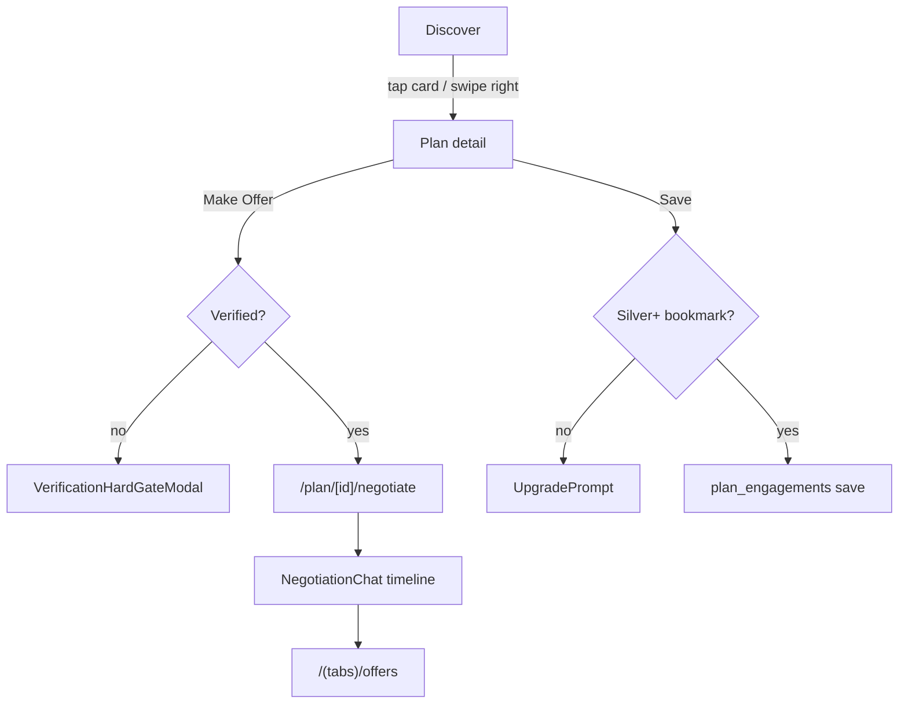

# LinkUp — Discovery & Browsing Userflow

This document is the **authoritative reference** for every user journey related to **discovering and browsing meetup plans** in LinkUp: the Discover tab, feed modes, filters, mood timeline, travel mode, swipe/list interactions, and all downstream routes opened from browsing.

**Related docs**

| Doc | Scope |
|-----|--------|
| [LINKUP-USERFLOW.md](./LINKUP-USERFLOW.md) | End-to-end app journeys (auth, chat, escrow, onboarding) |
| [PLAN-TYPES-USERFLOW.md](./PLAN-TYPES-USERFLOW.md) | Plan creation, meet types, mood overlay, discover surfacing rules (§8) |
| [LINKUP-USER-GUIDE.md](./LINKUP-USER-GUIDE.md) | User-facing product guide |

**Tip:** Mermaid diagrams paste into [Mermaid Live Editor](https://mermaid.live).

---

## How to read this document

| If you need… | Go to… |
|--------------|--------|
| Where browsing starts after login | **§1 Entry & routing** |
| Discover tab layout and controls | **§2 Discover hub** |
| How plans are fetched, filtered, sorted | **§3 Data pipeline** |
| Swipe vs list behavior | **§4 Feed modes** |
| Mood timeline + vibe chips | **§5 Mood discovery** |
| Filters, travel, location | **§6–§8** |
| Opening plan detail, profile, offers | **§9–§12** |
| Saved plans, offers tab, engagement strip | **§13 Re-entry tabs** |
| Boost, ranking, visibility | **§14 Ranking & visibility** |
| Subscription gates | **§15 Premium gates** |
| Empty / loading / error states | **§16 States** |
| All routes & file map | **§17 Screen inventory** |

---

## Table of contents

1. **§1** — Entry & routing to Discover  
2. **§2** — Discover hub (`/(tabs)/index`)  
3. **§3** — Data pipeline (fetch → merge → filter → sort)  
4. **§4** — Feed modes (swipe deck vs list)  
5. **§5** — Mood discovery (timeline, vibe filter, reach)  
6. **§6** — Filters sheet (`PlansFilterSheet`)  
7. **§7** — Travel mode browsing  
8. **§8** — Location, distance & presence  
9. **§9** — Plan detail from browse (`/plan/[id]`)  
10. **§10** — Public profile from browse (`/user/[id]`)  
11. **§11** — Offer & negotiation from browse  
12. **§12** — Host interest (views / saves)  
13. **§13** — Re-entry tabs (Saved, Offers, Messages strip)  
14. **§14** — Ranking, boost & plan visibility  
15. **§15** — Premium & verification gates  
16. **§16** — Loading, empty, error & realtime  
17. **§17** — Screen inventory & code map  
18. **§18** — Complete flow connection map  

---

## §1 Entry & routing

### §1.1 Post-auth landing



| Step | Route | File | Notes |
|------|-------|------|-------|
| Root redirect | `/` | `app/index.tsx` | Auth callback, session check |
| Onboarding gate | `/onboarding` | `app/onboarding/index.tsx` | On finish → `router.replace('/(tabs)')` |
| Default tab shell | `/(tabs)` | `app/(tabs)/_layout.tsx` | Requires session; blocks pending onboarding |
| **Discover (default tab)** | `/(tabs)/index` | `app/(tabs)/index.tsx` | Tab label **Discover**, heart icon |

Programmatic return to feed: `goToDiscoveryFeed()` in `lib/navigation/goToDiscoveryFeed.ts` → `router.dismissTo('/(tabs)')`. Used from plan agreement back navigation and plan stack header.

---

## §2 Discover hub

The Discover screen is the **single hub** for browsing other people’s meetup plans.

### §2.1 Screen anatomy (top → bottom)

| Region | Component | User action |
|--------|-----------|-------------|
| Header | `NearbyPlansHeader` | Location pill · Filter · Undo last hide (Gold+) |
| Banners | `TrialBanner`, `PlansKycBanner`, `PlansLocationPrompt` | Trial upsell · Verify CTA · Grant location |
| Mood timeline | `MoodTimelineCarousel` | Horizontal pills — tap opens plan |
| **Swipe mode** | `PlansSwipeDeck` + `SwipeActionButtons` | Pan / Pass / Like / Info |
| **List mode** | `PlansSearchBar` + `FlatList` of `PlanCard` | Search · scroll · pull refresh |
| FAB | `PlansFab` | Create plan (KYC-gated) |
| Sheets / modals | `PlansFilterSheet`, `UpgradePrompt`, `VerificationHardGateModal`, `PremiumFeaturePaywallModal`, `SilverTrialWelcomeModal` | Filters · paywalls · verification |

### §2.2 Header actions

| Control | Free | Gold+ | Destination / effect |
|---------|------|-------|----------------------|
| **Location pill** | Shows GPS city or “Near you” | Same + travel label `{city} · Travel` | Tap → `/settings/travel` or travel upgrade modal |
| **Filter** | Opens filter sheet | Same | `PlansFilterSheet` |
| **Undo last hide** | Hidden | Visible when a plan was passed/hidden | Restores last hidden plan ID from session state |

### §2.3 Persistent preferences

| Preference | Storage | Key / field |
|------------|---------|-------------|
| Feed layout (swipe / list) | AsyncStorage + filter Apply | `linkup_discovery_feed_mode` |
| Filter constraints | `profiles.preferences.feed_filters` | `maxDistanceKm`, price range, `verifiedHostsOnly`, `hostPresence`, `clientFiltersActive` |
| Hidden plans (pass) | In-memory session only | `hiddenPlanIds` — not persisted across app restarts |
| Blocked creators | Loaded from DB each session | `user_blocks` where `blocker_id = viewer` |

---

## §3 Data pipeline

Every plan shown in Discover passes through a **multi-stage pipeline**.



### §3.1 Server fetch (`fetchPlansPage`)

**File:** `lib/plans/planFeedMerge.ts`  
**Page size:** 12 (`PAGE_SIZE` in `app/(tabs)/index.tsx`)

**Included in query**

| Rule | Detail |
|------|--------|
| Status | `negotiating` or `active` |
| Suppression | `is_suppressed = false`, `archived_at IS NULL` |
| Mood TTL | Others’ expired mood plans hidden; viewer’s own mood plans always kept |
| Plan expiry | `is_expired = false` OR viewer is creator |
| Visibility | `public` or `radius` (or own plans regardless) |
| Order | `host_tier_rank DESC`, `boosted_until DESC`, `created_at DESC` |

**Pagination:** offset `pageRef * PAGE_SIZE`; dedupe by plan ID on merge; `hasMore` when last page length equals `PAGE_SIZE`.

### §3.2 Profile enrichment

`fetchProfilesForCreators` loads display name, avatar, verification badge, subscription badge, trust score, bio, preferences (for presence privacy), etc. Merged into `PlanFeedRow` via `mergePlansWithProfiles`.

### §3.3 Client filter (`rebuildRows`)

Applied to accumulated plans before mood/search/presence layers:

| Filter | When applied |
|--------|----------------|
| Mood window closed | `isPlanMoodWindowClosed` — drop expired mood rows |
| Suppressed / archived | Drop |
| Hidden (pass) | Drop if plan ID in `hiddenPlanIds` |
| Blocked creator | Drop if creator in `user_blocks` |
| Own plans | Always keep viewer’s own plans |
| Mood reach | `moodReachVisibleToViewer` — tier-based radius multiplier |
| **Active client filters** | Only when `feedFilter.clientFiltersActive === true` |

**Active client filters** (when enabled):

- Verified hosts only  
- Min / max price (`starting_price_cents`)  
- Max distance km from effective viewer coordinates  

**Default (filters not “active”):** distance is used for **sorting only**, not exclusion (except mood reach, blocks, hidden, suppression).

### §3.4 Client sort (`rebuildRows`)

| Priority | Rule |
|----------|------|
| 1 | Mood plans before standard plans |
| 2 | Among moods: soonest `mood_expires_at` first |
| 3 | Boosted plans (`boosted_until` in future) higher |
| 4 | If coords available: ascending distance km |
| 5 | Else: boosted then recency |

> **Note:** `lib/plans/feedRanking.ts` (`rankDiscoveryPlans`) exists but is **not** used by the live Discover screen — sorting is inline in `index.tsx`.

### §3.5 Downstream filters (after `rebuildRows`)

| Stage | Function | Scope |
|-------|----------|-------|
| Text search | Client filter on title / description / category | **List mode only** |
| Mood vibe | `filterPlansByMood` | Both modes |
| Host presence | `hostPresenceMatchesFilter` | Both modes |

### §3.6 Row split

| Bucket | Contents | UI surface |
|--------|----------|------------|
| `moodTimelineRows` | Live mood plans (`is_mood_plan`, window open) | `MoodTimelineCarousel` only |
| `standardDiscoverRows` | All non-mood plans | Swipe deck or list |

**Important:** Mood plans **never** appear in the swipe deck or list — only in the mood timeline carousel.

### §3.7 Ancillary data per visible rows

| Data | Fetch | Used for |
|------|-------|----------|
| Bidder offers | `fetchLatestBidderOffersByPlanIds` (debounced) | `PlanCard` offer CTA states |
| Creator presence | `fetchPresenceMap` | Online dot, host presence filter |

---

## §4 Feed modes

### §4.1 Mode selection

| Mode | UI | Persisted |
|------|-----|-----------|
| **Swipe** (default) | Full-screen card deck + action buttons | `linkup_discovery_feed_mode = swipe` |
| **List** | Scrollable `PlanCard` rows + search bar | `linkup_discovery_feed_mode = list` |

Changed in **Filters sheet → Display layout → Apply**. Switching to swipe clears active search query.

### §4.2 Swipe deck flow

**Components:** `PlansSwipeDeck`, `DiscoverySwipeCard`, `SwipeActionButtons`



| Action | Behavior |
|--------|----------|
| **Swipe right / Like** | Opens plan detail (`seedPlanDetailFromFeed` + navigate) |
| **Swipe left / Pass** | Gold+: hides plan for session; Free: advances deck without hiding |
| **Tap card** | Plan detail |
| **Info button** | Plan detail for current card |
| **Deck exhausted** | “You’re all caught up” empty state in deck |
| **Prefetch** | Next 3 plan details prefetched; pagination when ≤3 cards remain |

### §4.3 List mode flow

**Component:** `PlanCard` (`datingList` + `warmTone` styling)

| Action | Route / effect |
|--------|----------------|
| Tap card | `/plan/[id]` |
| Tap avatar | `/user/[creator_id]` |
| Tap offer CTA | KYC gate? → else same as card open (not direct negotiate) |
| Long-press dismiss | Hide from feed — **Gold+ only** (`onDismissFromFeed`) |
| Pull to refresh | Reset page 0, refetch |
| Scroll end | `onEndReached` pagination |

### §4.4 Offer CTA on list cards

Driven by `deriveOfferCta` in `PlanCard.tsx` from latest bidder offer:

| Offer state | Warm tone label (Discover list) |
|-------------|----------------------------------|
| No offer | “Say hello” |
| Pending / countered | Status-aware label |
| Accepted | “Keep chatting” |

Tapping offer CTA runs verification gate; on pass opens **plan detail** (not negotiate directly).

---

## §5 Mood discovery

Mood plans are **short-lived, urgency-forward** listings with a dedicated browse surface.

### §5.1 Mood timeline carousel

| Aspect | Detail |
|--------|--------|
| Component | `MoodTimelineCarousel` → `MoodPlanDiscoverPill` |
| Position | Always above swipe deck / list (in `feedBanner`) |
| Contents | `moodTimelineRows` only |
| Tap | `openPlanFromFeed` → `/plan/[id]` |
| Sort | Soonest `mood_expires_at` among mood rows |

### §5.2 Mood vibe filter (filter sheet)

**Component:** `DiscoverMoodStrip` inside `PlansFilterSheet`

| Chip | ID | Matching logic (`lib/discovery/moodFilter.ts`) |
|------|-----|------------------------------------------------|
| All | `all` | No mood filter |
| Chill | `chill` | Keyword heuristics + all mood plans |
| Active | `active` | Keyword heuristics + all mood plans |
| Social | `social` | Keyword heuristics + all mood plans |
| Premium | `premium` | Paid, boosted, or any mood plan |

Mood plans always pass Chill / Active / Social filters even when keywords don’t match.

### §5.3 Mood geographic reach

**File:** `lib/plans/moodReachFilter.ts`

Stamped on plan at publish: `mood_reach` ∈ `city` | `city_adjacent` | `city_widest` | `all_cities`

| Reach tier | Radius multiplier on viewer `radius_km` |
|------------|----------------------------------------|
| `city` | ×1 |
| `city_adjacent` | ×1.5 |
| `city_widest` | ×2.5 |
| `all_cities` | Global (no distance cap) |

Creator always sees own mood plans. Applied in `rebuildRows` before standard distance filter.

### §5.4 Mood-specific empty states

| Condition | Message |
|-----------|---------|
| Mood vibe filter active, no matches | “Nothing in this vibe yet” |
| Only mood timeline, no standard rows | “Mood moments in the timeline” |
| Swipe mode, mood rows only | Timeline guidance copy |

---

## §6 Filters sheet

**Component:** `components/plans/PlansFilterSheet.tsx`

### §6.1 Controls

| Control | Free | Silver+ (`discover.advanced_filters`) |
|---------|------|---------------------------------------|
| Display layout (swipe / list) | ✓ | ✓ |
| Mood vibe chips | ✓ | ✓ |
| Host presence (all / online / offline) | ✓ | ✓ |
| Max distance slider | ✓ | ✓ |
| Min / max price | Upsell row | ✓ |
| Verified hosts only | Upsell row | ✓ |

### §6.2 Apply behavior

1. Validates min price ≤ max price  
2. Forces `verifiedHostsOnly = false` if not Silver+  
3. Sets `clientFiltersActive` via `isDiscoverFilterConstraintActive` (any constraint differs from profile base radius)  
4. Persists to `profiles.preferences.feed_filters`  
5. Resets swipe index to 0  
6. Persists feed mode to AsyncStorage  

### §6.3 Host presence filter

Uses `resolveHostPresenceKind` + `hostPresenceMatchesFilter`. Respects:

- Viewer’s visibility preferences (fairness: hiding own activity affects what you see)  
- Creator’s `show_online_status` / `show_last_seen`  
- “Online” includes recently active hosts  

Viewer’s own plans always pass presence filter.

---

## §7 Travel mode browsing

**Screen:** `app/settings/travel.tsx`  
**Permission:** `discover.travel_mode` (Gold+)

### §7.1 Entry from Discover

| Viewer tier | Location pill tap |
|-------------|-------------------|
| Gold+ | Navigate to `/settings/travel` |
| Below Gold | `UpgradePrompt` for `discover.travel_mode` |

### §7.2 Travel mode screen

| State | UI |
|-------|-----|
| Not Gold+ | Paywall copy + “See Premium” → `/subscription` |
| Gold+ | `LocationSearchField`, city presets (Lagos, Abuja, Port Harcourt), active pin card, clear travel mode |

**Save:** `profiles.preferences.travel_mode = { label, latitude, longitude } | null`

### §7.3 Effect on Discover

| Aspect | With travel mode on |
|--------|-------------------|
| Effective coordinates | Travel pin replaces GPS / profile lat-lng |
| Header label | `{travel.label} · Travel` |
| Distance sort / filter | Computed from travel pin |
| Home profile location | Unchanged — turn off travel to restore |

---

## §8 Location, distance & presence

### §8.1 Location resolution order



### §8.2 Location prompt

**Component:** `PlansLocationPrompt`

Shown when foreground permission not granted and user hasn’t dismissed prompt.

| Action | Effect |
|--------|--------|
| Allow | `requestForegroundPermissionsAsync` → `syncLocation` |
| Not now | Dismiss prompt for session |

Without GPS: distance labels may be null; sort falls back to boost + recency.

### §8.3 Base discovery radius

From `profile.radius_km` (default **50 km**). Editable in profile settings (`/settings/edit-profile`). Used as:

- Default max distance in filter sheet  
- Mood reach multiplier base  
- Comparison for `clientFiltersActive`  

### §8.4 Presence on cards

`presenceForRow` → `derivePresenceUi` with viewer profile + creator preferences + `user_presence` row. Shown on `PlanCard` and `DiscoverySwipeCard` when privacy allows.

---

## §9 Plan detail from browse

**Route:** `/plan/[id]` — `app/plan/[id]/index.tsx`

### §9.1 Open from Discover

1. `seedPlanDetailFromFeed(row)` — instant paint from feed row  
2. `router.push('/plan/[id]')`  
3. Full load on focus (`load`)  
4. Non-creator: `recordPlanView` → `plan_engagements` kind `view`  

### §9.2 Viewer branches (not creator, not matched)

| Action | Gate | Route / effect |
|--------|------|----------------|
| View plan | — | Scroll detail, media, host info |
| **Save plan** | Silver+ `plans.bookmark` | `setPlanSaved` toggle |
| **Make offer** | Verification gate | `/plan/[id]/negotiate` |
| Planning together row | — | `/user/[host_id]` |
| Report plan | — | `ReportSheet` |
| Mood closed | — | `ExpiredPlanShelfBanner`; offer disabled |

### §9.3 Viewer (agreed / matched)

| Action | Route |
|--------|-------|
| View agreement | `/plan/[id]/agreement` |
| Open chat | `openDirectChat` → `/chat/[id]` |
| Add to calendar | Device calendar (when scheduled) |
| Confirm attendance | Completion ack (post-meet) |

### §9.4 Creator viewing own plan (in feed or management)

| Action | Gate | Effect |
|--------|------|--------|
| Boost plan | Silver 24h / Gold 72h | `PlanBoostControls` → `activatePlanBoost` |
| Who is interested? | Gold+ `plans.see_all_likes` | `/plan/[id]/interest` or upgrade |
| Interested strip avatars | Gold+ | `PlanInterestedStrip` previews |
| Extend mood | Gold+ `mood_plan.extend` | `extendMoodPlan` RPC |
| Edit plan | Creator tools | `PlanCreatorEditSheet` |

### §9.5 Navigation back to Discover

`PlanStackScreenHeader` back → `goToDiscoveryFeed()` when appropriate.

---

## §10 Public profile from browse

**Route:** `/user/[id]` — `app/user/[id].tsx`

### §10.1 Entry points from discovery path

| Source | Trigger |
|--------|---------|
| List mode `PlanCard` | Tap host avatar |
| Plan detail | “Planning together” / host row |
| Interest screen | Tap interested user row |
| `PlanInterestedStrip` | Tap avatar (host view) |

> Swipe deck opens **plan detail** on card tap; host profile is reached from plan detail (not direct avatar on deck).

### §10.2 Profile actions

| Action | Effect |
|--------|--------|
| View photos / video gallery | `HostMediaGallery` |
| Presence chip | `derivePresenceUi` |
| **Message** | `openDirectChat` → `/chat/[id]` |
| **Block** | `user_blocks` insert → `router.back()` — creator hidden from feed |
| Profile view recorded | `profile_views` insert (if public profile) |

### §10.3 Private / unavailable

Locked state when `is_profile_public === false` or profile not found.

---

## §11 Offer & negotiation from browse



| Step | Route | Notes |
|------|-------|-------|
| Browse interest | Open plan | `recordPlanView` automatic |
| Bookmark | Plan detail | `setPlanSaved` — Silver+ |
| Send offer | `/plan/[id]/negotiate` | Guest must be verified |
| Track sent/received | `/(tabs)/offers` | Links back to negotiate / plan |
| List offer CTA | Opens plan detail first | Does not skip to negotiate |

---

## §12 Host interest (views / saves)

**Route:** `/plan/[id]/interest` — `app/plan/[id]/interest.tsx`  
**Permission:** `plans.see_all_likes` (Gold+)

| Aspect | Detail |
|--------|--------|
| Who can open | Plan creator only |
| Data | `plan_engagements` kinds `view` and `save` |
| UI | Stats (view count, save count) + `PlanInterestEngagementCard` rows |
| Tap row | `/user/[user_id]` |
| Gate failure | Upgrade / paywall on plan detail strip |

**Preview on plan detail:** `PlanInterestedStrip` shows avatar stack before full interest screen.

---

## §13 Re-entry tabs

These tabs are not the Discover feed but are **primary re-entry paths** after browsing.

### §13.1 Saved plans

**Route:** `/(tabs)/saved` — `app/(tabs)/saved.tsx`

| Action | Effect |
|--------|--------|
| Tap saved card | `/plan/[id]` |
| Unsave | Confirm → `setPlanSaved(false)` |
| Empty state CTA | Navigate to Discover |
| Realtime | `plan_engagements` changes refresh list |

Requires Silver+ to save from plan detail; saved tab shows all prior saves.

### §13.2 Offers tab

**Route:** `/(tabs)/offers` — `app/(tabs)/offers.tsx`

| Action | Effect |
|--------|--------|
| Sent offer row | `/plan/[id]/negotiate` |
| Received offer row | `/plan/[id]/negotiate` or plan detail |

Bridges browse → negotiate → agreement.

### §13.3 Messages engagement strip

**Component:** `PlanEngagementStrip` on **Messages tab only** (`app/(tabs)/messages.tsx`)

| Action | Effect |
|--------|--------|
| Tap strip item | Open DM (`openDirectChat`) |
| Long press | Plan detail or agreement |

**Data:** `fetchFeedEngagementCarousel` — ongoing agreements, pending offers, active chats.

> `components/plans/EngagementCarousel.tsx` is a standalone variant **not mounted** in any route today.

---

## §14 Ranking, boost & plan visibility

### §14.1 Server ordering (initial fetch)

```
ORDER BY host_tier_rank DESC,
         boosted_until DESC,
         created_at DESC
```

`host_tier_rank` reflects host subscription tier signal in DB.

### §14.2 Client re-ranking

See §3.4 — mood priority, boost, distance, recency.

### §14.3 Creator boost (affects discover placement)

| Control | Location | Effect |
|---------|----------|--------|
| `PlanBoostControls` | Plan detail (creator) | Sets `boosted_until`, `spotlight_enabled` |
| Quotas | Permissions | `boost.24hr` Silver+, `boost.72hr` Gold+ |
| Publish spotlight | Plan create step 3 | Premium toggle sets boost at publish |

**UI signals:** Boost badge on `PlanCard`, `DiscoverySwipeCard`.

### §14.4 Plan visibility at creation

| Value | Discover query |
|-------|----------------|
| `public` | Included |
| `radius` | Included |
| `friends` | Excluded from public discover query today |

Set in plan create wizard (`VisibilityPickCard`). See [PLAN-TYPES-USERFLOW.md](./PLAN-TYPES-USERFLOW.md) §8.

---

## §15 Premium & verification gates

| Permission key | Min tier | Discover touchpoint |
|----------------|----------|---------------------|
| `discover.standard_filters` | FREE | Distance, mood vibe, host presence |
| `discover.advanced_filters` | SILVER | Price range, verified-only |
| `discover.travel_mode` | GOLD | Location pill, `/settings/travel` |
| `discover.undo_swipe` | GOLD | Pass/hide, list long-press dismiss, undo header |
| `plans.bookmark` | SILVER | Save on plan detail |
| `plans.see_all_likes` | GOLD | Interest screen, interested strip |
| `boost.24hr` | SILVER | Creator boost |
| `boost.72hr` | GOLD | Creator boost |
| `mood_plan.extend` | GOLD | Creator mood extension |
| `privacy.incognito_browse` | PLATINUM | Defined in permissions — **no Discover UI hook yet** |

**Verification (KYC):** `requiresVerificationGate` blocks:

- FAB create plan → `VerificationHardGateModal`  
- List offer CTA → gate then plan detail  
- Plan detail “Make offer” → gate then negotiate  

Checks: `usePermission` / `checkPermission` → `supabase/functions/permission-service` + `permissions.ts`.

---

## §16 Loading, empty, error & realtime

### §16.1 Loading states

| State | UI |
|-------|-----|
| Initial load | `PlansFeedSkeleton` |
| Load more | Footer `ActivityIndicator` |
| Pull refresh | `RefreshControl` on list mode |
| Offer map fetch | Debounced background (no blocking UI) |
| Presence fetch | Background per creator batch |

### §16.2 Empty states

| Condition | Component / copy |
|-----------|------------------|
| No plans at all | `PlansEmptyState` + create CTA |
| Search no results | “Nothing in that vibe yet” |
| Mood filter empty | “Nothing in this vibe yet” |
| Mood-only (no standard) | Timeline guidance |
| Swipe deck done | Deck “You’re all caught up” |
| Saved tab empty | Empty CTA → Discover |
| Supabase not configured | Error box |

### §16.3 Error handling

| Error | Recovery |
|-------|----------|
| `fetchPlansPage` failure | Red error box + “Tap to retry” (`retryLoad`) |
| Location failure | Fallback label “Near you”; non-fatal |

### §16.4 Realtime & refresh

| Mechanism | Behavior |
|-----------|----------|
| Tab refocus | `useFocusEffect` auto-refresh (skips first focus) |
| Pull-to-refresh | Reset pagination, reload page 0 |
| Plans UPDATE realtime | Debounced `rebuildRows` on suppress/archive |
| Swipe prefetch | When ≤3 cards remain → `onEndReached` |

---

## §17 Screen inventory & code map

### §17.1 Routes (discovery & browsing)

| Route | File | Role |
|-------|------|------|
| `/(tabs)/index` | `app/(tabs)/index.tsx` | **Discover hub** |
| `/plan/[id]` | `app/plan/[id]/index.tsx` | Plan detail from browse |
| `/plan/[id]/negotiate` | `app/plan/[id]/negotiate.tsx` | Offer composer |
| `/plan/[id]/interest` | `app/plan/[id]/interest.tsx` | Host views/saves (Gold+) |
| `/plan/[id]/agreement` | `app/plan/[id]/agreement.tsx` | Post-match agreement |
| `/user/[id]` | `app/user/[id].tsx` | Public profile |
| `/settings/travel` | `app/settings/travel.tsx` | Travel mode pin |
| `/settings/edit-profile` | `app/settings/edit-profile.tsx` | `radius_km`, home location |
| `/settings/privacy` | `app/settings/privacy.tsx` | Blocks (feed exclusion) |
| `/settings/notifications` | `app/settings/notifications.tsx` | Online / last-seen prefs |
| `/(tabs)/saved` | `app/(tabs)/saved.tsx` | Bookmarked plans |
| `/(tabs)/offers` | `app/(tabs)/offers.tsx` | Offer tracking |
| `/subscription` | Subscription upsell | Filter, travel, undo, save, interest gates |
| `/plan/create` | Plan creation | FAB / empty state |
| `/verification` | KYC | Create / offer gates |

### §17.2 Discover UI components

| Component | Path |
|-----------|------|
| `NearbyPlansHeader` | `components/plans/NearbyPlansHeader.tsx` |
| `PlansFilterSheet` | `components/plans/PlansFilterSheet.tsx` |
| `PlansSearchBar` | `components/plans/PlansSearchBar.tsx` |
| `PlanCard` | `components/plans/PlanCard.tsx` |
| `PlansSwipeDeck` | `components/discovery/PlansSwipeDeck.tsx` |
| `DiscoverySwipeCard` | `components/discovery/DiscoverySwipeCard.tsx` |
| `SwipeActionButtons` | `components/discovery/SwipeActionButtons.tsx` |
| `MoodTimelineCarousel` | `components/discovery/MoodTimelineCarousel.tsx` |
| `MoodPlanDiscoverPill` | `components/discovery/MoodPlanDiscoverPill.tsx` |
| `DiscoverMoodStrip` | `components/discovery/DiscoverMoodStrip.tsx` |
| `PlanEngagementStrip` | `components/discovery/PlanEngagementStrip.tsx` |
| `PlansEmptyState` | `components/plans/PlansEmptyState.tsx` |
| `PlansFeedSkeleton` | `components/plans/PlansFeedSkeleton.tsx` |
| `PlansLocationPrompt` | `components/plans/PlansLocationPrompt.tsx` |
| `PlansKycBanner` | `components/plans/PlansKycBanner.tsx` |
| `PlansFab` | `components/plans/PlansFab.tsx` |

### §17.3 Lib modules

| Module | Path | Purpose |
|--------|------|---------|
| Feed fetch & merge | `lib/plans/planFeedMerge.ts` | `fetchPlansPage`, profile merge |
| Plan detail seed | `lib/plans/planDetailSeed.ts` | Fast navigation paint |
| Engagement | `lib/plans/planEngagement.ts` | `recordPlanView`, `setPlanSaved` |
| Mood filter | `lib/discovery/moodFilter.ts` | Vibe chips |
| Mood reach | `lib/plans/moodReachFilter.ts` | Geo reach tiers |
| Feed filters parse | `lib/discovery/parseStoredFeedFilters.ts` | Hydrate saved filters |
| Price filter helpers | `lib/discovery/feedPriceFilter.ts` | Filter sheet formatting |
| Offer CTA data | `lib/plans/fetchLatestBidderOffersByPlans.ts` | List card states |
| Engagement carousel data | `lib/plans/fetchFeedEngagementCarousel.ts` | Messages strip |
| Presence | `lib/presence/derivePresenceUi.ts` | Online filter + card dots |
| Distance | `lib/location.ts` | `distanceKm` |
| Return to feed | `lib/navigation/goToDiscoveryFeed.ts` | `dismissTo('/(tabs)')` |
| Plan expiry | `lib/plans/planExpiry.ts` | Mood window, shelf copy |
| Boost | `lib/premium/boostPlan.ts` | `activatePlanBoost` |

---

## §18 Complete flow connection map

```
/(tabs)/index  DISCOVER HUB
│
├─ Header
│  ├─ Location pill ──► /settings/travel (Gold+) or upgrade modal
│  ├─ Filter ─────────► PlansFilterSheet ──► persist feed_filters
│  └─ Undo hide ───────► restore hiddenPlanIds (Gold+)
│
├─ Banners
│  ├─ TrialBanner ─────► /subscription
│  ├─ PlansKycBanner ──► /verification
│  └─ PlansLocationPrompt ──► OS location permission
│
├─ MoodTimelineCarousel (mood plans only)
│  └─ tap pill ────────► /plan/[id]
│
├─ SWIPE MODE
│  ├─ swipe right / like / tap ──► /plan/[id]
│  ├─ swipe left / pass ──► hide (Gold+) or advance only
│  ├─ deck empty ───────► "caught up"
│  └─ prefetch + paginate when ≤3 cards
│
├─ LIST MODE
│  ├─ PlansSearchBar (client text filter)
│  ├─ tap card ────────► /plan/[id]
│  ├─ tap avatar ──────► /user/[id]
│  ├─ offer CTA ───────► KYC? ──► /plan/[id]
│  ├─ long-press ──────► hide (Gold+)
│  └─ pull refresh / scroll paginate
│
└─ FAB ────────────────► KYC? ──► /plan/create

/plan/[id]  PLAN DETAIL
├─ recordPlanView (non-creator)
├─ Save ───────────────► Silver+ bookmark
├─ Make Offer ─────────► KYC? ──► /plan/[id]/negotiate
├─ Host interest ──────► Gold+ ──► /plan/[id]/interest
├─ Partner profile ────► /user/[id]
├─ Boost (creator) ──► activatePlanBoost
├─ Agreed ─────────────► /plan/[id]/agreement, chat
└─ Report ─────────────► ReportSheet

/user/[id]  PUBLIC PROFILE
├─ Message ────────────► /chat/[id]
└─ Block ──────────────► hidden from Discover feed

/(tabs)/saved ─────────► /plan/[id]
/(tabs)/offers ────────► /plan/[id]/negotiate
/(tabs)/messages ──────► PlanEngagementStrip ──► chat | plan | agreement

goToDiscoveryFeed() ◄── agreement back, plan stack back
```

---

## Appendix A — Implementation notes & gaps

| Topic | Status |
|-------|--------|
| `EngagementCarousel` component | Implemented; **not routed** — Messages uses `PlanEngagementStrip` |
| `rankDiscoveryPlans` in `feedRanking.ts` | **Unused** — live sort is inline in Discover screen |
| Hidden plans (`hiddenPlanIds`) | Session memory only — not synced to server |
| `friends` visibility | Not included in discover query until friends feature ships |
| `privacy.incognito_browse` (Platinum) | Permission exists; no Discover UI integration |
| Mood vibe strip | Only inside filter sheet — timeline is separate inline surface |
| Free-tier pass swipe | Advances deck but does **not** persist hide |

---

## Appendix B — Key constants

| Constant | Value | Location |
|----------|-------|----------|
| `PAGE_SIZE` | 12 | `app/(tabs)/index.tsx` |
| `FEED_MODE_STORAGE_KEY` | `linkup_discovery_feed_mode` | `app/(tabs)/index.tsx` |
| Default `radius_km` | 50 | Profile fallback in Discover |
| Swipe prefetch threshold | ≤3 cards remaining | `index.tsx` useEffect |
| Offer fetch debounce | 380 ms | `index.tsx` |
| Realtime rebuild debounce | 450 ms | Plans UPDATE channel |

---

*Last aligned with codebase: Discover tab `app/(tabs)/index.tsx`, plan feed merge, mood/travel/filter libs, and plan detail browse actions.*
