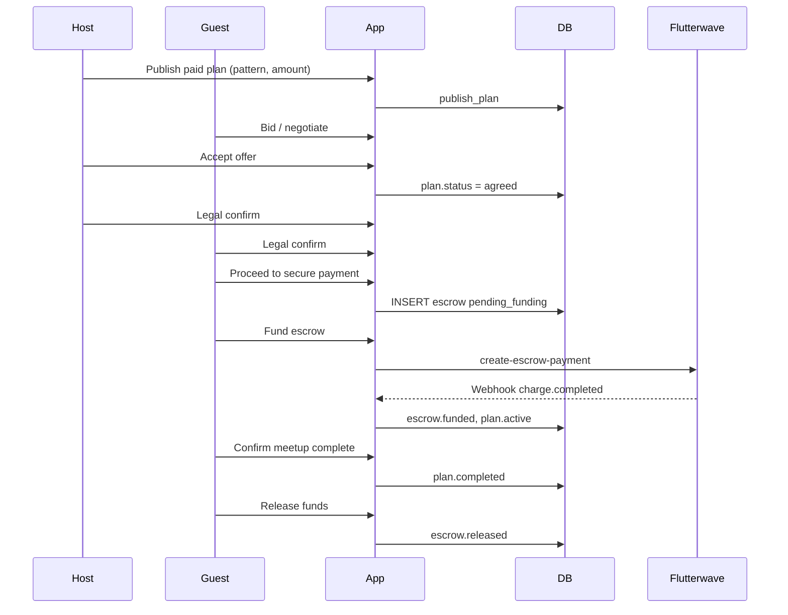
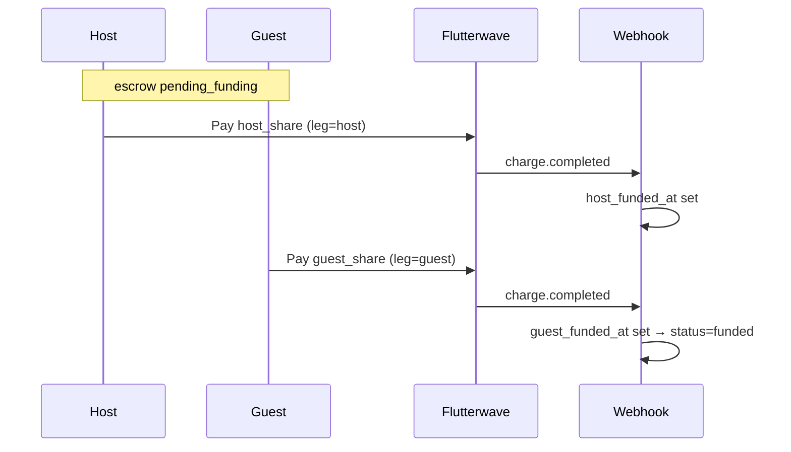

# LinkUp Escrow Logic — Application Reference

This document describes **all escrow-related behaviour implemented in the LinkUp codebase** as of the current repository state. It is intended for engineers, product, and support — not as legal copy for end users.

**Related docs:** `PLAN-TYPES-USERFLOW.md`, `PAYMENT_REMINDER_AUTOMATION.md`, `NOTIFICATIONS-AND-WEBHOOKS.md`

---

## Table of contents

1. [Conceptual overview](#1-conceptual-overview)
2. [Escrow patterns A, B, and C](#2-escrow-patterns-a-b-and-c)
3. [Financial rules](#3-financial-rules)
4. [Access gates (subscription, KYC, verification)](#4-access-gates-subscription-kyc-verification)
5. [Plan & escrow status machines](#5-plan--escrow-status-machines)
6. [End-to-end lifecycle](#6-end-to-end-lifecycle)
7. [Plan creation (wizard)](#7-plan-creation-wizard)
8. [Negotiation & offer acceptance](#8-negotiation--offer-acceptance)
9. [Agreement screen (PL6a)](#9-agreement-screen-pl6a)
10. [Escrow row creation](#10-escrow-row-creation)
11. [Funding checkout (Flutterwave)](#11-funding-checkout-flutterwave)
12. [Webhook fulfillment](#12-webhook-fulfillment)
13. [Post-funding: active plan](#13-post-funding-active-plan)
14. [Meetup completion](#14-meetup-completion)
15. [Fund release](#15-fund-release)
16. [Cancellation & refunds](#16-cancellation--refunds)
17. [Disputes](#17-disputes)
18. [Payment reminders](#18-payment-reminders)
19. [Group plans (partial)](#19-group-plans-partial)
20. [Database schema & policies](#20-database-schema--policies)
21. [Server functions (RPCs & edge)](#21-server-functions-rpcs--edge)
22. [Client modules, screens & components](#22-client-modules-screens--components)
23. [Flow diagrams](#23-flow-diagrams)
24. [Known gaps & inconsistencies](#24-known-gaps--inconsistencies)

---

## 1. Conceptual overview

LinkUp escrow secures **paid meetup commitments** between a **host** (plan creator) and a **guest** (accepted bidder). Money is collected via **Flutterwave**, held in an `escrow_transactions` row, and released or refunded according to plan outcome, cancellation policy, or dispute.

**Core principles in code:**

| Principle | Implementation |
|-----------|----------------|
| One escrow row per plan | `escrow_transactions.plan_id` is **UNIQUE** |
| Escrow is not created at offer accept | Created on “Proceed to secure payment” after legal confirmations |
| Payment provider | Flutterwave (`create-escrow-payment` + `flutterwave-webhook`) |
| Legacy naming | Column `paystack_reference` and table `paystack_charge_processed` still used for idempotency |
| Currency | NGN; amounts stored in **kobo** (`amount_cents`) |
| Free plans | Skip escrow entirely; `confirmFreePlan` sets plan `active` |

**Canonical party resolution:** `lib/plans/escrowParties.ts` → `resolveEscrowParties()`

---

## 2. Escrow patterns A, B, and C

Patterns define **who funds** the commitment and how amounts split. They are stored on `plans.escrow_pattern` at publish and copied to `escrow_transactions.escrow_pattern` at escrow creation.

| Pattern | UI label | Who pays (funding) | `payer_id` | `payee_id` | Host share | Guest share | Subscription gate |
|---------|----------|-------------------|------------|------------|------------|-------------|-------------------|
| **A** | Host funds | Host only | Host (`creator_id`) | Guest (bidder) | 100% | 0% | FREE+ (`escrow.pattern_a`) |
| **B** | Split | Host + guest (separate legs) | Host* | Guest* | `floor(total × bps / 10000)` | remainder | SILVER+ (`escrow.pattern_b`) |
| **C** | Guest funds | Guest only | Guest | Host | 0% | 100% | GOLD+ (`escrow.pattern_c`) |

\*For Pattern B, `payer_id` / `payee_id` on the escrow row are still host / guest respectively; each party pays their **share** via separate checkout legs (`escrow_leg: 'host' | 'guest'`).

### Pattern B split slider

- Draft field: `hostContributionBps` (default **5000** = 50%)
- UI slider range: **1000–9000** (10%–90% host share)
- Files: `components/plans/create/CommitmentEscrowForm.tsx`, `PlanCreatorEditSheet.tsx`

### Meet-type allowed patterns

Seeded in `supabase/migrations/20260215100000_meet_types_plans_escrow_v2.sql`:

| Meet type | Allowed | Default |
|-----------|---------|---------|
| Dinner, Casual, Hangout | A, B | A |
| Gym | A, B | B |
| Mood | A, C | A |
| Group (later migration) | A, B, C | — |
| User-created meet types | A, B, C | — |

DB trigger `trg_plans_financial_guard` rejects a paid plan whose `escrow_pattern` is not in `meet_types.allowed_patterns`.

### Pattern semantics note (`payee_id`)

`resolveEscrowParties` sets `payee_id` to the **guest** for Patterns A and B, and to the **host** for Pattern C. Several UI strings say funds are **“released to the host”** (`buildEscrowTimeline.ts`, `app/escrow/[id].tsx`). The **stored payee** and **release copy** may not align — see [§24](#24-known-gaps--inconsistencies).

---

## 3. Financial rules

**Source:** `lib/plans/planFinancialConfig.ts`

| Rule | Value |
|------|-------|
| Minimum escrow | ₦7,000 (`MIN_ESCROW_CENTS` = 700_000 kobo) |
| Tier-1 maximum | ₦5,000,000 (`MAX_ESCROW_TIER1_CENTS`) |
| Above Tier-1 | Client blocks in `proceedToSecurePayment` with “Tier 2 (BVN) required (coming soon)” |

### Platform fee (at release)

Computed in `platformFeeCentsForAmount()` when `releaseEscrowFunds` runs:

| Agreed amount (NGN) | Fee (bps) |
|---------------------|-----------|
| &lt; ₦50,000 | 700 (7%) |
| ₦50,000 – ₦499,999 | 600 (6%) |
| ≥ ₦500,000 | 500 (5%) |

Fee is written to `escrow_transactions.platform_fee_cents` on release. **No wallet payout is triggered** on release in current client code (see [§15](#15-fund-release)).

---

## 4. Access gates (subscription, KYC, verification)

### Subscription tier gates (client-only for pattern pick)

**Matrix:** `supabase/functions/_shared/permissions.ts`

| Feature | Minimum tier |
|---------|--------------|
| `escrow.pattern_a` | FREE |
| `escrow.pattern_b` | SILVER |
| `escrow.pattern_c` | GOLD |
| `escrow.high_value` | PLATINUM (defined but **not enforced** on amounts) |

**Enforced in UI:** `components/plans/create/CommitmentEscrowForm.tsx` via `checkPermission()` → `permission-service` edge function. On deny: `UpgradePrompt` and pattern reverts to **A**.

**Not enforced server-side** in `publish_plan` or `trg_plans_financial_guard` — API could publish Pattern B/C without tier if meet type allows.

### Identity verification (`verification_status`)

Required for:

- RLS: `escrow_insert`, offers, plans (verified users only) — `20240410000000_kyc_verification_rls.sql`
- Client hard gate: `lib/verification/access.ts` → `requiresVerificationGate()` on agreement confirm, escrow fund, etc.

### KYC tier (`users.kyc_tier`)

| Check | Where | Requirement |
|-------|-------|-------------|
| Pattern C at publish | `app/plan/create/details.tsx` | Host `kyc_tier >= 2` |
| Pattern C at create | `CommitmentEscrowForm.tsx` | Host `kyc_tier >= 2` or revert to A |
| Pattern C at escrow create | `proceedToSecurePayment` | **Both** host and guest `kyc_tier >= 2` |
| Tier 1 amount cap | `proceedToSecurePayment` | Block if amount &gt; ₦5M |

Tier 2/3 product (BVN) may be incomplete; checks exist in code ahead of full product.

---

## 5. Plan & escrow status machines

### Plan statuses (escrow-relevant)

```
negotiating → agreed → awaiting_payment → active → completed
                    ↘ cancelled
```

| Status | Meaning for escrow |
|--------|-------------------|
| `agreed` | Offer accepted; legal confirmations may be pending |
| `awaiting_payment` | Escrow row exists; funding pending |
| `active` | Escrow funded (or free plan confirmed) |
| `completed` | Meetup marked complete; release eligible |
| `cancelled` | Cancellation RPC or host decline |

### Escrow statuses

**Type:** `types/database.ts` → `EscrowStatus`

| Status | Meaning |
|--------|---------|
| `pending_funding` | Awaiting Flutterwave payment(s) |
| `funded` | Full amount (or both B legs) received |
| `active` | Enum exists; webhook primarily sets `funded` then plan `active` |
| `released` | Payee-side release completed in app |
| `disputed` | Open escrow dispute |
| `refunded` | Cancellation RPC credited wallets |
| `cancelled` | Terminal (less common in client paths) |

---

## 6. End-to-end lifecycle

```
┌─────────────────────────────────────────────────────────────────────────────┐
│ CREATE PLAN (paid, pattern, amount) → publish_plan RPC                        │
└─────────────────────────────────────────────────────────────────────────────┘
                                      │
                                      ▼
┌─────────────────────────────────────────────────────────────────────────────┐
│ NEGOTIATE → Host accepts offer → plan.status = agreed                       │
│ (NO escrow row yet)                                                         │
└─────────────────────────────────────────────────────────────────────────────┘
                                      │
                                      ▼
┌─────────────────────────────────────────────────────────────────────────────┐
│ AGREEMENT PL6a: both parties record_agreement_confirmation (×2)             │
└─────────────────────────────────────────────────────────────────────────────┘
                                      │
                    ┌─────────────────┴─────────────────┐
                    ▼                                   ▼
            [Free plan]                           [Paid plan]
     confirmFreePlan → active              Guest: proceedToSecurePayment
                                                    → escrow INSERT
                                                    → awaiting_payment
                                      │
                                      ▼
┌─────────────────────────────────────────────────────────────────────────────┐
│ ESCROW SCREEN: Flutterwave checkout (create-escrow-payment)                 │
│ Webhook: processEscrowCharge → funded, plan.active                          │
└─────────────────────────────────────────────────────────────────────────────┘
                                      │
                                      ▼
┌─────────────────────────────────────────────────────────────────────────────┐
│ MEETUP: confirmMeetupComplete → plan.completed                              │
└─────────────────────────────────────────────────────────────────────────────┘
                                      │
                                      ▼
┌─────────────────────────────────────────────────────────────────────────────┐
│ RELEASE: releaseEscrowFunds → escrow.released (+ platform_fee_cents)        │
│ (wallet credit to payee NOT implemented in client)                          │
└─────────────────────────────────────────────────────────────────────────────┘

Branches:
  • Cancellation → submit_plan_cancellation → escrow.refunded + wallet credits
  • Dispute → openEscrowDisputeWithTicket → escrow.disputed + support ticket
```

---

## 7. Plan creation (wizard)

### Draft fields

**Types:** `types/planDraft.ts`, **defaults:** `contexts/PlanDraftContext.tsx`, **persistence:** `lib/plans/planDraftStorage.ts` (key `linkup_plan_draft_v3`)

| Field | Escrow relevance |
|-------|------------------|
| `isPaid` | If false, pattern/amount cleared |
| `escrowPattern` | `'A' \| 'B' \| 'C' \| null` |
| `hostContributionBps` | Pattern B only (default 5000) |
| `startingPrice` | Commitment amount string (NGN) |
| `budgetTier` | Derived from amount when paid |

### Wizard routes

| Step | Route | Component |
|------|-------|-----------|
| 1 | `/plan/create` | Meet type, schedule, mood |
| 2 | `/plan/create/commitment` | `CommitmentEscrowForm.tsx` |
| 3 | `/plan/create/details` | Publish via `publish_plan` RPC |

### Validation

| Step | Checks |
|------|--------|
| Commitment (`commitment.tsx`) | If paid: pattern required, amount ≥ MIN_ESCROW_CENTS |
| Details (`details.tsx`) | Re-validates amount/pattern; Pattern C host `kyc_tier`; calls `publish_plan` with `escrow_pattern`, `host_contribution_bps`, `is_paid`, `starting_price_cents` |

### UI: funding pattern picker

`FundingPatternCard.tsx` — stacked selectable cards (Host funds / Split / Guest funds) with tier badges.

---

## 8. Negotiation & offer acceptance

**File:** `lib/plans/acceptPlanOffer.ts`

When the host accepts an offer:

1. Offer → `accepted`; other offers → `superseded`
2. Plan → `agreed` with `agreed_price_cents`, schedule, location, notes
3. **Escrow is NOT created** (comment in code: created on PL6a payment step)

---

## 9. Agreement screen (PL6a)

**Screen:** `app/plan/[id]/agreement.tsx`

### Legal confirmation gate

1. User taps primary CTA → `PreAgreementFullscreenModal` / legal gate
2. `record_agreement_confirmation(plan_id)` RPC (per user)
3. Trigger `tr_plans_agreement_confirm` requires **≥2 distinct confirmations** before plan can move to `awaiting_payment` / `active`

### Primary actions by role & state

| Plan status | Role | Action |
|-------------|------|--------|
| `agreed` | Either | Review & confirm terms (legal gate) |
| `agreed` (both confirmed, free) | Either | `confirmFreePlan` → `active` |
| `agreed` (both confirmed, paid) | **Guest (bidder)** | `proceedToSecurePayment` → navigate `/escrow/[id]` |
| `agreed` (both confirmed, paid) | Host | “Waiting for guest payment” |
| `awaiting_payment` | Guest | Continue to secure payment |
| `awaiting_payment` | Host | Waiting |

### Payment preview

`getAgreementPaymentPreview()` in `lib/escrow/escrowPaymentPreview.ts` — shows what **current user** vs counterparty pays per pattern.

### Cancellation from agreement

`submit_plan_cancellation` RPC — see [§16](#16-cancellation--refunds).

---

## 10. Escrow row creation

**File:** `lib/plans/planAgreementActions.ts` → `proceedToSecurePayment()`

### Preconditions

- Plan is paid
- `agreed_price_cents` / offer amount &gt; 0 and ≥ `MIN_ESCROW_CENTS`
- Amount ≤ `MAX_ESCROW_TIER1_CENTS` (else Tier 2 error)
- `escrow_pattern` set on plan
- Pattern C: host **and** guest `kyc_tier >= 2`

### Insert payload

```typescript
{
  plan_id, payer_id, payee_id, host_id, guest_id,
  escrow_pattern, amount_cents,
  host_share_cents, guest_share_cents,
  funding_deadline, currency,
  status: 'pending_funding',
  metadata: pattern === 'B' ? { legs: 'split', phase: 'awaiting_host' } : {}
}
```

### Funding deadline

| Plan type | Deadline |
|-----------|----------|
| Mood (`is_mood_plan`) | **1 hour** from creation |
| Standard | **24 hours** from creation |

### Idempotency

If escrow already exists for `plan_id`: reuse row, set plan `awaiting_payment`, return existing `escrowId`.

### RLS (`escrow_insert`)

- Caller is `payer_id` or `payee_id`
- User `verification_status = 'verified'`
- **≥2** `agreement_confirmations` for plan

---

## 11. Funding checkout (Flutterwave)

### Client path

| Step | File |
|------|------|
| Open checkout | `lib/escrow/openEscrowCheckout.ts` |
| Invoke edge function | `supabase.functions.invoke('create-escrow-payment')` |
| Browser | `lib/flutterwave/openFlutterwaveBrowser.ts` |
| Deep link return | `linkup://escrow/{escrowId}` — `lib/flutterwave/callbackUrl.ts` |
| Stamp init metadata | `recordEscrowPaymentInitiated()` — `lib/escrow/escrowActions.ts` |

### Escrow screen funding UX

**Screen:** `app/escrow/[id].tsx`

| Pattern | Who sees “Fund” CTA |
|---------|---------------------|
| A | `payer_id` (host) |
| C | `payer_id` (guest) |
| B | Host if `!host_funded_at`; guest if `!guest_funded_at` |

Pattern B also shows `EscrowSplitFundingCard` and “waiting for other person” after one leg pays.

### Server: `create-escrow-payment`

**File:** `supabase/functions/create-escrow-payment/index.ts`

| Check | Rule |
|-------|------|
| Auth | JWT required |
| Escrow status | Must be `pending_funding` |
| Pattern B | `escrow_leg` required; amount = host or guest share; role must match |
| Pattern A/C | Caller must be `payer_id`; full `amount_cents` |
| Flutterwave meta | `{ linkup: 'escrow', escrow_id, plan_id, escrow_leg? }` |

### Dev bypass

`__DEV__` only: “Demo: mark funded” calls `markEscrowFunded()` without Flutterwave.

---

## 12. Webhook fulfillment

**Entry:** `supabase/functions/flutterwave-webhook/index.ts`  
**Processor:** `supabase/functions/_shared/flutterwaveEscrow.ts` → `processEscrowCharge()`

### Steps

1. Verify webhook hash + Flutterwave transaction verify API
2. Idempotency: `paystack_charge_processed` by `reference`
3. Validate amount vs expected kobo (full or leg share)
4. **Pattern B:** set `host_funded_at` or `guest_funded_at`; when **both** set → `status = funded`, plan → `active`
5. **Pattern A/C:** single charge → `status = funded`, plan → `active`
6. Notify host & guest (`escrow_funded` notification)
7. Record idempotency row

### Plan status after funding

Plan updated to `active` from `awaiting_payment` or `agreed`.

---

## 13. Post-funding: active plan

- Escrow `status` is typically `funded`
- Plan `status` is `active`
- Escrow screen shows “Waiting for plan completion” with **Confirm meetup complete**
- Either party may open dispute (`openEscrowDisputeWithTicket`)
- RLS `escrow_update`: payer or payee may update unless `plan_escrow_frozen(plan_id)`

---

## 14. Meetup completion

**File:** `lib/escrow/escrowActions.ts` → `confirmMeetupComplete()`

- Sets plan `status` from `active` → `completed`
- Optional: `insertPlanCompletionAck` for the confirming user
- **Either host or guest** can confirm (no role check in function)
- Enables release UI block on escrow screen

---

## 15. Fund release

**File:** `lib/escrow/escrowActions.ts` → `releaseEscrowFunds()`

### Preconditions

- Plan `status === 'completed'`
- Escrow `status === 'funded'`

### Effects

- Escrow → `released`
- Sets `released_at`, `platform_fee_cents` (from `platformFeeCentsForAmount`)

### UI

- `app/escrow/[id].tsx`: “Release funds” CTA when `funded` + plan `completed`
- Copy: “pays out to the host” (see payee semantics note)

### Gap

**No `_wallet_credit_internal` or payout API** is called on release. `tr_financial_log_escrow` may log `escrow_released` to `financial_events`, but **payee wallet is not credited** in the current client release path. Refunds via cancellation **do** credit wallets.

---

## 16. Cancellation & refunds

### Client entry points

- Agreement screen: `submit_plan_cancellation` RPC
- Edge wrapper: `supabase/functions/plan-cancel/index.ts`

### Server: `submit_plan_cancellation` (v2)

**Migration:** `supabase/migrations/20260529120000_cancellation_refund_policy_v2.sql`  
**Policy copy / preview:** `lib/plans/cancellationPolicy.ts`

Cancellable plan statuses: `agreed`, `awaiting_payment`, `active`

### Funded escrow refund logic (summary)

| Actor | Scenario | Guest wallet | Host wallet |
|-------|----------|--------------|-------------|
| Guest | Cancel anytime | 0 | 100% of funded legs |
| Guest | Host no-show | 100% | 0 (+ host strikes) |
| Host | Cancel 72h+ before meetup | 0% of host-funded pool | 100% |
| Host | Cancel 48–72h | 30% of applicable pool | 70% |
| Host | Cancel 24–48h | 50% | 50% |
| Host | Cancel &lt;24h | 70% | 30% |

**Pattern B:** matrix applies to **host-paid portion**; guest’s already-paid share returns to guest on host cancel.

### Goodwill credits

Auto goodwill to guest when host cancels within 48h or guest reports host no-show (not cash — `goodwill_credits` table).

### Effects on escrow

- Escrow → `refunded`
- `_wallet_credit_internal` for guest and/or host per computed split
- Plan → `cancelled`; offer → `declined`

### Mutual cancel

`vote_mutual_plan_cancel` — refunds full amount to `payer_id` only (**may be wrong for Pattern B/C** where both funded).

### Pre-funding cancel

`cancelAgreedPlan()` in `planAgreementActions.ts` — declines offer, plan `cancelled` (no escrow row or unfunded escrow).

---

## 17. Disputes

### A. Escrow dispute (payment hold)

**Files:** `lib/escrow/escrowActions.ts`, `components/escrow/OpenDisputeModal.tsx`, `lib/escrow/disputeReasons.ts`

Flow:

1. User submits reason + detail on escrow screen
2. Creates `support_tickets` row (high priority)
3. Inserts `escrow_disputes` linked to ticket
4. Escrow → `disputed` (from `pending_funding` or `funded`)
5. Routes user to `/support`

**No automated resolution** — admin must resolve manually; no edge function for resolve → refund/release.

### B. Plan dispute (trust / video evidence)

**Separate system:** `app/dispute/[planId].tsx`, `lib/trust/submitPlanDispute.ts`  
Tables: `disputes`, `dispute_evidence` — **not** the same as `escrow_disputes`.

---

## 18. Payment reminders

**Doc:** `docs/PAYMENT_REMINDER_AUTOMATION.md`  
**Migration:** `supabase/migrations/20260528120000_payment_reminder_automation.sql`

| Trigger | When |
|---------|------|
| Escrow INSERT `pending_funding` | Immediate payer/payee notifications |
| Pattern B leg funded | Notify other party to fund their share |
| Cron `sweep_awaiting_payment_reminders()` | 30m nudge, 12h/2h deadline, 48h/24h meetup warnings |

Edge: `payment-reminder-sweep` (scheduled every 15 min recommended).

---

## 19. Group plans (partial)

- `GroupEscrowStatusCard.tsx` lists accepted bidders and matches escrows by `payer_id === bidder`
- Schema: **one escrow per plan** (`plan_id` UNIQUE) — **cannot** support per-guest escrows without schema change
- `proceedToSecurePayment` creates **single** escrow for one accepted offer (1:1 flow)
- Group multi-guest escrow is **not fully implemented**

---

## 20. Database schema & policies

### Primary tables

| Table | Purpose |
|-------|---------|
| `escrow_transactions` | Hold per-plan escrow state |
| `escrow_disputes` | Escrow-linked disputes |
| `agreement_confirmations` | Legal confirm per user per plan |
| `wallet_ledger` | Wallet balances (refunds) |
| `goodwill_credits` | Non-cash goodwill |
| `financial_events` | Audit log |
| `cancellations` | Cancellation records |
| `paystack_charge_processed` | Payment idempotency |

### Key `escrow_transactions` columns

`plan_id`, `payer_id`, `payee_id`, `host_id`, `guest_id`, `escrow_pattern`, `amount_cents`, `host_share_cents`, `guest_share_cents`, `host_funded_at`, `guest_funded_at`, `funding_deadline`, `platform_fee_cents`, `paystack_reference`, `status`, `metadata`, `released_at`

### Triggers (selected)

| Trigger | Role |
|---------|------|
| `trg_plans_financial_guard` | Validates paid plan pattern vs meet type |
| `tr_plans_agreement_confirm` | Blocks status advance without 2 confirmations |
| `tr_escrow_financial` | Logs financial events on escrow status change |
| `escrow_notify_*` | Payment reminder notifications |

### RLS highlights

- **Insert escrow:** payer/payee, verified, ≥2 agreement confirmations
- **Update escrow:** payer/payee (or admin), not frozen plan

---

## 21. Server functions (RPCs & edge)

### Postgres RPCs

| RPC | Purpose |
|-----|---------|
| `publish_plan(jsonb)` | Create plan with escrow fields |
| `record_agreement_confirmation(uuid)` | Legal confirmation per user |
| `submit_plan_cancellation(uuid, boolean)` | Cancel + pattern-aware refunds |
| `vote_mutual_plan_cancel(uuid)` | Mutual cancel → refund payer |
| `sweep_awaiting_payment_reminders()` | Payment nudge cron |
| `sweep_expired_mood_plans()` | Mood plan expiry |

### Edge functions

| Function | Purpose |
|----------|---------|
| `create-escrow-payment` | Flutterwave payment init |
| `flutterwave-webhook` | Charge completion (escrow + subscription) |
| `permission-service` | Tier feature gates |
| `plan-cancel` | Wrapper for cancellation RPC |
| `payment-reminder-sweep` | Cron for reminders |
| `paystack-webhook-escrow` | **Legacy** — superseded by Flutterwave path |

---

## 22. Client modules, screens & components

### Screens (`app/`)

| Path | Role |
|------|------|
| `/plan/create/commitment` | Paid/free, pattern, amount |
| `/plan/create/details` | Publish |
| `/plan/[id]/agreement` | PL6a confirmations & cancel |
| `/escrow/[id]` | Fund, complete, release, dispute |
| `/(tabs)/wallet` | Wallet ledger view |
| `/dispute/[planId]` | Video/plan dispute (separate) |
| `/disputes`, `/support` | Dispute/ticket lists |
| `/subscription` | Tier upgrade for patterns B/C |

### Lib (`lib/`)

| Module | Role |
|--------|------|
| `lib/plans/escrowParties.ts` | Payer/payee/split resolution |
| `lib/plans/planAgreementActions.ts` | Escrow create, free confirm, cancel agreed |
| `lib/plans/acceptPlanOffer.ts` | Offer accept (no escrow) |
| `lib/plans/planFinancialConfig.ts` | Min/max/fee rules |
| `lib/plans/cancellationPolicy.ts` | Refund preview & policy tables |
| `lib/escrow/escrowActions.ts` | Fund, release, dispute, demo fund |
| `lib/escrow/openEscrowCheckout.ts` | Flutterwave checkout |
| `lib/escrow/escrowPaymentPreview.ts` | Agreement payment preview |
| `lib/escrow/buildEscrowTimeline.ts` | Timeline steps |
| `lib/escrow/disputeReasons.ts` | Dispute reason list |
| `lib/subscription/checkPermission.ts` | Tier gates |

### Components (`components/escrow/`, `components/plans/`)

`EscrowFundCTA`, `EscrowSplitFundingCard`, `EscrowTimeline`, `EscrowStatusBadge`, `EscrowStepIndicator`, `EscrowSummaryCard`, `FundingDeadlineUrgencyBanner`, `OpenDisputeModal`, `FundingPatternCard`, `CommitmentEscrowForm`, `AgreementPaymentPreviewCard`, `GroupEscrowStatusCard`, `EscrowTrustExplainerCard`

---

## 23. Flow diagrams

### Paid plan — happy path



### Pattern B — split funding



---

## 24. Known gaps & inconsistencies

| # | Issue | Detail |
|---|-------|--------|
| 1 | **No wallet payout on release** | `releaseEscrowFunds` only updates escrow row |
| 2 | **payee_id vs UI copy** | Patterns A/B set `payee_id=guest`; UI says “released to host” |
| 3 | **Server tier gates missing** | Pattern B/C only gated in create UI |
| 4 | **`escrow.high_value` unused** | PLATINUM permission not tied to amount checks |
| 5 | **Group escrow incomplete** | One escrow per plan; UI assumes multiple possible |
| 6 | **Mutual cancel refund** | Credits `payer_id` only — wrong for split/guest-funded |
| 7 | **Pattern B metadata `awaiting_host`** | API allows either leg first |
| 8 | **Paystack legacy naming** | Columns/tables/functions retain Paystack names |
| 9 | **Demo fund in dev** | `markEscrowFunded` on escrow screen |
| 10 | **No auto-release cron** | 24h auto-release not implemented |
| 11 | **Tier 2 above ₦5M** | Client block only; no full BVN path |
| 12 | **Dispute resolution** | Manual support only |
| 13 | **Realtime escrow** | Commented out in migrations |
| 14 | **PRD-VS-CODEBASE.md stale** | May contradict current pattern implementation |

---

## File index (quick reference)

```
lib/plans/escrowParties.ts
lib/plans/planAgreementActions.ts
lib/plans/acceptPlanOffer.ts
lib/plans/planFinancialConfig.ts
lib/plans/cancellationPolicy.ts
lib/escrow/escrowActions.ts
lib/escrow/openEscrowCheckout.ts
lib/escrow/escrowPaymentPreview.ts
lib/escrow/buildEscrowTimeline.ts
app/plan/create/commitment.tsx
app/plan/create/details.tsx
app/plan/[id]/agreement.tsx
app/escrow/[id].tsx
components/plans/create/CommitmentEscrowForm.tsx
components/plans/create/FundingPatternCard.tsx
supabase/functions/create-escrow-payment/index.ts
supabase/functions/flutterwave-webhook/index.ts
supabase/functions/_shared/flutterwaveEscrow.ts
supabase/migrations/20260215100000_meet_types_plans_escrow_v2.sql
supabase/migrations/20260221120000_wallet_cancellations_compliance.sql
supabase/migrations/20260529120000_cancellation_refund_policy_v2.sql
supabase/migrations/20260528120000_payment_reminder_automation.sql
```

---

*Generated from repository analysis. Update this doc when escrow schema, payment provider, or release/payout behaviour changes.*
