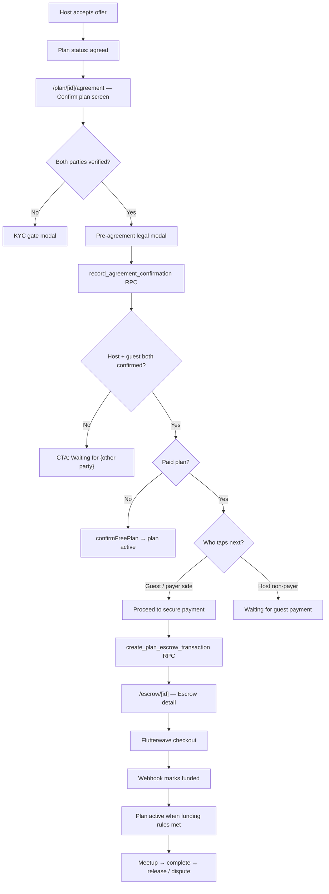
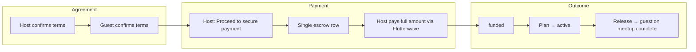
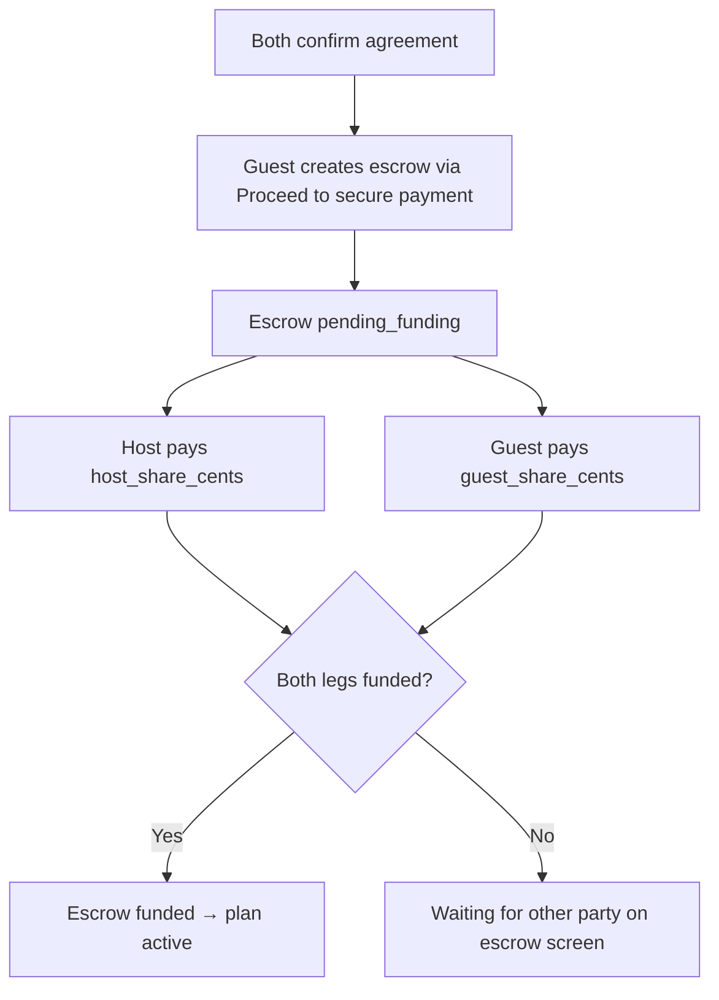
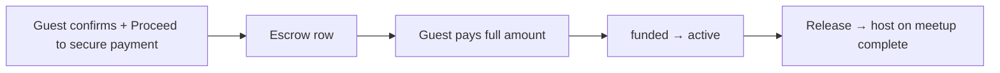
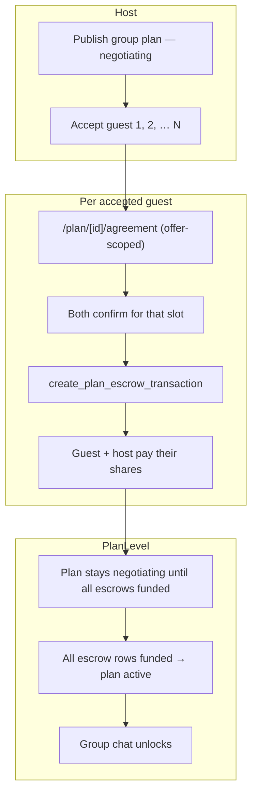
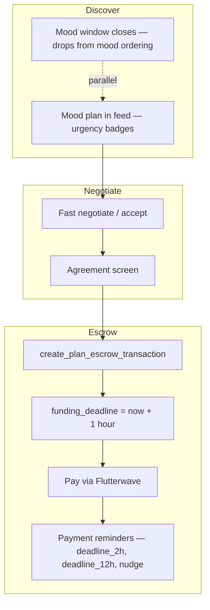
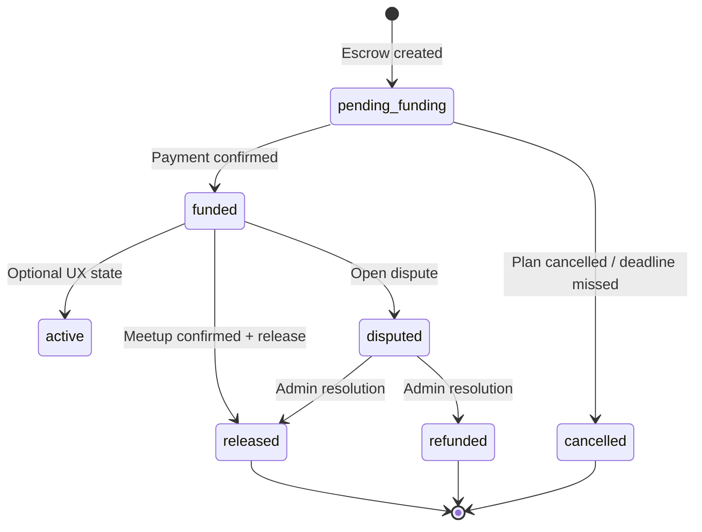

# LinkUp — Escrow Payment Userflow

This document describes the **end-to-end escrow payment journey** for paid plans: from offer acceptance through agreement confirmation, Flutterwave checkout, funding, and post-meetup release. It covers **1:1 standard plans** (escrow patterns A / B / C), **group plans**, and **mood plans**.

For engineering detail (RPCs, webhooks, schema, cancellation math), see [ESCROW-LOGIC.md](./ESCROW-LOGIC.md). For plan creation dimensions and wizard steps, see [PLAN-TYPES-USERFLOW.md](./PLAN-TYPES-USERFLOW.md). For general app navigation, see [LINKUP-USERFLOW.md](./LINKUP-USERFLOW.md) (§5.8 agreement, §5.9 escrow).

**Tip:** Mermaid diagrams paste into [Mermaid Live Editor](https://mermaid.live).

---

## How to read this document

| If you need… | Go to… |
|--------------|--------|
| The path every paid plan shares before checkout | **§1 Shared path** |
| 1:1 plans by escrow pattern (A / B / C) | **§2 Standard 1:1 plans** |
| Multiple guests, one escrow row per slot | **§3 Group plans** |
| Urgent mood listings and 1-hour funding deadline | **§4 Mood plans** |
| Escrow screen states after payment | **§5 Escrow lifecycle** |
| Side-by-side comparison table | **§6 Comparison matrix** |
| Routes and code map | **§7 Screen inventory & code map** |

---

## Table of contents

1. **§1** — Shared path (all paid plans)  
2. **§2** — Standard 1:1 plans (Pattern A, B, C)  
3. **§3** — Group plans  
4. **§4** — Mood plans  
5. **§5** — Escrow screen lifecycle  
6. **§6** — Comparison matrix  
7. **§7** — Screen inventory & code map  

---

## §1 Shared path (all paid plans)

Every paid plan follows the same **agreement gate** before money moves. Plan type and escrow pattern determine **who pays**, **how many escrow rows** exist, and **when the plan becomes active**.

### Step-by-step

| Step | Screen | Actor | What happens |
|------|--------|-------|--------------|
| 1 | Negotiate `/plan/[id]/negotiate` | Host / guest | Offers until host accepts |
| 2 | Agreement `/plan/[id]/agreement` | Both | Review when, where, price, cancellation policy |
| 3 | Legal gate modal | Each party | Checkbox + **Confirm and continue** → row in `agreement_confirmations` |
| 4 | Agreement CTA | Guest (typical payer) | **Proceed to secure payment** → creates escrow row |
| 5 | Escrow `/escrow/[id]` | Payer(s) | **Pay** → `create-escrow-payment` → Flutterwave |
| 6 | Escrow | System | `charge.completed` webhook → `pending_funding` → `funded` |
| 7 | Escrow / plan | Both | Meetup complete → release to payee (pattern-dependent) |

### Hard gates (all paid paths)

| Gate | Rule |
|------|------|
| Identity verification | Required to confirm agreement and to pay |
| Pattern B | Silver+ subscription to create / use split escrow |
| Pattern C | Gold+ subscription; Tier 2 KYC for **both** host and guest |
| High value (> ₦5M) | Platinum + Tier 3 KYC; counterparty Tier 3 for Pattern C |
| Minimum escrow | Per `MIN_ESCROW_CENTS` in `lib/plans/planFinancialConfig.ts` |

---

## §2 Standard 1:1 plans

One accepted guest, **one escrow row** per plan. Behavior depends on **escrow pattern** chosen at create time.

### Pattern A — Host funds

| Item | Value |
|------|--------|
| UI label | Host funds |
| Payer | Host (`creator_id`) |
| Payee | Guest (accepted bidder) |
| Amount | Full agreed price |
| Plan status after escrow create | `awaiting_payment` |
| Activation | Host funds → plan `active` |
| Release | Funds go to **guest** |

### Pattern B — Split escrow

| Item | Value |
|------|--------|
| UI label | Split escrow |
| Split | `host_contribution_bps` (default 50/50) |
| Checkout | Two separate Flutterwave sessions (`escrow_leg`: `host` \| `guest`) |
| UI | Each party sees **Pay your share**; other sees **Waiting…** |
| Activation | **Both** legs must complete before escrow → `funded` and plan → `active` |
| Release | Funds go to **guest** (payee on escrow row) |

### Pattern C — Guest funds

| Item | Value |
|------|--------|
| UI label | Guest funds |
| Payer | Guest |
| Payee | Host |
| Tier | Gold+ to create; Tier 2 KYC for **both** host and guest |
| Activation | Guest funds → plan `active` |
| Release | Funds go to **host** |

### Agreement screen CTAs (1:1)

On `/plan/[id]/agreement`, the primary button depends on confirmation and payment state:

| State | Guest sees | Host sees |
|-------|------------|-----------|
| Neither confirmed | Review terms & pay (opens legal gate) | Review & confirm terms |
| One confirmed | Waiting for {other} | Waiting for {other} |
| Both confirmed, paid | Proceed to secure payment | Waiting for guest payment |
| Escrow exists, awaiting pay | Continue to secure payment | Waiting for secure payment |
| Plan active | View plan | View plan |

Guest typically taps **Proceed to secure payment** after both confirm; host waits unless host is the payer (Pattern A or Pattern B host leg).

---

## §3 Group plans

Group plans accept **multiple guests**. Each accepted guest gets their **own escrow row** (`UNIQUE plan_id + guest_id`).

### Group plan rules

| Dimension | Behavior |
|-----------|----------|
| Escrow rows | **One per guest** (`group_plan_index` for display order) |
| Plan status after escrow create | **`negotiating`** (not `awaiting_payment`) |
| Escrow pattern | Equal split uses **Pattern B** logic: total ÷ (host + max guest slots) |
| Host share | Host pays their per-person share **once** (first escrow that still needs it); later guest slots skip host leg if already funded |
| Guest share | Each guest pays their per-person share on **their** escrow row |
| Plan activation | **All** escrow rows for the plan must be `funded` (`maybeActivatePlanAfterFunding` in webhook) |
| Agreement UI | `needsConfirm` / `awaitingPay` can apply per accepted slot while plan is still `negotiating` |

### Worked example

**₦20,000 total, 3 guest slots → 4 participants (host + 3 guests)**

- Per person = ₦5,000 (`groupPlanPerPersonCents`)
- **Guest A escrow:** host ₦5,000 + guest A ₦5,000
- **Guest B escrow:** guest B ₦5,000 only (host already funded on first row)
- **Guest C escrow:** guest C ₦5,000 only
- Plan → `active` only when all three escrow rows are `funded`

---

## §4 Mood plans

Mood plans are **time-urgent** listings. Escrow mechanics match the plan’s pattern (A / B / C), with **tighter deadlines**.

### Mood vs standard

| Dimension | Mood plan | Standard 1:1 |
|-----------|-----------|--------------|
| Funding deadline | **1 hour** from escrow creation | **24 hours** |
| Listing TTL | `mood_expires_at` — short discover window | Normal plan lifecycle |
| Escrow pattern | Same A / B / C rules | Same |
| Group mood | Group rules + 1h deadline per escrow row | — |
| Host tools | Extend mood window (Gold+), boost | Standard boost |

**User-visible pressure:** escrow screen shows funding deadline countdown; push/email `payment_reminder` fires as deadline nears and when meetup is within 24–48h. See [PAYMENT_REMINDER_AUTOMATION.md](./PAYMENT_REMINDER_AUTOMATION.md).

---

## §5 Escrow screen lifecycle

Route: **`/escrow/[id]`** — shared by all plan types after escrow row creation.

### By status

| Status | User sees | Actions |
|--------|-----------|---------|
| `pending_funding` | Amount, deadline, pattern-specific pay CTAs | **Pay** (Flutterwave), message counterparty |
| `pending_funding` (Pattern B, one leg paid) | Waiting for other party | — |
| `funded` | Held securely in escrow | **Confirm meetup complete**, **Open dispute** |
| Plan `active` | Plan detail, chat | Navigate to meetup |
| `released` | Payee received funds | View timeline |
| `disputed` | On hold | Support ticket |

### Release recipient

| Pattern | Funds released to |
|---------|-------------------|
| A | Guest |
| B | Guest |
| C | Host |

### Checkout flow (escrow screen)

1. User taps **Pay** (verified users only).
2. Client calls `openEscrowCheckout` → Edge Function `create-escrow-payment`.
3. Flutterwave in-app webview or external browser.
4. Webhook `processEscrowCharge` updates escrow; Pattern B may require two legs before `funded`.
5. Realtime subscription on escrow row shows **Escrow funded** alert when status changes.

For dispute and support paths, see [SUPPORT-AND-DISPUTE-RESOLUTION-USERFLOW.md](./SUPPORT-AND-DISPUTE-RESOLUTION-USERFLOW.md).

---

## §6 Comparison matrix

| | **1:1 Pattern A** | **1:1 Pattern B** | **1:1 Pattern C** | **Group (Pattern B)** | **Mood (any pattern)** |
|--|-------------------|-------------------|-------------------|------------------------|-------------------------|
| Escrow rows | 1 | 1 | 1 | 1 per guest | Same as base pattern |
| Who creates escrow | Guest taps pay* | Guest taps pay* | Guest taps pay | Guest per slot | Same |
| Payers | Host only | Host + guest | Guest only | Host (once) + each guest | Same |
| Plan status when paying | `awaiting_payment` | `awaiting_payment` | `awaiting_payment` | `negotiating` | Same + **1h deadline** |
| Becomes `active` | Single fund | Both legs funded | Single fund | **All** rows funded | Same rule as base |
| Min tier | Free+ | Silver+ | Gold+ | Silver+ (split) | Same |

\*Guest is the one who typically taps **Proceed to secure payment** after both confirm; host sees **Waiting for guest payment** unless host is the payer (Pattern A / Pattern B host leg).

---

## §7 Screen inventory & code map

### Routes

| Surface | Route |
|---------|--------|
| Negotiate offers | `/plan/[id]/negotiate` |
| Agreement / confirm | `/plan/[id]/agreement` |
| Escrow checkout | `/escrow/[id]` |
| Plan detail | `/plan/[id]` |
| Group interest (host) | `/plan/[id]/interest` |
| Support (from dispute) | `/support` |

### Key modules

| Concern | File |
|---------|------|
| Create escrow + deadlines | `lib/plans/planAgreementActions.ts` |
| Pattern A/B/C party resolution | `lib/plans/escrowParties.ts` |
| Group equal split | `lib/plans/groupEscrowSplit.ts` |
| Agreement confirmation helper | `lib/plans/agreementConfirmations.ts` |
| Payment preview copy | `lib/escrow/escrowPaymentPreview.ts` |
| Flutterwave checkout | `lib/escrow/openEscrowCheckout.ts` |
| Fund / release / dispute actions | `lib/escrow/escrowActions.ts` |
| Webhook fulfillment | `supabase/functions/_shared/flutterwaveEscrow.ts` |
| Agreement screen CTAs | `app/plan/[id]/agreement.tsx` |
| Escrow pay UI | `app/escrow/[id].tsx` |
| Payment preview card | `components/plans/agreement/AgreementPaymentPreviewCard.tsx` |
| Escrow RPC (server) | `supabase/migrations/20260628000002_escrow_agreement_confirmations_rls_fix.sql` |

### Related documentation

| Doc | Contents |
|-----|----------|
| [ESCROW-LOGIC.md](./ESCROW-LOGIC.md) | Engineering reference: RPCs, RLS, cancellation, gaps |
| [PLAN-TYPES-USERFLOW.md](./PLAN-TYPES-USERFLOW.md) | Create wizard, mood overlay, pattern tier gates |
| [PAYMENT_REMINDER_AUTOMATION.md](./PAYMENT_REMINDER_AUTOMATION.md) | Reminder cron and notification phases |
| [LINKUP-USERFLOW.md](./LINKUP-USERFLOW.md) | §5.8 agreement, §5.9 escrow in full app context |

---

*Last updated: 2026-06-28 — reflects group multi-escrow, agreement confirmations RPC, and `create_plan_escrow_transaction` SECURITY DEFINER flow.*
