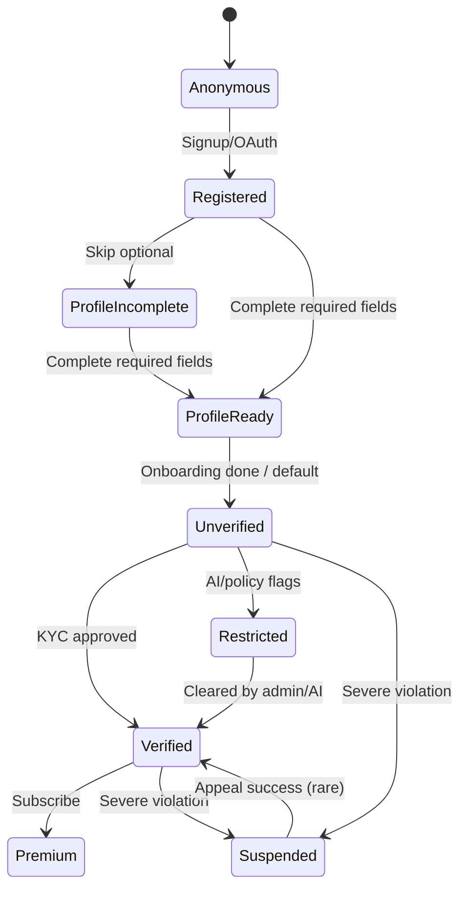
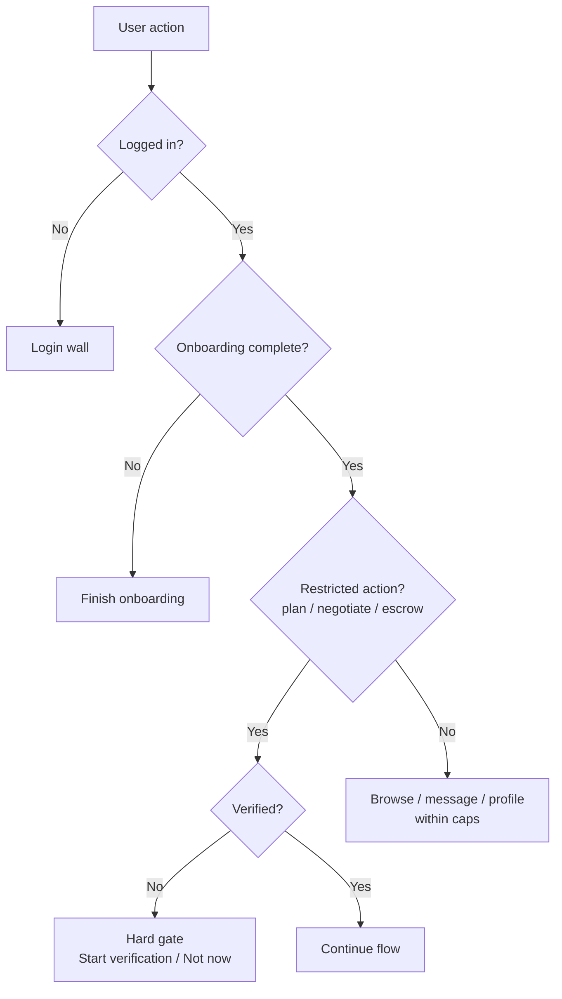
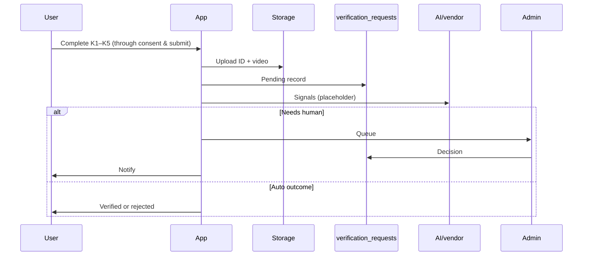

# LinkUp — Userflow Specification

This document describes **who can do what**, **in what order**, and **when verification (KYC) applies**. Use it for product decisions, UX copy, and engineering gates (including Supabase RLS).

**Tip:** Mermaid diagrams can be pasted into [Mermaid Live Editor](https://mermaid.live). Tables can be copied into Notion or Sheets.

---

## How to read this document

| If you need… | Go to… |
|--------------|--------|
| A fast mental model of the product | **§2 At-a-glance** → **§3 Journey in plain language** |
| Verification: soft prompt, hard gate, steps K1–K7 | **§4 Verification (progressive KYC)** |
| Screen-by-screen flows in **chronological order** (auth → onboarding → homepage) | **§5** — read **§5.1 → §5.5** for the first-time path |
| What unverified vs verified users can do | **§6 Access rules** |
| Notifications and side effects | **§7 Events & notifications** |
| Legal / payments / safety context | **§8 Compliance** |
| Admin review and backlog lists | **§9 Admin & appendix** → **§10 Screen inventory** |
| **PDF phased doc** vs **this spec** (crosswalk) | **§1 Mapping** |

---

## Table of contents

1. **§1** — Mapping: PDF phases ↔ this spec (**crosswalk table**)  
2. **§2** — At-a-glance: states & principles (incl. **§2.3** status colors)  
3. **§3** — Journey in plain language  
4. **§4** — Verification (progressive KYC) — *single home for all KYC detail*  
5. **§5** — Feature flows: **§5.1** auth → **§5.2** onboarding → **§5.3** tab shell → **§5.4** first session → **§5.5** homepage → **§5.6** plans → **§5.7** Messages → **§5.8** acceptance / cancel / agreement → **§5.9** escrow → **§5.10** support & disputes → **§5.11** premium / account  
6. **§6** — Access rules (verified vs unverified + flowchart)  
7. **§7** — Events & notifications  
8. **§8** — Compliance  
9. **§9** — Admin & appendix (sequence diagram)  
10. **§10** — Screen inventory & maintenance  

*(Search the heading text in this file, or use your editor’s outline view, to jump.)*

## 1. Mapping: PDF phases ↔ this specification

The **LinkUp MVP Userflow (PDF)** uses numbered **phases** (onboarding → soft KYC → limited access → …). This file uses **§ sections**. They describe the **same product intent**; use the table below to stay aligned when editing either document.

| PDF phase (title) | What it covers | Where in this doc |
|-------------------|----------------|-------------------|
| **Phase 1** — Onboarding (5 steps) | Signup/login, profile wizard, optional AI check, then **limited access** entry | **§5.1** Auth · **§5.2** P1–P5 · then **§5.3–§5.5** (shell → first session → **homepage**) · scoring note under **§5.2** |
| **Phase 2** — Soft KYC prompt | “Unlock more…”, Verify / Skip, badge, reminders | **§4.2** |
| **Phase 3** — Limited app access | Browse/view plans; **no** create / negotiate / escrow | **§6.1** · **§5.5** (Plans tab = “dashboard” / homepage in MVP) |
| **Phase 4** — Hard gate | Restricted action → “Verification required…” → Start verification | **§4.3–§4.4** |
| **Phase 5** — KYC K1–K7 | Full verification wizard (incl. document-type step before ID) | **§4.5** |
| **Phase 6** — Verified UX | Plans, negotiation, escrow, **premium** (paid) | **§6** · **§5.5–§5.11** (see **§5.11** for premium) |
| **Phase 7** — Plan negotiation | InDrive-style offers; verified-only | **§5.6** |
| **Phase 8** — Acceptance & escrow | Paystack, hold, outcomes | **§5.8** (accept / agree) · **§5.9** (escrow) · **§7** |
| **Phase 9** — Execution & messaging | Chat, media, AI moderation, report | **§5.7** (Messages) · **§8** |
| **Phase 10** — Completion / release | Mutual complete, release, dispute | **§5.8** · **§5.9** · **§5.10** · **§7** |
| **Phase 11** — Support & disputes | Tickets, admin resolution | **§5.10** · **§9.1** |
| **Phase 12** — Admin dashboard | KYC queue, mod, disputes | **§9** · **§10.1** |
| **Phase 13** — Premium | Boost, subscription, Paystack | **§5.11** |
| **Phase 14** — Account management | Edit profile, logout, delete | **§5.11** |

**Terminology:** PDF **“dashboard”** (limited-access / main app browsing) aligns with **Phase 3** in the table above — **main app after onboarding**; in the current MVP that maps to the **tab shell** with default **Plans** tab (**§5.3** shell, **§5.5** homepage feed), not a separate branded “Dashboard” screen unless you add one later.

---

## 2. At-a-glance: states & principles

### 2.1 User states

| State | Meaning | What it feels like in the app |
|-------|---------|-------------------------------|
| **Anonymous** | Not logged in | Marketing / entry only; no plans or messaging |
| **Registered** | Account exists | Can continue signup and profile |
| **Profile incomplete** | Required profile fields missing | Cannot fully use discovery / publish as intended |
| **Unverified** *(after onboarding)* | Onboarding done; identity not approved yet | **You are inside the app.** You can browse, use profile, and message within limits. You **cannot** create plans, start negotiation offers, or use escrow until verified |
| **Verified** | KYC approved | Full access to plans, negotiation, escrow (per product rules) |
| **Premium** | Paid subscription | Extra boosts / perks on top of verified features |
| **Restricted** | Policy warning | Reduced visibility; may be in a review queue |
| **Suspended** | Serious policy breach | Read-only or locked out; appeal path |

### 2.2 Two principles to remember

1. **Onboarding is not KYC.** Finishing the 5-step profile wizard **does not** force identity verification. After **§5.2**, users enter the **main app shell** (**§5.3**); the **default first screen** is the **Plans** tab / homepage (**§5.5**).
2. **Verification is progressive.** LinkUp asks for ID/video **when the user tries something that needs trust** (plans, negotiation, escrow), or via a **gentle “Unlock more” prompt** — not as a wall immediately after onboarding.

### 2.3 Status & feedback colors (product-wide)

Aligned with common **PDF / design brief** language: use **green** for success states, **red** for errors or rejected KYC, **blue** (or neutral) for informational banners. **KYC marketing UI** also uses LinkUp brand tokens (**§4.5**: primary `#6C63FF`, secondary `#FF6584`, background `#F5F6FA`). Do not confuse **semantic** status colors with **brand** fills on the same screen.

---

## 3. Journey in plain language

**Typical happy path (conceptual):**

1. **Sign up / log in** → verify email or phone where required.  
2. **Complete profile onboarding (5 steps)** → name, photos, bio, preferences, safety, review.  
3. **Enter the main app (tab bar)** → default landing is the **Plans** tab (**homepage** in the MVP app). **No mandatory KYC step here.**  
4. **Optional (same session or soon after):** **soft KYC prompt** (“Unlock more with verification”) and/or a **light nudge banner** on Plans — both dismissible; see **§4** and **§5.4** (post-onboarding entry).  
5. **When needed:** user taps **Create plan**, **send offer**, or **escrow** → if not verified, a **hard gate** appears: “Verification required to continue” → **Start verification** or **Not now**.  
6. **KYC wizard (K1–K7)** → intro, **choose ID type**, ID capture (instructions match selection), short video, consent, “in progress”, then approved / rejected / more info.  
7. **Verified** → user can complete the action they attempted (create plan, negotiate, fund escrow).  
8. Later: **plans → negotiation → escrow → meet → complete / dispute → support** as the product defines.

**Parallel tracks (always):** messaging (within rules), notifications, admin (verification, moderation, disputes).

### 3.1 State diagram (high level)

---

## 4. Verification (progressive KYC)

*Everything about identity verification is in this section so you do not have to hunt across multiple chapters.*

### 4.1 TL;DR

| Question | Answer |
|----------|--------|
| Is KYC required right after onboarding? | **No.** |
| When is the user blocked? | Only when they try a **restricted action** while **not verified** (or when opening the hard gate from there). |
| What are restricted actions? | **Create plan**, **negotiate** (e.g. send offer / accept in gated flows), **escrow / payment hold**. |
| How does the app ask nicely first? | **Soft prompt** after onboarding (dismissible) + **unverified** badge on profile + light reminders. |
| How many KYC steps? | **Seven (K1–K7)** with progress and **save / resume** (draft includes selected document type). |

### 4.2 Soft prompt (non-blocking)

**When:** After onboarding completes, show once at a natural moment (e.g. first Home session), and surface again from Profile (“Unlock more”) — not an infinite blocking loop.

| Element | Copy / behavior |
|---------|-----------------|
| Title | **Unlock more with verification** |
| Body | Short trust explanation + bullets: Create plans · Negotiate meetups · Use secure escrow |
| Primary | **Verify now** → opens KYC at K1 |
| Secondary | **Skip for now** → closes; no penalty |
| Ongoing | **Unverified** badge on profile; occasional dismissible banner (low frequency) |

**Tone:** Calm and clear — explain *why*, not fear.

### 4.3 Hard gate (blocking)

**When:** User attempts a **restricted action** and is **not verified**.

| Element | Copy / behavior |
|---------|-----------------|
| Title | **Verification required to continue** |
| Body | Plans, negotiation, and escrow need identity verification for safety |
| Primary | **Start verification** → KYC (resume if draft exists) |
| Secondary | **Not now** → close; **the action does not complete** |

### 4.4 Restricted actions (reference)

| User tries to… | If unverified |
|----------------|----------------|
| Create a plan | Block → hard gate |
| Start negotiation (e.g. send offer / flows defined as gated) | Block → hard gate |
| Use escrow / fund payment hold | Block → hard gate |

Implementation note: **Supabase RLS** should also enforce inserts for plans, offers, and escrow for **verified** users only, so the rule holds even if the client is bypassed.

### 4.5 KYC steps K1–K7 (guided UI)

**Design intent:** Camera-first, trust copy, structured steps (similar in spirit to common dating/trust apps). **Tokens:** primary `#6C63FF`, secondary `#FF6584`, background `#F5F6FA`, Inter/Poppins, rounded cards, soft shadows.

**Global UX rules**

- Progress: **Step X of 7** + progress bar.  
- **Save progress** and **resume** later (client draft, including **document type**; after submit, **`verification_requests`** row on server).  
- User can **go back** from ID capture to **change document type** (K3 → K2).  
- Liveness video **≤ 5 seconds**, reasonable resolution (e.g. 480p) to limit data.  
- Clear **retry** on reject, upload failure, or “more info”.  
- Simple language; optimize for low-end devices.

| Step | Name | What happens |
|------|------|----------------|
| **K1** | Trust center intro | Why verification exists; what unlocks; short data-use summary → **Start verification** |
| **K2** | Document type selection | User picks one: national ID, passport, driver’s license, or voter’s card — large cards, short trust copy → **Continue** (disabled until selected) |
| **K3** | ID capture | Camera + optional gallery; **country** selector; frame overlay; **dynamic instruction** by document type (e.g. passport photo page, license front); hints for blur/glare |
| **K4** | Liveness video | Short selfie clip (e.g. 3–5 s); prompts like blink / turn head; upload compressed |
| **K5** | Consent | Plain-language processing notice; **required checkbox** to submit |
| **K6** | Submission queue | “Verification in progress”; ETA band; user can **keep using the app** with limited trust features |
| **K7** | Outcome | **Approved:** verified badge, success state · **Rejected:** reason + retry (can resume from document selection) · **More info:** targeted re-upload |

**Conceptual client state:** current step (1–7), **selected document type**, verification status, local capture URIs until upload succeeds, loading and retry on network errors.

### 4.6 Data: `verification_requests` (Supabase)

| Field | Role |
|-------|------|
| `user_id` | Owner |
| `id_document_path` / image URL | Storage path for ID |
| `selfie_video_path` / video URL | Storage path for liveness |
| `status` | e.g. pending → approved / rejected / more_info (per your enum) |
| `rejection_reason` | User-safe text when rejected |
| `document_type` | ID kind submitted with the request (e.g. `national_id`, `passport`, `drivers_license`, `voters_card`) |
| Optional | `country_code`, `consent_at`, review metadata |

**Storage:** Private bucket; access for reviewers via signed URLs or server-side tools — **never** public URLs for ID media.

**AI (placeholder):** Face match (ID vs video), liveness scoring, fraud signals — wire to vendor or Edge Functions later; product should allow **human review** when automation is unsure.

---

## 5. Feature flows

Each subsection uses a **`Flow label:`** line (stable string for specs, tickets, or **LLM prompts**), plus **Purpose**, **Trigger** / **Entry** where it helps, and numbered **steps** or tables.

**Suggested prompt pattern (repeat per flow):**  
`[Flow label] + Purpose + Trigger + Entry point + Ordered steps + Verification note (see §4 if gated) + Exit / next screen`

**Reading order (first-time path):** **§5.1** Authentication → **§5.2** Profile onboarding → **§5.3** Tab shell → **§5.4** First session on the Plans tab → **§5.5** Home / Plans feed (default homepage). Deeper flows: **§5.6** Plans (create → negotiate → PL6), **§5.7** Messages, **§5.8** acceptance / agreement / cancel, **§5.9** Escrow, **§5.10** Support & disputes, **§5.11** Premium / account.

Verification rules are always in **§4**; access matrix in **§6**.

---

### 5.1 Flow: Authentication & account

**Flow label:** `Auth — signup, login, recovery`  

| ID | Screen | Primary actions | Next |
|----|--------|-----------------|------|
| A1 | Splash / welcome | Email, phone, Apple/Google | A2 or OAuth |
| A2 | Signup | Credentials, ToS | A3 |
| A3 | Verify contact | OTP | A4 |
| A4 | Login | Credentials / magic link | **Index** → **§5.2** onboarding or **main tabs** (returning users) |
| A5 | Forgot password | Reset email | A4 |
| A6 | Security | 2FA, sessions | Settings |

*OAuth may skip OTP if the provider already verified email.*

---

### 5.2 Flow: Profile onboarding (five steps — not KYC)

**Flow label:** `Onboarding wizard — profile only (P1–P5)`  

| ID | Screen | Content | Next |
|----|--------|---------|------|
| P1 | Basics | Name, photos, age | P2 |
| P2 | Bio & interests | Bio, tags, languages, intent | P3 |
| P3 | Preferences | Who to meet, age range, **radius** | P4 |
| P4 | Safety | Block import (optional), safety tips | P5 |
| P5 | Review | Preview, publish or draft / skip | **Main tabs** → **§5.3–§5.5** — **not** forced into KYC |

*Radius pairs with **location permission** (explain value + safety).*

**Optional — initial AI-assisted checks (PDF “Initial AI check”):** During or after profile save, run **light automated screening** on bio/photos (e.g. trust score, flags for fake or policy-violating content). Outcome is **non-blocking** for entering the app unless policy escalates to review. Implementation can reuse existing profile scoring hooks; tune thresholds separately from **KYC** face-match AI (**§4.6**).

---

### 5.3 Application shell (where everything lives after onboarding)

**Flow label:** `Main app — tab shell`  

**Purpose:** After **§5.2** profile onboarding is complete, the user is **not** sent to a separate “discovery” route first. They enter the **main tab navigator**.

| Element | MVP behavior (current product intent) |
|---------|----------------------------------------|
| Tabs | **Plans** (default) · **Messages** · **Profile** |
| Default route on entry | **Plans** tab = first tab = **homepage** for browsing nearby plans (**§5.5**) |
| “Home” in UX copy | Means **Plans tab / Nearby plans**, unless you later add a dedicated Home hub |

---

### 5.4 Flow: Post-onboarding entry (first moments in the app)

**Flow label:** `Post-onboarding landing — first session`  

**Purpose:** Describe exactly what happens **immediately after** the user finishes the 5-step profile wizard (publish, draft complete, or skip — per product rules).

**Trigger:** `onboarding_status` is no longer `pending` (user completed or skipped onboarding).

**Entry point:** Deep link or cold start resolves to **main tabs** → **Plans tab** opens by default.

**Ordered experience (copy-paste friendly):**

1. User lands on **Plans** tab (see **§5.5** — this is the homepage, after **§5.1–§5.2**).  
2. User may grant **location** when the feed loads (better “nearby” ranking).  
3. User sees **nearby plans list** (or empty state + “Create” CTA).  
4. **Optional, non-blocking:** **Soft KYC prompt** (modal) if flagged for first session after onboarding — **Verify now** / **Skip for now**.  
5. **Optional, non-blocking:** **Dismissible nudge banner** on Plans reminding unverified users they can verify to unlock plans / escrow.  
6. User may switch to **Messages** or **Profile** at any time — no extra gate for browsing.

**Exit / next:** User stays in shell; next flows are **browse plans**, **open a plan**, **create plan** (gated), **Messages** (**§5.7**), or **Profile → Verify**.

---

### 5.5 Flow: Home / Plans feed (default homepage)

**Flow label:** `Homepage — Nearby plans (Plans tab)`  

**Purpose:** This flow **is** the main **homepage** in the MVP — the screen users reach **after** **§5.1** Authentication and **§5.2** Profile onboarding (via **§5.3** shell and **§5.4** first session). It is **not** a separate “Discovery” chapter for a different screen. Older docs used “Discovery & location” as a bucket; here **D1 = Plans tab = homepage**.

**Screen ID:** `D1` = **Plans** tab (`Nearby plans` feed).

| Step | Screen / state | User actions | Notes |
|------|----------------|--------------|--------|
| 1 | Plans tab header | Read title (“Nearby plans”), tap **+ Create** | Create leads to **Flow: Plans — create…** (**§5.6**) — **hard gate** if unverified |
| 2 | Location | Allow or deny foreground location | Improves distance filter; feed may still show plans without precise GPS |
| 3 | Feed list | Scroll plans; tap a row | Opens **plan detail** → offers / negotiation (**§5.6**) |
| 4 | Empty state | See copy + create CTA | Same gating rules |

**Optional / future (not the default homepage path unless you build them):**

| Screen ID | Name | Role |
|-----------|------|------|
| D2 | Map (optional) | Pins, radius ring — **separate entry** from tabs if implemented |
| D3 | Other user profile detail | From feed / chat — badges, trust context |
| D4 | Search (optional) | Query + filters — **separate** from default landing |

---

### 5.6 Flow: Plans — create, publish, negotiate

**Flow label:** `Plans — create → publish → offers → agree`  

| ID | Screen | Gate |
|----|--------|------|
| PL1 | Create plan | **Hard gate if unverified** |
| PL2 | Visibility | Friends / radius / public |
| PL3 | Published | Appears on **Plans feed (D1)** (**§5.5**); stats |
| PL4 | Plan detail — offers | List incoming offers |
| PL5 | Negotiation / offers | **Hard gate if unverified** to **send offer**; **Open messages** bridges to **§5.7** (same 1:1 thread) |
| PL6 | Agree | Host accepts offer → **§5.8** (agreement summary); paid amount → **§5.9** Escrow — **§4** / **§6** gates |

*Free / no-price paths: **§5.8** only. Paid: **§5.8** then **§5.9**.*

---

### 5.7 Flow: Messages tab (inbox & threads)

**Flow label:** `Messages — inbox, thread, media, moderation`  

**Purpose:** The **Messages** tab is a first-class surface in the tab shell (**§5.3**). It deserves the same level of spec detail as **Plans** (**§5.5–§5.6**). Earlier versions of this doc only mentioned messaging inside a **post-agreement summary** because the source PDF groups **Phase 9 (Execution & messaging)** with escrow and disputes; that was a **documentation shortcut**, not a product rule that messaging is secondary.

**Entry points**

| Entry | Notes |
|-------|--------|
| **Tab bar → Messages** | Default inbox list (**M1**). |
| **Plan flow → Open messages** | From negotiation (**§5.6** PL5) or plan detail when a counterparty exists; opens the **same** 1:1 conversation as choosing that person from the inbox. |
| **Deep link** *(future)* | Optional `linkup://chat/...` — not required for MVP. |

**Verification:** Messaging is **not** gated like **create plan / send offer / escrow** — see **§6.1** (*trust caps* for unverified vs full for verified). Hard gates in **§4.3** apply to **plans / negotiation / escrow**, not to opening the inbox.

| Step | Screen ID | User actions | System / product notes |
|------|-----------|--------------|-------------------------|
| 1 | **M1** — Inbox (`Messages` tab) | See list of conversations (peer name + last message preview); pull to refresh on focus | Rows come from `conversations` where the user is `user_a` or `user_b`. Empty state explains how to start (e.g. from a plan). |
| 2 | **M1** | Tap a row | Navigate to **M2** thread (`/chat/[conversationId]`). |
| 3 | **M2** — Thread | Read history (oldest → newest); type message; send | Inserts into `messages` for that `conversation_id`. May run **AI moderation** on send (**§8**); blocked/flagged copy per policy. |
| 4 | **M2** | Attach media *(if enabled)* | Uses storage + `messages` / `media` patterns; respect moderation and size limits. |
| 5 | **M2** | Back | Returns to **M1**. |

**MVP implementation note:** Conversations are **pair-scoped** (ordered pair of user IDs). There is **no separate `plan_id` on the thread** in the baseline schema; plan context is **UX** (user opened chat from a plan). A future iteration can add **plan-scoped threads** if product requires isolated history per plan.

**Safety:** Report / block flows should align with **§8** and in-app safety copy; push rules for message notifications live in **§7**.

---

### 5.8 Flow: Plan acceptance, agreement & cancellation

**Flow label:** `After offer accept — confirm terms, active plan, cancel paths`  

**Purpose:** Once a host **accepts** an offer (**§5.6** PL5–PL6), the product must show **final terms** and move the plan into the right **status** (active vs agreed-with-escrow). Earlier specs folded this together with **escrow** and **support** because the PDF stacks **Phase 8 (Acceptance)** next to **Phase 10 (Completion)** and **Phase 11 (Support)** in one “after deal” narrative—that was a **documentation shortcut**, not a reason to omit screen-level detail.

**Verification:** Accepting offers and transitioning plan state follow **§6** (typically **verified** for paid / escrow paths). Review **§4.3** for hard gates.

| Step | Screen ID | User actions | System / product notes |
|------|-----------|--------------|-------------------------|
| 1 | **PL6a** — Agreement / summary | Read **when**, **where**, **price**, optional **offer time** | Route: e.g. plan stack **agreement** screen after accept. Plan row moves to `agreed` (paid) or `active` (free / no hold). |
| 2 | **PL6a** | **Confirm plan** (free / no escrow) | No payment: user sees confirmation; plan usable per policy. |
| 3 | **PL6a** | **Proceed to payment** (if paid) | Navigates to **§5.9** Escrow (one row per plan in MVP). |
| 4 | **Cancel / withdraw** *(product-defined)* | Host or guest cancels before meet | Rules: whether escrow refunds, offer `declined` / `superseded`, plan `cancelled`—mirror your **state machine** and **§6** gating. Document edge cases in engineering specs. |

**Exit / next:** Free path → Plans feed or plan detail; paid path → **§5.9**.

---

### 5.9 Flow: Escrow (fund, hold, release, dispute)

**Flow label:** `Escrow — Paystack hold, funded, release, dispute`  

**Purpose:** Hold funds so meetups tied to **paid** plans have a **trust path**. This is distinct from **§5.8** (human “yes” on terms) and from **§5.10** (help tickets).

**Verification:** **§6.1** — unverified users **cannot** complete escrow / payment hold; **§4.3** hard gate at pay action.

**Entry:** From **§5.8** when plan status is **`agreed`** and an `escrow_transactions` row exists (payer = guest / offer side, payee = host per product rules).

| Step | Screen ID | User actions | Notes |
|------|-----------|--------------|--------|
| 1 | **E1** — Escrow detail (`/escrow/[id]`) | See amount, currency, status, linked plan | Read from `escrow_transactions`; status enum drives UI (e.g. `pending_funding`, `funded`, `released`, `disputed`). |
| 2 | **E1** | **Pay** (payer) | Opens PSP checkout (e.g. Paystack); **hard gate** if not verified. |
| 3 | **E1** | **Release** / **Confirm fulfilled** *(when product allows)* | Policy: who may trigger release; audit trail. |
| 4 | **E1** | **Open dispute** | Locks or flags funds per **§5.10** / admin; notify per **§7**. |

**State machine:** Keep client, Edge Functions, and **§7** notification rows aligned with DB enums.

---

### 5.10 Flow: Support, tickets & disputes (user-facing)

**Flow label:** `Support — help, tickets, dispute intake`  

**Purpose:** Users need a **clear path** off the happy path (bugs, safety, payment confusion). That is separate from **§5.8** (plan terms) and **§5.9** (money movement). The PDF’s **Phase 11** was previously only cross-referenced from a **§5.8 bullet**; this section gives it a proper home.

**Entry:** Profile / settings link to **Support** (e.g. `/support`), or deep link from error / dispute CTAs.

| Step | Screen ID | User actions | Notes |
|------|-----------|--------------|--------|
| 1 | **S1** — Support home | Read help copy; **Create ticket** | MVP: `support_tickets` with subject + body. |
| 2 | **S1** | Submit ticket | Tied to `user_id`; status for user visibility. |
| 3 | **S1** | List **open** / **past** tickets | Read-only list; resolution flows in **§9** (admin). |
| 4 | **Dispute** *(from escrow or plan)* | User opens dispute with reason | May create or link ticket; escalate per **§9.1**. |

**Admin resolution** is **§9**, not duplicated here.

---

### 5.11 Flow: Premium, account management, session

**Flow label:** `Premium + account lifecycle`  

**Purpose:** Match **PDF Phase 13–14**: paid features vs identity verification, and standard account actions. Premium follows the **same monetization grammar** as major social/discovery apps (Tinder, Hinge, Bumble, Badoo): **subscriptions** for ongoing perks, **à-la-carte boosts** for short-term visibility, and **optional higher tiers** for power users — always **stacked on top of verification** for anything that touches **plans, negotiation, or escrow** (**§6**).

**Premium (subscription / boosts) — policy table**

| Element | Spec (aligned with PDF + industry patterns) |
|---------|-----------------------------------------------|
| Paywall | Paystack (or regional PSP) on mobile web checkout; **app-store subscriptions** where required by platform policy; receipt / webhook updates `users.premium_until` and entitlements |
| Who can buy | **Logged-in** users; **premium never replaces KYC** for trust-gated commerce — verification remains mandatory for **create plan / negotiate / escrow** |
| Copy | **Verified identity** = safety rail for real-world meetups and money; **Premium** = discovery, convenience, and standing out — *not* “pay to skip verification” |

**Premium functionality (Tinder / Hinge / Bumble / Badoo–style, mapped to LinkUp)**

Industry apps combine **(A) visibility**, **(B) intent & filters**, **(C) undo / second chances**, **(D) travel or context switching**, and **(E) insight into interest**. LinkUp should expose the same *categories*, adapted to **plans and meetups** (not only 1:1 matching).

| Theme | Reference apps (typical) | LinkUp premium interpretation |
|-------|--------------------------|----------------------------------|
| **Boost / Spotlight** | Tinder Boost, Bumble Spotlight, Badoo “rise up” | **Time-boxed feed elevation**: subscriber’s **plan** (or profile) gets stronger **placement** in the Plans feed for N minutes / hours; optional **boost_credits** for one-off use without subscribing |
| **Unlimited or higher caps** | Tinder+ likes, Hinge Preferred daily likes | **Higher soft limits** where product uses caps (e.g. offer rounds, saved searches, pinned plans) — *messaging caps for unverified users remain a trust rule, not a paywall* (**§6**) |
| **See who’s interested** | Tinder Gold/Likes You, Bumble Beeline, Badoo “Encounters” unlocks | **Interest surfaces**: who **saved**, **requested**, or **recently viewed** your public plans (within privacy settings); **not** a bypass for escrow or verification |
| **Advanced filters & preferences** | Hinge / Bumble advanced filters | **Rich discovery**: distance tiers, categories, price band, time window, “verified hosts only” as a **filter** (verification still required to *host paid flow*, but premium can **prioritize** verified-only browsing) |
| **Rewind / undo** | Tinder Rewind | **Undo dismiss** on feed or **recall last declined counter** in negotiation (time-limited, abuse-safe) |
| **Passport / Travel mode** | Tinder Passport, Bumble Travel | **Browse or post plans in another city** ahead of a trip; clear **UI label** so trust expectations stay honest (still subject to **§6** for paid actions in that region) |
| **Priority / read receipts / status** | Various tiers | **Optional polish**: faster support tier, **read receipts** in chat (if shipped), **“active plan”** badge — cosmetic + convenience only where it doesn’t imply verification |
| **Incognito / visibility control** | Bumble Incognito, Badoo invisible | **Browse with reduced exposure** or **hide from certain surfaces** while still able to use core verified flows per policy |

**Suggested tiers (product shorthand; exact SKUs in storefront)**

| Tier | Positioning | Example entitlements |
|------|-------------|----------------------|
| **LinkUp+** (base paid) | Bumble Premium / Tinder+–style | Unlimited (or high) boosts allowance per month, advanced filters, travel browse, undo, see-who’s-interested (basic) |
| **LinkUp Pro** (optional upsell) | Tinder Platinum / Hinge+–style | Everything in +, stronger boost discounts, priority placement windows, richer analytics on plan views |
| **Boost pack** (IAP) | Badoo / single Boost | Consumable **`boost_credits`**; burns `plans.boosted_until` or equivalent without full subscription |

**Implementation notes (MVP → scale)**

- Persist **`users.premium_until`**, **`users.boost_credits`**, and **`plans.boosted_until`** (or equivalent) server-side; **never** trust client-only flags for entitlements.
- **Webhook / store** updates subscription state; **RLS** may read entitlements for feature flags but **must not** weaken verification gates for escrow.
- **Paywall surfaces**: Profile, post-plan success, feed “Get seen more” card, and **pre-boost** checkout — aligned with **§5.5** homepage / **§5.6** plans.

**Account management**

| Action | Notes |
|--------|--------|
| Edit profile | From **Profile** tab; same surfaces as post-onboarding |
| Logout | Ends session; return to auth |
| Delete account | DSR / retention: follow **§8**; may require support or in-app flow per policy |

---

## 6. Access rules (verified vs unverified)

### 6.1 Capability matrix

| Capability | Unverified (after onboarding) | Verified |
|------------|-------------------------------|----------|
| Use **Plans** tab / browse feed | Yes | Yes |
| Profile | Yes | Yes |
| Messaging | Per trust caps (e.g. requests / limits) | Full (per policy) |
| **Create plan** | **No — hard gate** | Yes |
| **Negotiate (gated flows)** | **No — hard gate** | Yes |
| **Escrow / payment hold** | **No — hard gate** | Yes (full, per policy) |
| Premium extras | If subscribed | If subscribed |

**Soft surfaces** (do not block browsing): “Unlock more” card, unverified badge, occasional dismissible reminders.

### 6.2 Decision flowchart

---

## 7. Events & notifications

| Event | Channels | Escrow / dispute notes |
|-------|----------|-------------------------|
| New offer / counter | Push + in-app | — |
| Mutual agreement | Push + email digest | May create escrow intent |
| Escrow funded / status change | In-app + email | State machine |
| Plan reminders | Push | — |
| Completion / release | In-app | Timers, payout |
| Cancel / chargeback | Urgent in-app + email | Freeze / dispute |
| Message media | In-app | Moderation pipeline |
| Report | — | Ticket / optional hold |
| Dispute opened | Push | Funds locked |
| KYC submitted / decision | In-app + email | — |
| Account restricted | Push + in-app | Per policy |

*Prefer batched low-priority pushes; never hide critical escrow/dispute messages in-app.*

---

## 8. Compliance

**Payments / PSPs:** Marketplace terms, KYC/KYB thresholds, prohibited categories, chargeback evidence, PCI tokenization, refund windows.

**Safety / law:** CSAM zero-tolerance and reporting; lawful requests workflow; GDPR-style DSR and retention; sanctions/AML where required; regional age rules.

**Product copy:** Privacy sections for **location**, **biometrics/liveness**, **payments**, **AI moderation** (human review + appeals).

---

## 9. Admin & appendix

### 9.1 KYC review (operator view)

| Step | Action |
|------|--------|
| Triage queue | Priority by risk / payouts |
| Case detail | ID + liveness + history |
| Approve / reject / request more info | Notify user; log audit |
| Escalate | Senior / legal when needed |

### 9.2 KYC sequence (technical overview)

---

## 10. Screen inventory & maintenance

### 10.1 Suggested backlog inventory

| Area | Screens / surfaces |
|------|---------------------|
| Auth | Welcome, signup, OTP, login, reset, security |
| Onboarding | P1–P5 |
| KYC | Soft prompt, hard gate, K1–K7 |
| Profile | Edit, **unverified badge**, link to verification |
| Plans homepage | Plans tab (Nearby plans); optional: map, search, other profiles |
| Plans | Create (gated), detail, negotiate (gated); agreement **§5.8** |
| Escrow | **§5.9** — funding, detail, release, dispute |
| Chat | **§5.7** — Messages tab (inbox), thread, media, moderation |
| Support | **§5.10** — tickets, dispute intake |
| Premium | **§5.11** — paywall, manage |
| Admin | Verification, moderation, disputes, audit |

### 10.2 Editing & delivery tips

- When planning sprints, add columns: **Screen ID**, **Owner**, **MVP?**, **Depends on** (especially **§4** gates and **§6** matrix).  
- Freeze **gating rules** and **escrow state machine** early — they drive navigation and edge cases.  
- Keep **Mermaid** diagrams updated when flows change.

### 10.3 Optional next steps

- MVP cut: e.g. full **K1–K7** wizard + manual approval only; AI stubs.  
- Formalize **API events**, **RLS policy names**, **storage paths**.  
- A/B test soft prompt timing and copy.

### 10.4 Experience goals (verification)

Verification should feel **trustworthy**, **light on data**, **non-intrusive** (soft + hard only where needed), and **easy to complete** (clear steps, resume, friendly retries).

**PDF alignment:** The same intent as the PDF closing section — **lower onboarding friction**, **higher KYC completion**, **stronger trust**, **payment/compliance readiness**, and **low-bandwidth-friendly** capture (short video, compression) — is reflected in **§4**, **§5.1–§5.5** (auth through default Plans homepage), and **§6**.

---

*End of document.*
