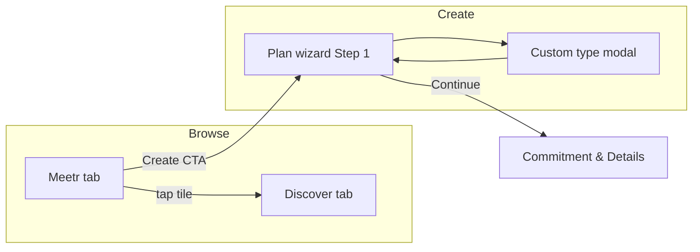
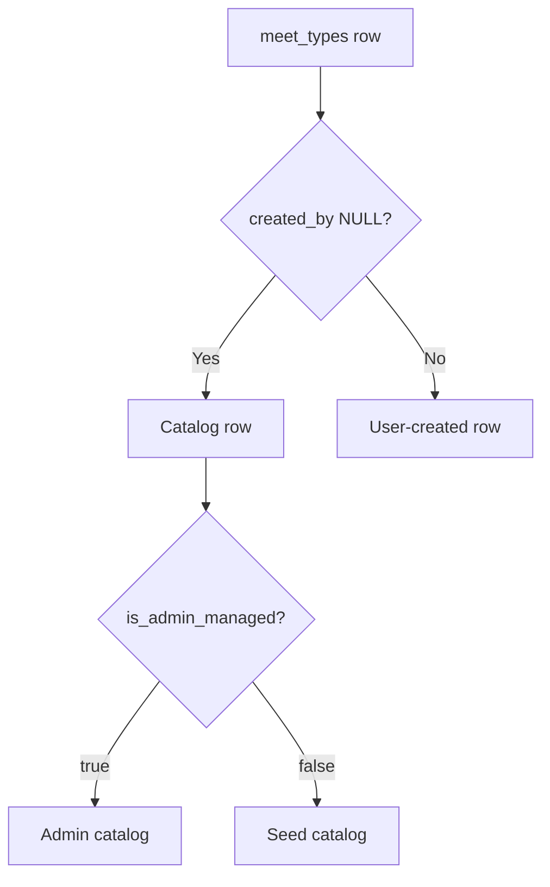
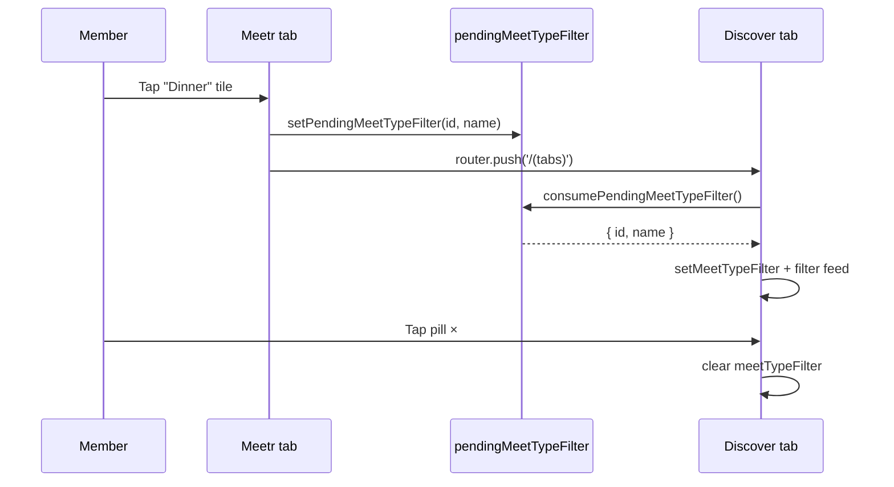
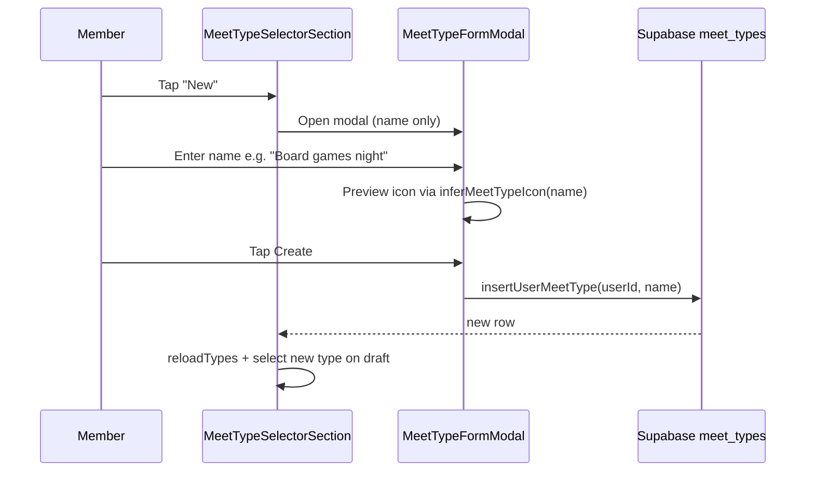
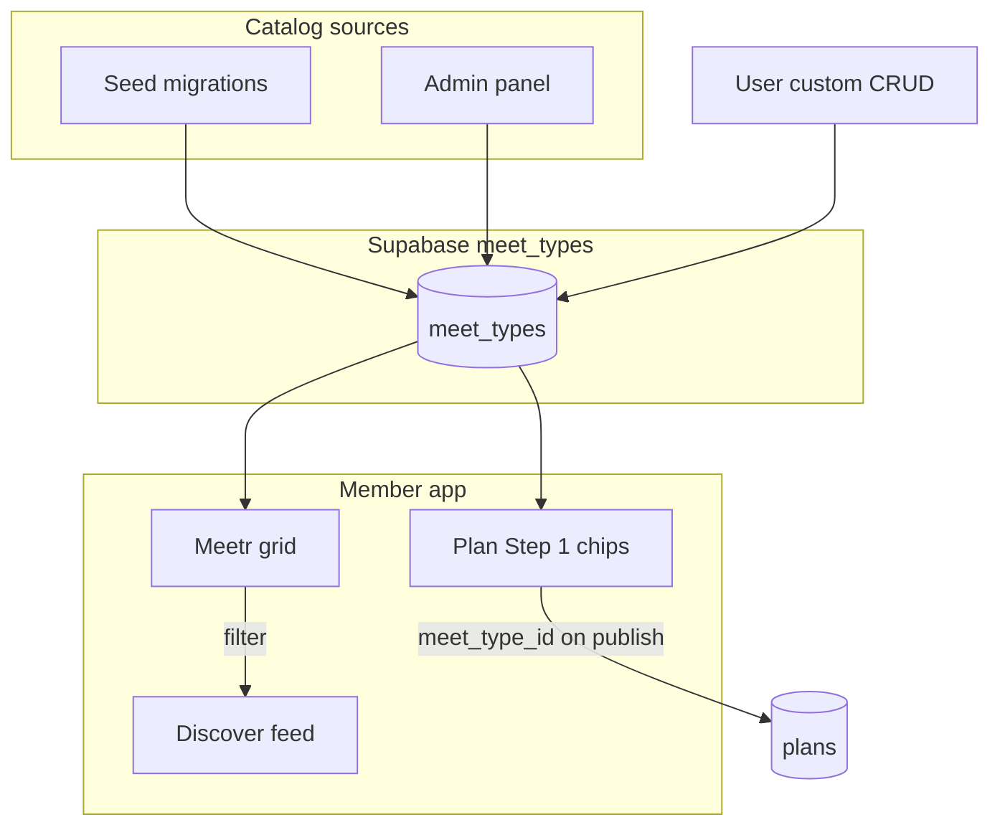

# LinkUp — Meet Types Userflow

This document explains **what meet types are**, how members **browse, filter, create, and manage** them, and how admins **maintain the catalog**. It is written so a **new team member or product stakeholder** can understand the full journey without reading the codebase first.

For how meet types fit into **plan creation, mood overlays, escrow, and Discover ranking**, see [PLAN-TYPES-USERFLOW.md](./PLAN-TYPES-USERFLOW.md) (especially §2 and §8). For general app navigation, see [LINKUP-USERFLOW.md](./LINKUP-USERFLOW.md) and [DISCOVERY-BROWSING-USERFLOW.md](./DISCOVERY-BROWSING-USERFLOW.md).

**Tip:** Mermaid diagrams paste into [Mermaid Live Editor](https://mermaid.live).

---

## How to read this document

| If you need… | Go to… |
|--------------|--------|
| A plain-language explanation of meet types | **§1 What is a meet type?** |
| The three kinds of meet types (catalog, admin, user) | **§2 Meet type origins** |
| Browsing vibes on the Meetr tab | **§3 Meetr — explore by vibe** |
| Filtering Discover after picking a vibe | **§4 Meetr → Discover filter** |
| Picking a type when creating a plan | **§5 Plan creation — Step 1** |
| Creating your own custom meet type | **§6 User-owned meet types** |
| How tiles look (photos, icons, descriptions) | **§7 Visual design & assets** |
| Admin catalog management | **§8 Admin meet types panel** |
| Database fields, RLS, and server rules | **§9 Data model & permissions** |
| What meet types control on a plan | **§10 Plan behavior driven by meet type** |
| Full seeded catalog list | **§11 Catalog inventory** |
| Screens, routes, and code files | **§12 Screen inventory & code map** |
| Common questions & edge cases | **§13 FAQ & troubleshooting** |

---

## Table of contents

1. **§1** — What is a meet type?  
2. **§2** — Meet type origins (seed, admin, user)  
3. **§3** — Meetr tab — explore by vibe  
4. **§4** — Meetr → Discover filter handoff  
5. **§5** — Plan creation Step 1 (meet type selector)  
6. **§6** — User-owned meet types (create / edit / delete)  
7. **§7** — Visual design, covers, icons, descriptions  
8. **§8** — Admin meet types panel  
9. **§9** — Data model, visibility, RLS  
10. **§10** — What meet types control on plans  
11. **§11** — Catalog inventory (seeded types)  
12. **§12** — Screen inventory & code map  
13. **§13** — FAQ & troubleshooting  

---

## §1 What is a meet type?

A **meet type** is the “vibe” or category of a meetup — for example **Dinner**, **Gym**, **Brunch Meet**, or a custom label like **Board games night**.

Every published plan stores a reference to exactly one meet type:

```
plans.meet_type_id  →  meet_types.id
```

Meet types are **not** a fixed enum in the database. They live in a dynamic catalog table (`public.meet_types`) that can grow over time through:

- **Seed migrations** (shipped with the app),
- **Admin-created catalog rows** (visible to all members),
- **User-created custom rows** (visible only to the creator).

### Why meet types matter

| For members | For the product |
|-------------|-----------------|
| Pick a vibe when posting a plan | Drives default duration and escrow rules |
| Browse Meetr tiles to find matching plans | Powers Discover filtering by category |
| Save personal labels (“My running club”) | Separates catalog content from user content |
| See icons and cover art in the UI | Gates mood plans and group plans by type flags |

### High-level member journey



---

## §2 Meet type origins

Every row in `meet_types` falls into one of three **origins**. The app uses `created_by` and `is_admin_managed` to distinguish them.



| Origin | `created_by` | `is_admin_managed` | Who sees it | Who can edit |
|--------|--------------|--------------------|-------------|--------------|
| **Seed catalog** | `NULL` | `false` | All signed-in members | Admins only (Admin panel) |
| **Admin catalog** | `NULL` | `true` | All signed-in members | Admins only (Admin panel) |
| **User custom** | `auth.uid()` | `false` | Creator + catalog types always | Creator only (chip edit/delete) |

**Visibility rule (client):** `filterMeetTypesVisibleToUser()` returns:

1. Every **catalog** row (`created_by IS NULL`), and  
2. Custom rows where `created_by === currentUserId`.

Other members’ custom types are **never** shown in Meetr, the plan picker, or admin lists as selectable options.

**Origin badges in Admin panel:**

| Label | Meaning |
|-------|---------|
| Seed catalog | Legacy migration seed (`created_by` null, not admin-managed) |
| Admin catalog | Created via Admin → Meet types (`is_admin_managed = true`) |
| User | Created by a member (`created_by` set) |

---

## §3 Meetr — explore by vibe

**Route:** `/(tabs)/meetr`  
**File:** `app/(tabs)/meetr.tsx`  
**Tab bar:** Compass icon, label **Meetr** (second tab after Discover)

### §3.1 Purpose

Meetr is a **category browser** — a grid of portrait tiles (Tinder Explore style). Each tile represents one meet type. Tapping a tile does **not** open plan detail; it sends the member to **Discover** with that type pre-filtered (see §4).

### §3.2 Layout

| Section | Content |
|---------|---------|
| Hero | “Explore / Meetr” — *Pick a vibe you like and we'll show matching plans on Discover.* |
| **Browse by vibe** | Catalog meet types (`created_by IS NULL`) |
| **Your meet types** | Custom types owned by the signed-in user (if any) |
| Bottom CTA | **Create a plan with a custom meet type** → `/plan/create` |

Pull-to-refresh reloads active meet types from Supabase.

### §3.3 Tile interaction (`MeetTypeExploreCard`)

| Gesture | Effect |
|---------|--------|
| **Tap** | Apply meet type filter → navigate to Discover |
| **Press & hold / hover** (if type has `description`) | Title fades; full description scrolls in the scrim |
| **Press & hold / hover** (no description) | Title stays visible (legacy catalog rows) |

Custom tiles show a **“Yours”** badge when `isUserMeetType(type, userId)`.

### §3.4 Empty & loading states

| State | What the member sees |
|-------|----------------------|
| Loading | Six skeleton tiles |
| No types | “No meet types yet” + hint to create a custom type when posting |
| Offline / misconfigured Supabase | Empty list after failed fetch |

### §3.5 Data source

```text
fetchActiveMeetTypes()
  → SELECT * FROM meet_types WHERE is_active = true ORDER BY sort_order
  → filterMeetTypesVisibleToUser(rows, userId)
  → split into catalogTypes / customTypes
```

Results are cached in memory for **60 seconds** (`lib/plans/meetTypes.ts`). Any create/update/delete/admin change calls `invalidateMeetTypesCache()`.

---

## §4 Meetr → Discover filter handoff

When a member taps a Meetr tile, the app:

1. Calls `setPendingMeetTypeFilter({ id, name })` (`lib/discovery/pendingMeetTypeFilter.ts`).
2. Navigates to `/(tabs)` (Discover tab).
3. On Discover focus, `consumePendingMeetTypeFilter()` applies the filter once (one-shot; cleared after read).

### §4.1 Discover UI when filtered

| Element | Behavior |
|---------|----------|
| Filter pill | Shows meet type name + compass icon; tap **×** to clear |
| Feed rows | Client filter: `row.meet_type_id === meetTypeFilter.id` |
| Swipe index | Resets when filter changes |
| Mood timeline | Still visible above feed; mood rows also respect meet type filter |

The filter stacks with other Discover filters (search, mood vibe, host presence, distance, etc.).



---

## §5 Plan creation — Step 1

**Route:** `/plan/create` (Step 1 of 3)  
**File:** `app/plan/create/index.tsx`  
**Component:** `MeetTypeSelectorSection`

### §5.1 Entry points

| From | Action |
|------|--------|
| Discover **+ FAB** | `/plan/create` |
| Meetr bottom CTA | `/plan/create` |
| Chat / profile CTAs | Same wizard stack |

Step 1 also includes schedule, duration chips, and (when applicable) mood or group fields — but **meet type selection** is the first decision.

### §5.2 Selector UI

| Control | Behavior |
|---------|----------|
| Chip row | One chip per visible meet type (icon + name) |
| Selected chip | Gradient highlight; drives draft fields |
| **New** chip (dashed) | Opens custom meet type modal |
| Edit / trash icons | Only on **user-owned** chips (not catalog) |

**Default on load:** If draft has no `meetTypeId`, the wizard selects **Dinner** (`slug === 'dinner'`) or the first visible type.

### §5.3 What happens when a type is selected

`applyMeetType(t)` updates the in-memory plan draft:

| Draft field | Source |
|-------------|--------|
| `meetTypeId` | `t.id` |
| `durationMinutes` | `t.default_duration_minutes` |
| `escrowPattern` | `t.default_pattern` (fallback `A`) |
| `isMoodPlan` | Cleared unless `slug === 'mood'` |
| `moodExpiresAt` | Cleared unless mood type |
| `isGroupPlan` / `multiCity` / `cityIds` | Set only when `slug === 'group'` |

### §5.4 Group plan gate

Selecting a meet type with `slug === 'group'` triggers `checkPermission(userId, 'group_plan.host')`. Non–Gold/Platinum members see an upgrade alert. *(Note: `group` is not in the core seed today — the gate is ready when the slug exists.)*

### §5.5 Mood overlay coupling

If the selected type does **not** support mood (`supports_mood = false`), any mood draft state is cleared automatically. Only the **Mood** seed type (`supports_mood = true`) enables `MoodPlanFieldsSection`.

### §5.6 Continue to Step 2

Step 1 **Continue** requires:

- `meetTypeId` set  
- `scheduledAt` set (standard plans) or valid mood window (mood plans)

KYC hard gate may block Continue — see [PLAN-TYPES-USERFLOW.md](./PLAN-TYPES-USERFLOW.md) §6.

---

## §6 User-owned meet types

Members can define **personal meet type labels** without admin access.

### §6.1 Create flow



**Modal fields:** Name only. Icon is inferred from the title and shown as a live preview — members do not pick icons manually.

**Row defaults** (`insertUserMeetType`):

| Field | Value |
|-------|-------|
| `slug` | `u-{slugified-name}-{timestamp-random}` |
| `default_duration_minutes` | 120 |
| `allows_escrow` | `true` |
| `allowed_patterns` | A, B, C |
| `default_pattern` | A |
| `supports_mood` | `false` |
| `sort_order` | 9000 |
| `is_active` | `true` |
| `is_admin_managed` | `false` |
| `created_by` | current user |
| `icon` | `inferMeetTypeIcon(name)` |

### §6.2 Edit flow

- Tap **pencil** on an owned chip → same modal in edit mode.  
- Only **name** can change; icon updates automatically from the new name.  
- RLS: `created_by = auth.uid()` AND `is_admin_managed = false`.

### §6.3 Delete flow

- Tap **trash** on an owned chip → confirm modal.  
- **Blocked** if any plan references the type (`countPlansUsingMeetType > 0`). Member sees a message to change or remove those plans first.  
- If deleted while selected, draft falls back to Dinner (or next available type).

### §6.4 What members cannot do

| Action | Restriction |
|--------|-------------|
| Edit seed / admin catalog types | No edit/delete icons on catalog chips |
| See others’ custom types | Filtered out client-side and by RLS on write |
| Set description / cover URL | User CRUD is name-only today |
| Enable mood on custom types | `supports_mood` stays false at insert |

---

## §7 Visual design, covers, icons, descriptions

### §7.1 Catalog tiles (Meetr)

**Component:** `CatalogMeetTypeCard` inside `MeetTypeExploreCard`

Cover image resolution order (`resolveMeetTypeCoverSource`):

1. **`meet_type_images`** — public Supabase Storage URL (admin/new catalog rows).  
2. **Bundled asset** by slug — `assets/meetr-images/{slug}.jpg` via `meetTypeCatalogCovers.ts`.  
3. **Fallback** — `default.jpg` when slug has no bundled file.

Bundled slugs today: `dinner`, `gym`, `mood`, `casual`, `hangout`, `group`, `default`.

### §7.2 Custom tiles (Meetr)

**Component:** `CustomMeetTypeCard`

- Gradient background from `meetTypeVisuals.meetTypeGradient(slug)` (known slugs get brand colors; unknown use primary→secondary).  
- Centered Ionicons icon from stored `icon` field.  
- Optional description overlay (usually null for user types).

### §7.3 Plan wizard chips

All types (catalog + custom) show **icon + name** in `GradientSelectionChip` rows — no cover photo in Step 1.

### §7.4 Icon inference (`inferMeetTypeIcon`)

Keyword rules map titles to Ionicons names, e.g.:

| Keywords in title | Icon |
|-------------------|------|
| gym, workout, fitness | `barbell-outline` |
| dinner, lunch, restaurant | `restaurant-outline` |
| game, board | `game-controller-outline` |
| coffee, brunch | `cafe-outline` |
| *(no match)* | `sparkles-outline` |

Used for: user create/edit, admin create/edit (automatic), and live preview in modals.

### §7.5 Descriptions

- **New catalog seeds** (migration `20260610000019`) include marketing descriptions shown on Meetr press/hover.  
- **Legacy five types** (Dinner, Casual, Gym, Hangout, Mood) may have `description = NULL` until backfilled — hover reveals nothing extra.  
- Admins can set `description` in the Admin meet types form.

---

## §8 Admin meet types panel

**Route:** `/admin` → tab **Meet types**  
**File:** `components/admin/AdminMeetTypesPanel.tsx`  
**Access:** Requires admin session (`is_admin(auth.uid())`).

### §8.1 Panel layout

| Area | Purpose |
|------|---------|
| Search | Name, slug, description, creator display name |
| **New** button | Open create modal (48px CTA) |
| Filters | All · Active · Archived |
| **Admin & catalog** section | Rows with `created_by IS NULL` |
| **User-created** section | Rows with `created_by` set; creator name in **bold** |

### §8.2 Row actions

| Action | Behavior |
|--------|----------|
| **Active** switch | `adminSetMeetTypeActive` — archive without deleting |
| **Edit** | Opens bottom sheet form |
| **Delete** | Hard delete; blocked if plans exist (same rule as user delete) |

When plans block delete, admin should **turn Active off** (archive) instead.

### §8.3 Create / edit form fields

| Field | Create | Edit |
|-------|--------|------|
| Name | Required | Required |
| Slug | Optional (auto from name) | Optional patch |
| Description | Optional | Optional |
| Cover image URL | Optional (`meet_type_images`) | Optional |
| Duration (minutes) | Default 120 | Editable |
| Active / Supports mood / Restricted | Toggles | Toggles |
| Icon | **Auto** from name | **Auto** from name |
| Sort order | **Auto** (`max(sort_order)+10`) | **Not changed** on save |

Form uses keyboard-aware scrolling so fields stay visible above the IME.

List refresh after save is **silent** (no full-screen loading spinner).

### §8.4 Admin-created row defaults

| Field | Value |
|-------|-------|
| `created_by` | `NULL` |
| `is_admin_managed` | `true` |
| `allows_escrow` | `true` |
| `allowed_patterns` | A, B, C |
| `default_pattern` | A (or form value) |
| `icon` | inferred from name |

Admin types appear in Meetr and plan picker for **all members** but cannot be edited by non-admins.

---

## §9 Data model, visibility, RLS

### §9.1 Table: `public.meet_types`

| Column | Type | Purpose |
|--------|------|---------|
| `id` | UUID | Primary key |
| `name` | TEXT | Display label |
| `slug` | TEXT UNIQUE | Stable key; URLs, bundled covers |
| `description` | TEXT NULL | Meetr hover copy |
| `meet_type_images` | TEXT NULL | Storage URL for tile cover |
| `icon` | TEXT NULL | Ionicons glyph name |
| `default_duration_minutes` | INT | Wizard default |
| `allows_escrow` | BOOL | Financial guard |
| `allowed_patterns` | TEXT[] | Escrow A/B/C allowed on paid plans |
| `default_pattern` | TEXT | Default escrow when paid |
| `is_restricted` | BOOL | Product flag (future gating) |
| `supports_mood` | BOOL | Enables mood overlay in wizard |
| `sort_order` | INT | Meetr + picker ordering |
| `is_active` | BOOL | Archived when false |
| `is_admin_managed` | BOOL | Admin catalog marker |
| `created_by` | UUID NULL | Owner for user types |
| `created_at` | TIMESTAMPTZ | Audit |

### §9.2 Read access

All authenticated members can **SELECT** active meet types (standard RLS read policies). Client-side filtering hides other users’ custom types.

### §9.3 Write policies (summary)

| Policy | Who | Operation |
|--------|-----|-----------|
| `meet_types_insert_user` | Member | INSERT own row, not admin-managed |
| `meet_types_update_user` | Member | UPDATE own row, not admin-managed |
| `meet_types_delete_user` | Member | DELETE own row, not admin-managed |
| `meet_types_admin_*` | Admin | INSERT / UPDATE / DELETE any row |

### §9.4 Storage: `meet-type-images` bucket

Public read; service-role write for seed placeholder. Admins paste public URLs into **Cover image URL** for new catalog tiles.

Placeholder upload (ops):

```bash
npx supabase storage cp --experimental "./supabase/seed/meet-type-images/placeholder-meet-type.png" "ss:///meet-type-images/placeholder-meet-type.png"
```

### §9.5 Migrations (apply in order)

| Migration | Purpose |
|-----------|---------|
| `20260215100000_meet_types_plans_escrow_v2.sql` | Core table + 5 seed types |
| `20260610000019_meet_types_description.sql` | `description`, `meet_type_images`, +16 catalog types |
| `20260620000000_meet_types_user_crud.sql` | User update/delete policies |
| `20260620000004_meet_types_admin.sql` | `is_admin_managed`, admin RLS, tightened user insert |

---

## §10 What meet types control on plans

Selecting a meet type does **not** publish a plan by itself. It sets **defaults and guardrails** consumed later in the wizard and at publish time.

| Meet type field | Effect on plan |
|-----------------|----------------|
| `default_duration_minutes` | Step 1 duration default |
| `default_pattern` | Step 2 escrow default when paid |
| `allowed_patterns` | Paid publish must use allowed pattern (`trg_plans_financial_guard`) |
| `allows_escrow` | If false, type cannot be paid (none of current seeds disable this) |
| `supports_mood` | Step 1 mood toggle availability |
| `slug === 'group'` | Group settings + Gold host permission |
| `slug === 'mood'` | Mood fields; special Discover timeline behavior when mood overlay on |

**Deleting a meet type** does not delete plans: `plans.meet_type_id` uses `ON DELETE SET NULL`.

---

## §11 Catalog inventory

### §11.1 Core seed (5 types)

Source: `20260215100000_meet_types_plans_escrow_v2.sql`

| Name | Slug | Duration | Patterns | Default | Mood | Sort |
|------|------|----------|----------|---------|------|------|
| Mood | `mood` | 240 min | A, C | A | **Yes** | 5 |
| Dinner | `dinner` | 180 min | A, B | A | No | 10 |
| Casual | `casual` | 90 min | A, B | A | No | 20 |
| Gym | `gym` | 60 min | A, B | B | No | 30 |
| Hangout | `hangout` | 120 min | A, B | A | No | 40 |

Legacy rows: typically **no** `description` / `meet_type_images`; Meetr uses bundled JPG covers.

### §11.2 Extended catalog (+16 types)

Source: `20260610000019_meet_types_description.sql` — each includes description + placeholder Storage URL.

| Name | Slug | Duration (min) | Sort |
|------|------|----------------|------|
| Brunch Meet | `brunch-meet` | 90 | 60 |
| Street Food | `street-food` | 90 | 70 |
| Cook-Together Experience | `cook-together-experience` | 120 | 80 |
| Lounge & Drinks | `lounge-drinks` | 120 | 90 |
| Live Event / Concert Companion | `live-event-concert-companion` | 180 | 100 |
| Game Night | `game-night` | 120 | 110 |
| Run Club / Outdoor Fitness | `run-club-outdoor-fitness` | 60 | 120 |
| Spa & Wellness Day | `spa-wellness-day` | 180 | 130 |
| Sports Companion | `sports-companion` | 120 | 140 |
| Travel Companion | `travel-companion` | 480 | 150 |
| Weekend Getaway | `weekend-getaway` | 2880 | 160 |
| City Tour / Staycation | `city-tour-staycation` | 240 | 170 |
| Road Trip Companion | `road-trip-companion` | 480 | 180 |
| Companionship Arrangement | `companionship-arrangement` | 120 | 190 |
| Plus-One / Event Date | `plus-one-event-date` | 180 | 200 |
| Virtual Companion | `virtual-companion` | 60 | 210 |

All extended types: `allowed_patterns` A/B/C, `default_pattern` A, `supports_mood` false (except core Mood type).

### §11.3 User custom types

Unbounded labels; sort_order **9000**; slug prefix **`u-`**. Visible only to creator in picker and Meetr “Your meet types” section.

---

## §12 Screen inventory & code map

### §12.1 Member-facing screens

| Screen | Route | File |
|--------|-------|------|
| Meetr explore | `/(tabs)/meetr` | `app/(tabs)/meetr.tsx` |
| Discover (filter target) | `/(tabs)/index` | `app/(tabs)/index.tsx` |
| Plan wizard Step 1 | `/plan/create` | `app/plan/create/index.tsx` |
| Plan management (shows type on plans) | `/settings/plan-management` | `app/settings/plan-management.tsx` |

### §12.2 Admin

| Screen | Route | File |
|--------|-------|------|
| Admin shell + Meet types tab | `/admin` | `app/admin/index.tsx` |
| Meet types panel | *(tab panel)* | `components/admin/AdminMeetTypesPanel.tsx` |

### §12.3 Components

| Component | Role |
|-----------|------|
| `MeetTypeExploreCard` | Meetr portrait tile + description reveal |
| `MeetTypeSelectorSection` | Plan Step 1 chips + user CRUD |
| `MeetTypeFormModal` | User create/edit name modal |

### §12.4 Libraries

| Module | Role |
|--------|------|
| `lib/plans/meetTypes.ts` | Fetch active types, cache, visibility filter |
| `lib/plans/insertUserMeetType.ts` | User INSERT |
| `lib/plans/userMeetTypeCrud.ts` | User update/delete, plan count guard |
| `lib/plans/adminMeetTypeCrud.ts` | Admin CRUD, sort order helper |
| `lib/plans/inferMeetTypeIcon.ts` | Title → Ionicons |
| `lib/plans/resolveMeetTypeCoverSource.ts` | Storage URL → bundled fallback |
| `lib/plans/meetTypeCatalogCovers.ts` | Slug → local JPG |
| `lib/plans/meetTypeVisuals.ts` | Custom tile gradients + icon helper |
| `lib/discovery/pendingMeetTypeFilter.ts` | Meetr → Discover one-shot filter |

### §12.5 Types

| Type | File |
|------|------|
| `DbMeetType` | `types/database.ts` |

---

## §13 FAQ & troubleshooting

### For members

**Q: I created “Board games night” but my friend can’t see it in Meetr.**  
A: Custom types are **private to you**. Friends only see **catalog** types in Meetr. Your custom label appears on **your** plans and in **your** plan picker.

**Q: Why can’t I delete my custom type?**  
A: At least one plan still references it. Change those plans to another type or delete the plans, then try again.

**Q: I tapped Dinner in Meetr but still see unrelated plans.**  
A: Clear other filters (search, mood vibe, distance). Tap the **meet type pill** on Discover to remove the category filter. Mood timeline cards may still show mood plans that match the filter.

**Q: Why doesn’t hover show a description on Dinner?**  
A: Legacy catalog types may lack `description` until backfilled. Newer seeded types (Brunch Meet, Game Night, etc.) include descriptions.

**Q: Can I pick my own icon?**  
A: No — icons are **inferred from the name** automatically whenever you create or rename a type.

### For admins

**Q: Delete is blocked for a catalog type.**  
A: Plans reference it. Set **Active** off to archive instead of deleting.

**Q: Where do cover images live?**  
A: Either upload to the `meet-type-images` bucket and paste the public URL, or rely on bundled assets for slugs that exist in `assets/meetr-images/`.

**Q: New admin type doesn’t appear.**  
A: Confirm **Active** is on and `is_admin_managed = true`. Members only fetch `is_active = true` rows. Cache TTL is 60s — pull to refresh Meetr.

### For engineers

**Q: Plan publish fails on escrow pattern.**  
A: Check `meet_types.allowed_patterns` vs draft `escrowPattern`. Custom types allow A/B/C but subscription/KYC may still block B/C in UI.

**Q: User can’t update a type they didn’t create.**  
A: Expected — RLS requires `created_by = auth.uid()` and `is_admin_managed = false`.

**Q: After admin edit, Meetr shows stale data.**  
A: Ensure `invalidateMeetTypesCache()` ran (all CRUD helpers call it). Client cache TTL is 60 seconds max.

---

## Appendix A — End-to-end flow map



---

## Appendix B — Maintenance checklist

When changing meet type behavior, update **this file** and verify:

1. `meet_types` migrations / seeds  
2. `AdminMeetTypesPanel` form fields  
3. `MeetTypeSelectorSection` + `MeetTypeFormModal`  
4. `MeetTypeExploreCard` + cover resolution  
5. `filterMeetTypesVisibleToUser` visibility rules  
6. RLS policies in latest admin migration  
7. [PLAN-TYPES-USERFLOW.md](./PLAN-TYPES-USERFLOW.md) §2 for plan wizard impact  
8. [DISCOVERY-BROWSING-USERFLOW.md](./DISCOVERY-BROWSING-USERFLOW.md) if Discover filter UX changes  

*Last aligned to codebase: Meetr tab, admin meet types panel, description/cover migration, user & admin CRUD, silent admin list refresh, auto icon/sort on admin create.*
