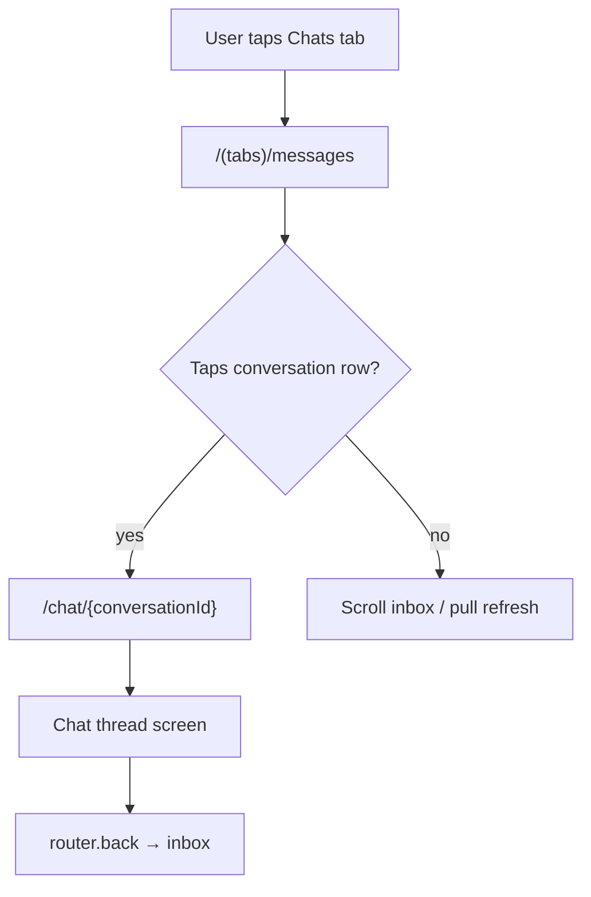
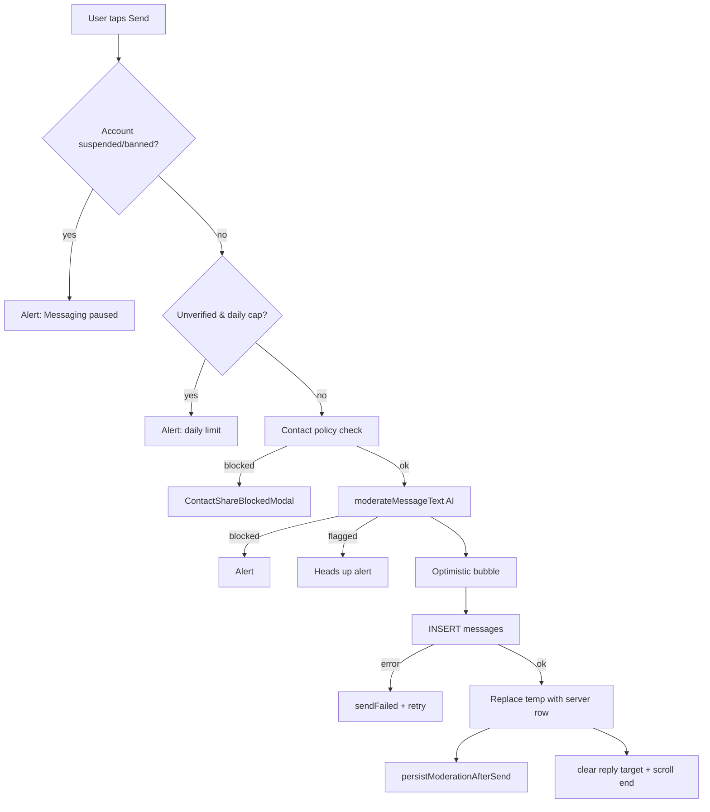
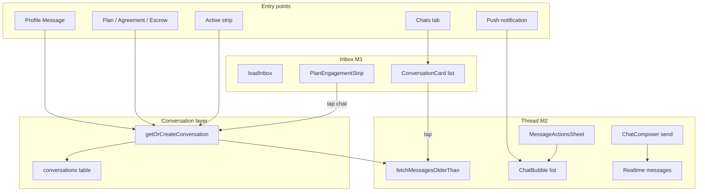

# LinkUp — Messaging & Chat Userflow

This document is the **authoritative reference** for every user journey related to **direct messaging and chat** in LinkUp: the Messages inbox, 1:1 chat threads, message actions (reply, edit, delete, forward, pin), media, presence, trust gates, and all routes that open or surface chat.

**Related docs**

| Doc | Scope |
|-----|--------|
| [LINKUP-USERFLOW.md](./LINKUP-USERFLOW.md) | End-to-end app journeys (auth, plans, escrow, onboarding) |
| [DISCOVERY-BROWSING-USERFLOW.md](./DISCOVERY-BROWSING-USERFLOW.md) | Discover tab, plan browsing, engagement strip context |
| [LINKUP-USER-GUIDE.md](./LINKUP-USER-GUIDE.md) | User-facing product guide |

**Tip:** Mermaid diagrams paste into [Mermaid Live Editor](https://mermaid.live).

---

## How to read this document

| If you need… | Go to… |
|--------------|--------|
| Where messaging starts after login | **§1 Entry & routing** |
| How conversations are created | **§2 Conversation model** |
| Messages tab / inbox behaviour | **§3 Inbox** |
| Chat thread layout and header | **§4 Thread screen** |
| Sending text or media | **§5–§6** |
| Long-press actions (reply, edit, delete…) | **§7 Message actions** |
| Trust limits & contact blocking | **§12 Trust & safety** |
| Realtime & read state | **§13 Presence & reads** |
| Plan negotiation chat (offers) | **§15 Negotiation chat** |
| All entry points into chat | **§16 Entry points** |
| Schema & migrations | **§18 Database** |
| File map | **§20 Screen inventory** |
| Known gaps | **Appendix A** |

---

## Table of contents

1. **§1** — Entry & routing  
2. **§2** — Conversation model (`conversations` + `getOrCreateConversation`)  
3. **§3** — Messages inbox (`/(tabs)/messages`)  
4. **§4** — Chat thread (`/chat/[id]`)  
5. **§5** — Message load, pagination & optimistic send  
6. **§6** — Send text  
7. **§7** — Send media (photo / video)  
8. **§8** — Long-press message actions  
9. **§9** — Reply threading  
10. **§10** — Edit messages  
11. **§11** — Delete messages (for me / for everyone)  
12. **§12** — Forward & pin  
13. **§13** — Composer quick actions (Plan / Offer / Place / Media)  
14. **§14** — Presence, typing & read receipts  
15. **§15** — Negotiation chat (plan offers timeline)  
16. **§16** — External entry points into chat  
17. **§17** — Engagement surfaces (Active strip, Offers carousel)  
18. **§18** — Database schema & migrations  
19. **§19** — Trust, moderation & contact policy  
20. **§20** — Screen inventory & code map  
21. **§21** — Complete flow connection map  

---

## §1 Entry & routing

### §1.1 Tab shell

| Route | File | Tab label |
|-------|------|-----------|
| `/(tabs)/messages` | `app/(tabs)/messages.tsx` | **Chats** |
| `/chat/[id]` | `app/chat/[id].tsx` | Stack (no tab bar) |
| `/messages` | `app/messages/index.tsx` | Redirect → `/(tabs)/messages` |



### §1.2 Deep links & notifications

| Source | Destination | File |
|--------|-------------|------|
| Push / in-app notification `chatId` | `/chat/{chatId}` | `lib/notifications/navigateFromNotification.ts` |
| Push `href` starting with `/` | That route | same |
| `openDirectChat()` | `/chat/{conversationId}` | `lib/messaging/openDirectChat.ts` |

---

## §2 Conversation model

### §2.1 Data shape

Direct messages are **1:1 only**. Table `conversations`:

| Column | Notes |
|--------|-------|
| `id` | UUID primary key |
| `user_a`, `user_b` | Canonical ordered pair (`user_a < user_b`) |
| `created_at` | Thread creation |
| `pinned_message_id`, `pinned_at`, `pinned_by` | Per-thread pin (migration `20260620000001`) |

**Constraint:** `UNIQUE (user_a, user_b)` — one thread per pair.

### §2.2 Create or open

```text
openDirectChat(client, currentUserId, otherUserId)
  → getOrCreateConversation(client, uid1, uid2)   // lib/conversations.ts
  → SELECT existing OR INSERT { user_a, user_b }
  → router.push(`/chat/${conversationId}`)
```

| Function | File |
|----------|------|
| `orderPair` | `lib/conversations.ts` |
| `getOrCreateConversation` | `lib/conversations.ts` |
| `openDirectChat` | `lib/messaging/openDirectChat.ts` |

### §2.3 RLS

- **SELECT / INSERT** on `conversations`: participant (`user_a` or `user_b`) only — `linkup_init.sql`
- **UPDATE** on `conversations`: participants (pin/unpin) — `20260620000001_chat_forward_pin.sql`

---

## §3 Inbox (`/(tabs)/messages`)

**File:** `app/(tabs)/messages.tsx`  
**Label:** M1 — Inbox

### §3.1 Screen anatomy (top → bottom)

| Region | Component | Purpose |
|--------|-----------|---------|
| Hero header | Inline gradient + badge | Title **Chats**, unread total badge |
| List header | `PlanEngagementStrip` | Horizontal **Active** strip (agreements, offers) |
| List header | “Recent” pill | Shown when inbox has rows |
| Body | `ConversationCard` rows | One row per conversation |
| Empty | `MessagesEmptyState` | CTA → Discover tab |
| Loading | `MessagesInboxSkeleton` | Initial load skeleton |

### §3.2 Inbox data pipeline

```mermaid
flowchart LR
  A[loadInbox] --> B[Fetch conversations for user]
  B --> C[Fetch all messages in those convs ordered DESC]
  C --> D[Pick last message per conversation_id]
  D --> E[Resolve media kind for preview]
  E --> F[Merge profiles for other user]
  F --> G[getLastReadMap AsyncStorage]
  G --> H[Compute unread per row]
  H --> I[Sort by last activity DESC]
```



| Step | Query / lib | Notes |
|------|-------------|-------|
| Conversations | `conversations` WHERE `user_a` OR `user_b` = viewer | All threads |
| Last message | `messages` IN conversation ids, order `created_at DESC`, first per conv | Not filtered by `message_user_deletions` (see Appendix A) |
| Preview text | `previewForLast()` | Deleted → “Message deleted”; image/video labels |
| Unread | `last.sender_id !== me` AND (`!readAt` OR `last.created_at > readAt`) | `readAt` from AsyncStorage `@linkup/inbox_last_read_v1` |
| Sort | `timeIso` descending | Most recent thread first |

### §3.3 Inbox realtime

- Channel: `inbox-msgs:{userId}:{runId}`
- Subscribes to `messages` **INSERT** and **UPDATE** for up to **48** conversation IDs
- Debounce: immediate `loadInbox()` on each event
- Engagement strip reloads on pull-to-refresh only (focus reloads strip separately)

### §3.4 Row tap

`router.push(`/chat/${conversation.id}`)` — opens thread with conversation UUID (not user id).

---

## §4 Chat thread (`/chat/[id]`)

**File:** `app/chat/[id].tsx`  
**Label:** M2 — Chat thread  
**Param:** `id` = `conversation_id`

### §4.1 Screen anatomy (top → bottom)

| Region | Component | User action |
|--------|-----------|-------------|
| Header | Back, avatar, name, presence / meetup pill | Tap avatar → `/user/[peerId]` |
| Header actions | Palette, safety (⋯) | Appearance sheet; safety menu |
| Trust banner | Inline (unverified only) | Informational — daily cap + no media |
| Pin banner | `PinnedMessageBanner` | Tap → scroll to message; unpin |
| Message list | `FlatList` + `ChatBubble` | Scroll; pull older at top |
| Typing | `ChatTypingIndicator` | Shown when peer typing |
| Composer | `ChatComposer` | Text, reply bar, quick actions, send |
| Modals / sheets | See §8–§12 | Actions, edit, forward, safety |

### §4.2 Thread bootstrap

On mount (`conversationId`):

1. `loadChatAppearance()` → local preset / wallpaper
2. `loadInitial()` — fetch latest `CHAT_PAGE_SIZE` (40) messages + media + signed URLs
3. `fetchHiddenMessageIdsForConversation` — delete-for-me ids → filter display
4. Load peer profile from `conversations` → other `user_a`/`user_b`
5. `fetchUserPresence` + `subscribeUserPresenceRealtime`
6. `fetchConversationPin` + `subscribeConversationRealtime` (pin changes)
7. `subscribeThreadMessagesRealtime` (INSERT / UPDATE / DELETE on `messages`)
8. `fetchActiveMeetupWithPeer` → header meetup pill if shared plan exists

### §4.3 Linked meetup pill

When `fetchActiveMeetupWithPeer` finds a plan linking host + peer (via offers):

- Header shows plan title pill → `/plan/[id]`
- Composer **Offer** quick action → that plan if linked, else Discover prompt
- Safety sheet **Plan dispute** → `/dispute/[planId]` when status allows

---

## §5 Message load, pagination & optimistic send

### §5.1 Pagination

| Function | File | Behaviour |
|----------|------|-----------|
| `fetchMessagesOlderThan` | `lib/messaging/chatQueries.ts` | Newest page first; `beforeCreatedAt` for older |
| `loadOlder` | `app/chat/[id].tsx` | `onStartReached` on `FlatList`; merges + dedupes |
| `CHAT_PAGE_SIZE` | `chatQueries.ts` | 40 |

Media resolution per page:

1. By `messages.media_id` → `media` table  
2. Fallback: `media.parent_table = 'messages'` + `parent_id`

Signed URLs: `supabase.storage.createSignedUrl` cached in `signedByPath`.

### §5.2 Column fallback

`runMessageSelect` / `chatMessageSelectColumns()` retries without missing columns:

| Tier | Columns |
|------|---------|
| Full | base + `reply_to_message_id` + `is_forwarded` + `forwarded_from_message_id` |
| With reply | base + `reply_to_message_id` |
| Base | `id, text, body, media_id, sender_id, created_at, edited_at, deleted_at` |

Supports DBs that have not applied forward/reply migrations yet.

### §5.3 Optimistic send

Failed sends keep a row with `tempKey` + `sendFailed: true` → `ChatBubbleStatus` “Not sent · Tap to retry” → `retryOptimistic`.

---

## §6 Send text



| Field | Value |
|-------|-------|
| `conversation_id` | thread id |
| `sender_id` | auth user |
| `text` | trimmed body |
| `moderation_status` | `clean` or `flagged` |
| `reply_to_message_id` | optional, from `replyTarget` |

**Typing:** `signalTyping(conversationId)` on text change; `clearTyping()` on send.

**Gates:**

| Gate | Condition | File |
|------|-----------|------|
| Suspended / banned | `dbUser.account_status` | `chat/[id].tsx` |
| Unverified daily cap | 8 sends / UTC day | `lib/messaging/trustCaps.ts` (`UNVERIFIED_DAILY_MESSAGE_CAP`) |
| Contact share | Until plan completion ack | `lib/messaging/contactSharePolicy.ts` |

---

## §7 Send media (photo / video)

**Trigger:** Composer `+` → **Media** → `pickAndSendMedia`

| Step | Detail |
|------|--------|
| Verification | **Required** — unverified users get alert, attach disabled in UI |
| Picker | `expo-image-picker` library, images + video (max 60s) |
| Video size cap | ~14 MB (`MAX_VIDEO_BYTES`) |
| Image | Resize width 1600, JPEG compress |
| Flow | INSERT message (optional caption) → upload `chat-media` bucket → INSERT `media` → UPDATE `media_id` |
| Reply | Caption message can include `reply_to_message_id` |
| Rollback | On upload/media failure: delete message row + storage object |

Legacy display: rows with body `[image] {url}` still render via `parseLegacyImageBody`.

---

## §8 Long-press message actions

**UI:** `MessageActionsSheet` — bottom sheet modal  
**Builder:** `lib/messaging/buildMessageActions.ts`  
**Rules:** `lib/messaging/messageEditRules.ts`

Long-press (`delayLongPress: 350`) on any non-optimistic bubble opens the sheet.  
**Not available** on `tempKey` optimistic rows.

### §8.1 Action matrix

| Action | Received msg | Sent msg (any age) | Sent msg (≤ 15 min) | Deleted for everyone |
|--------|--------------|--------------------|----------------------|---------------------|
| **Reply** | ✓ | — | — | — |
| **Copy** | ✓ (if text/media label) | ✓ | ✓ | — |
| **Forward** | ✓ | ✓ | ✓ | — |
| **Edit** | — | — | ✓ (text only) | — |
| **Pin / Unpin** | ✓ | ✓ | ✓ | — |
| **Delete for me** | ✓ | ✓ | ✓ | — |
| **Delete for everyone** | — | — | ✓ | — |

**Time windows** (`messageEditRules.ts`):

| Constant | Duration |
|----------|----------|
| `MESSAGE_EDIT_WINDOW_MS` | 15 minutes |
| `MESSAGE_DELETE_FOR_EVERYONE_MS` | 15 minutes |

### §8.2 Sheet order

Reply → Copy → Forward → Edit → Pin/Unpin → Delete for me → Delete for everyone

---

## §9 Reply threading

### §9.1 Start reply

- Long-press **received** message → **Reply**
- `buildReplyQuoteFromTarget` → `replyTarget` state
- `ReplyPreviewBar` above composer shows sender + preview
- Cancel clears `replyTarget`

### §9.2 Send with reply

- INSERT includes `reply_to_message_id`
- Bubble renders quote block via `resolveReplyQuote` + `messagesById` map
- Tap quote → `scrollToMessage` + brief highlight

### §9.3 Schema

- Column: `messages.reply_to_message_id` → `messages(id) ON DELETE SET NULL`
- Migration: `20260619000000_chat_realtime_reads_reply.sql`

---

## §10 Edit messages

### §10.1 Client flow

1. Long-press own text message (within 15 min) → **Edit**
2. Modal with `TextInput` pre-filled
3. `editMessage()` in `lib/messaging/editMessage.ts`
4. UPDATE `text`, `edited_at`, `moderation_status`
5. Bubble shows **Edited** label (`showEdited`)

**Not editable:** media-only messages (no text), messages outside window, deleted messages.

### §10.2 Server enforcement

- Trigger `tr_messages_enforce_edit_window` — rejects text/body changes after 15 minutes
- Migration: `20260620000002_message_edit_window.sql`
- `body` kept in sync via `tr_messages_body_text` trigger (`20240412000002`)

### §10.3 Realtime

Peer sees update via `subscribeThreadMessagesRealtime` → `onUpdate` merges row.

---

## §11 Delete messages

### §11.1 Delete for me

**Scope:** Any message (sent or received) not already soft-deleted for everyone.

```text
hideMessageForMe(userId, messageId, conversationId)
  → UPSERT message_user_deletions
  → Remove from local messages state
  → hiddenForMeIds Set updated
```

- Table: `message_user_deletions` (`user_id`, `message_id`, `conversation_id`)
- Migration: `20260620000003_message_delete_for_me.sql`
- RLS: own rows only
- Reload: `fetchHiddenMessageIdsForConversation` on thread open
- Pin banner hidden if pinned message was deleted-for-me locally

**Peer still sees the message.**

### §11.2 Delete for everyone

**Scope:** Own messages only, within **15 minutes** of `created_at`.

```text
deleteMessageForEveryone(supabase, message, viewerId)
  → UPDATE messages SET deleted_at, text/body/media_id NULL
```

- Bubble: “You deleted this message” / “This message was deleted”
- Auto-unpin if pinned message deleted (`onUpdate` handler)
- Server trigger: `tr_messages_enforce_delete_everyone_window`

### §11.3 Confirm dialogs

| Action | Copy |
|--------|------|
| Delete for me | “Removed from your chat. The other person can still see it.” |
| Delete for everyone | “Removes the message for you and the other person.” |

---

## §12 Forward & pin

### §12.1 Forward

1. Long-press → **Forward** → `ForwardMessageSheet`
2. `fetchForwardTargets(userId, excludeCurrentConv)` — other 1:1 threads
3. `forwardMessage()` — INSERT in target conv with `is_forwarded: true`, `forwarded_from_message_id`
4. Media: storage copy to new path + new `media` row
5. Success alert: Stay / Open chat

**Cannot forward** deleted messages.

### §12.2 Pin

| Action | Effect |
|--------|--------|
| Pin | UPDATE `conversations` set `pinned_message_id`, `pinned_at`, `pinned_by` |
| Unpin | Clear pin columns |
| Banner | `PinnedMessageBanner` at list top |
| Realtime | `subscribeConversationRealtime` syncs pin for both participants |
| Deleted pin target | Banner hidden; auto-unpin on delete-for-everyone |

**Lib:** `lib/messaging/conversationPin.ts`  
**Migration:** `20260620000001_chat_forward_pin.sql`

---

## §13 Composer quick actions

**Component:** `ChatComposer` + `ChatQuickActionsBar`  
**Toggle:** `+` button expands tools row

| Action | Handler | Result |
|--------|---------|--------|
| **Plan** | `onPlan` | `router.push('/plan/create')` |
| **Offer** | `onQuickSendOffer` | Linked plan detail OR Discover alert |
| **Place** | `suggestMeetingArea` | Reverse geocode → append “I'm usually around…” to composer text |
| **Media** | `pickAndSendMedia` | §7 |

---

## §14 Presence, typing & read receipts

### §14.1 Header presence

- `fetchUserPresence` + `subscribeUserPresenceRealtime`
- `derivePresenceUi(viewerProfile, peerPrefs, peerPresence)` → online / last seen caption
- Respects peer visibility preferences (`lib/presence/visibilityPrefs.ts`)

### §14.2 Typing indicator

- Viewer sends typing via `PresenceContext.signalTyping(conversationId)`
- Shown when `peer.typing_conversation_id === conversationId` and `typing_updated_at` within `TYPING_STALE_MS`
- Gated by `typingVisibleToViewer(profile, peer?.preferences)`

### §14.3 Read receipts (outgoing ticks)

| Tick | Meaning | Implementation |
|------|---------|----------------|
| ✓ | Sent (in thread) | `showSent` on own non-temp messages |
| ✓✓ | Read | `showRead` when `readReceiptsOn` AND heuristic match |

**Read receipt preference:** `getVisibilityPrefs(profile).read_receipts` — user can disable showing receipts.

**Current read logic (thread):** `approxReadByMessageId` — heuristic: own message is “read” if peer sent any **later** message. Does **not** use `conversation_reads` cursor in UI yet.

### §14.4 Mark conversation read

On thread open / new messages:

```text
setConversationLastRead(conversationId, lastMessage.created_at, messageId?)
  → AsyncStorage @linkup/inbox_last_read_v1
  → markConversationRead() RPC → conversation_reads table
```

**Server read cursor:** `lib/messaging/conversationReads.ts`  
**Realtime helper exists but unused in thread:** `subscribeConversationReadsRealtime.ts` (see Appendix A)

### §14.5 Inbox unread

Computed from AsyncStorage `getLastReadMap()` vs last message timestamp — not from `conversation_reads` SELECT in inbox load.

---

## §15 Negotiation chat (plan offers timeline)

**Not a DM thread** — separate UI for price/time negotiation on a plan.

| Item | Detail |
|------|--------|
| Component | `components/plans/negotiation/NegotiationChat.tsx` |
| Route context | `/plan/[id]/negotiate` (embedded) |
| Data | `plan_offers` ordered by `created_at` |
| UI | `OfferBubble` timeline + composer (amount, note, proposed time) |
| Open DM | `getOrCreateConversation` → `/chat/{id}` (“Open chat” button) |
| Gates | KYC verification for sending offers; mood window closed blocks negotiate |

This is **offer negotiation**, not the `messages` table. Users often continue alignment in `/chat/[id]` after offers.

---

## §16 External entry points into chat

| Surface | Trigger | File |
|---------|---------|------|
| Messages inbox row | Tap `ConversationCard` | `app/(tabs)/messages.tsx` |
| Public profile | Message button | `app/user/[id].tsx` → `openDirectChat` |
| Plan detail | Message host/guest | `app/plan/[id]/index.tsx` |
| Plan agreement | Open chat with counterpart | `app/plan/[id]/agreement.tsx` |
| Escrow detail | Message other party | `app/escrow/[id].tsx` |
| Plan interest strip | Avatar tap on interested user | `components/plans/PlanInterestedStrip.tsx` |
| Messages Active strip | Tap engagement avatar | `components/discovery/PlanEngagementStrip.tsx` |
| Negotiation screen | Open chat | `NegotiationChat.tsx` |
| Push notification | `chatId` in payload | `navigateFromNotification.ts` |
| Forward success | “Open chat” | `app/chat/[id].tsx` |

All paths converge on `getOrCreateConversation` + `/chat/[conversationId]`.

---

## §17 Engagement surfaces (Active strip, Offers carousel)

### §17.1 PlanEngagementStrip (Messages tab)

| Item | Detail |
|------|--------|
| Data | `fetchFeedEngagementCarousel(userId)` |
| Items | Ongoing agreements, pending sent offers, pending received offers |
| Tap | `openDirectChat` with `otherUserId` |
| Long-press | Plan detail or agreement route |
| Presence | `fetchPresenceMap` for online dots |

### §17.2 EngagementCarousel (Offers tab)

| Item | Detail |
|------|--------|
| Component | `components/plans/EngagementCarousel.tsx` |
| Mounted in | `app/(tabs)/offers.tsx` (above Sent/Received) |
| Data | Same `fetchFeedEngagementCarousel` |
| Navigation | Built into carousel card press (agreement / plan) |

---

## §18 Database schema & migrations

### §18.1 Core tables

**`conversations`**

| Column | Migration |
|--------|-----------|
| `id`, `user_a`, `user_b`, `created_at` | `20240406120000_linkup_init.sql` |
| `pinned_message_id`, `pinned_at`, `pinned_by` | `20260620000001_chat_forward_pin.sql` |

**`messages`**

| Column | Migration |
|--------|-----------|
| `id`, `conversation_id`, `sender_id`, `body`, `created_at`, `moderation_status` | init |
| `text`, `media_id` | `20240412000002_messages_text_media_id.sql` |
| `edited_at`, `deleted_at` | `20240421000000_messages_edit_soft_delete.sql` |
| `reply_to_message_id` | `20260619000000_chat_realtime_reads_reply.sql` |
| `is_forwarded`, `forwarded_from_message_id` | `20260620000001_chat_forward_pin.sql` |

**`conversation_reads`**

| Column | Purpose |
|--------|---------|
| `conversation_id`, `user_id` PK | Per-user read cursor |
| `last_read_at`, `last_read_message_id` | Server read state |
| RPC `mark_conversation_read` | Upsert on thread view |

**`message_user_deletions`**

| Column | Purpose |
|--------|---------|
| `user_id`, `message_id` PK | Delete-for-me |
| `conversation_id` | Fast per-thread fetch |

### §18.2 Triggers & enforcement

| Trigger | Purpose | File |
|---------|---------|------|
| `tr_messages_body_text` | Sync `text` ↔ `body` | `20240412000002` |
| `tr_messages_enforce_edit_window` | 15 min edit limit | `20260620000002` |
| `tr_messages_enforce_delete_everyone_window` | 15 min delete-for-everyone | `20260620000003` |

### §18.3 Realtime publication

| Table | Migration |
|-------|-----------|
| `messages` | `20260619000000` (INSERT/UPDATE/DELETE in thread) |
| `conversations` | `20260620000001` (pin UPDATE) |

### §18.4 Storage

| Bucket | Use |
|--------|-----|
| `chat-media` | Uploaded photos/videos `{userId}/{messageId}-{ts}.{ext}` |

### §18.5 Recommended deploy order (chat-specific)

1. `20240421000000_messages_edit_soft_delete.sql`  
2. `20240412000002_messages_text_media_id.sql` (if not already)  
3. `20260619000000_chat_realtime_reads_reply.sql`  
4. `20260620000001_chat_forward_pin.sql`  
5. `20260620000002_message_edit_window.sql`  
6. `20260620000003_message_delete_for_me.sql`  

---

## §19 Trust, moderation & contact policy

### §19.1 Verification & caps

| Rule | Value | File |
|------|-------|------|
| Unverified daily message cap | 8 / UTC day | `trustCaps.ts` |
| Media send | Verified only | `chat/[id].tsx` |
| Full messaging | `verification_status === 'verified'` | `isMessagingFullyVerified` |

### §19.2 AI moderation

- `moderateMessageText` on send and edit (`lib/ai`)
- Status: `blocked` | `flagged` | `clean`
- `persistModerationAfterSend` logs sample for trust pipeline

### §19.3 Off-platform contact blocking

Until `pair_contact_share_unlocked(peer)` (both completed shared plan):

- Detects email, phone, WhatsApp, Telegram, Instagram, Snapchat patterns
- Blocks send; shows `ContactShareBlockedModal`
- Strike RPC `record_contact_share_strike` on dismiss-from-send path

**Lib:** `lib/messaging/contactSharePolicy.ts`

### §19.4 Account status

`suspended` / `banned` → cannot send text or media; alert shown.

### §19.5 Safety UI

| Component | Entry |
|-----------|-------|
| `ChatSafetyEntrySheet` | Header ⋯ |
| `ReportSheet` | Report member |
| Plan dispute link | When `linkedMeetup` in dispute-eligible status |

---

## §20 Screen inventory & code map

### §20.1 Routes

| Route | Screen file |
|-------|-------------|
| `/(tabs)/messages` | `app/(tabs)/messages.tsx` |
| `/messages` | `app/messages/index.tsx` (redirect) |
| `/chat/[id]` | `app/chat/[id].tsx` |
| `/chat/_layout` | `app/chat/_layout.tsx` |

### §20.2 Components

| Component | Path | Role |
|-----------|------|------|
| `ConversationCard` | `components/messages/ConversationCard.tsx` | Inbox row |
| `MessagesEmptyState` | `components/messages/MessagesEmptyState.tsx` | Empty inbox |
| `MessagesInboxSkeleton` | `components/messages/MessagesInboxSkeleton.tsx` | Loading |
| `PlanEngagementStrip` | `components/discovery/PlanEngagementStrip.tsx` | Active strip |
| `EngagementCarousel` | `components/plans/EngagementCarousel.tsx` | Offers tab carousel |
| `ChatBubble` | `components/messages/ChatBubble.tsx` | Message bubble |
| `ChatComposer` | `components/messages/ChatComposer.tsx` | Input + tools |
| `ChatQuickActionsBar` | `components/messages/ChatQuickActionsBar.tsx` | Plan/Offer/Place/Media |
| `MessageInput` | `components/messages/MessageInput.tsx` | Text field + send |
| `ReplyPreviewBar` | `components/messages/ReplyPreviewBar.tsx` | Reply composer chip |
| `MessageActionsSheet` | `components/messages/MessageActionsSheet.tsx` | Long-press menu |
| `ForwardMessageSheet` | `components/messages/ForwardMessageSheet.tsx` | Forward target picker |
| `PinnedMessageBanner` | `components/messages/PinnedMessageBanner.tsx` | Pinned message header |
| `ChatAppearanceSheet` | `components/messages/ChatAppearanceSheet.tsx` | Theme / wallpaper |
| `ChatTypingIndicator` | `components/presence/ChatTypingIndicator.tsx` | Typing dots |
| `NegotiationChat` | `components/plans/negotiation/NegotiationChat.tsx` | Plan offer timeline |

### §20.3 Lib modules

| Module | Path | Responsibility |
|--------|------|----------------|
| `chatQueries` | `lib/messaging/chatQueries.ts` | Fetch, normalize, reply quotes, column fallback |
| `openDirectChat` | `lib/messaging/openDirectChat.ts` | Navigate to thread |
| `getOrCreateConversation` | `lib/conversations.ts` | Thread CRUD |
| `inboxCache` | `lib/messaging/inboxCache.ts` | AsyncStorage last-read |
| `conversationReads` | `lib/messaging/conversationReads.ts` | Server read cursor RPC |
| `subscribeThreadMessagesRealtime` | `lib/messaging/subscribeThreadMessagesRealtime.ts` | Message realtime |
| `subscribeConversationRealtime` | `lib/messaging/subscribeConversationRealtime.ts` | Pin realtime |
| `subscribeConversationReadsRealtime` | `lib/messaging/subscribeConversationReadsRealtime.ts` | Read cursor realtime (unused in UI) |
| `conversationPin` | `lib/messaging/conversationPin.ts` | Pin / unpin |
| `forwardMessage` | `lib/messaging/forwardMessage.ts` | Forward + media copy |
| `fetchForwardTargets` | `lib/messaging/fetchForwardTargets.ts` | Forward destination list |
| `buildMessageActions` | `lib/messaging/buildMessageActions.ts` | Action sheet items |
| `messageEditRules` | `lib/messaging/messageEditRules.ts` | Edit/delete windows |
| `editMessage` | `lib/messaging/editMessage.ts` | Edit UPDATE |
| `deleteMessage` | `lib/messaging/deleteMessage.ts` | Delete for everyone |
| `messageDeletions` | `lib/messaging/messageDeletions.ts` | Delete for me |
| `chatAppearance` | `lib/messaging/chatAppearance.ts` | Themes, AsyncStorage |
| `contactSharePolicy` | `lib/messaging/contactSharePolicy.ts` | Off-platform block |
| `trustCaps` | `lib/messaging/trustCaps.ts` | Verification caps |
| `fetchActiveMeetupWithPeer` | `lib/messaging/fetchActiveMeetupWithPeer.ts` | Header plan pill |
| `formatRelative` | `lib/messaging/formatRelative.ts` | Inbox time labels |
| `fetchFeedEngagementCarousel` | `lib/plans/fetchFeedEngagementCarousel.ts` | Active strip data |

---

## §21 Complete flow connection map



---

## Appendix A — Known gaps & implementation notes

| Topic | Status | Notes |
|-------|--------|-------|
| Server read cursor in thread UI | **Partial** | `conversation_reads` written via `markConversationRead`; thread uses peer-reply heuristic for ✓✓ |
| `subscribeConversationReadsRealtime` | **Unused** | Wired in lib but not mounted in `chat/[id].tsx` |
| Inbox + delete-for-me | **Gap** | Last message preview may still show messages hidden via delete-for-me in thread |
| Inbox realtime scope | **Cap** | Only first 48 conversation IDs subscribed |
| Group chat | **Not implemented** | 1:1 `conversations` only |
| Message search | **Not implemented** | No in-thread search |
| Voice notes | **Not implemented** | Text + image/video only |
| Negotiation vs DM | **Separate UIs** | Offers live in `plan_offers`; chat is `messages` |
| Column fallback | **By design** | App runs on DBs missing forward/reply columns until migrations applied |

---

*Last updated: reflects messaging through migrations `20260620000003_message_delete_for_me.sql` and chat thread implementation in `app/chat/[id].tsx`.*
