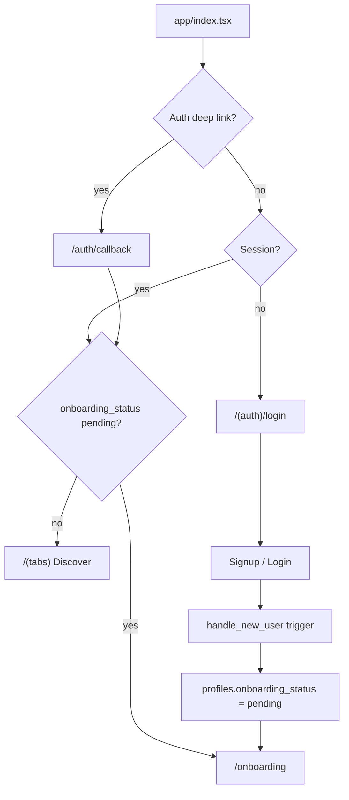
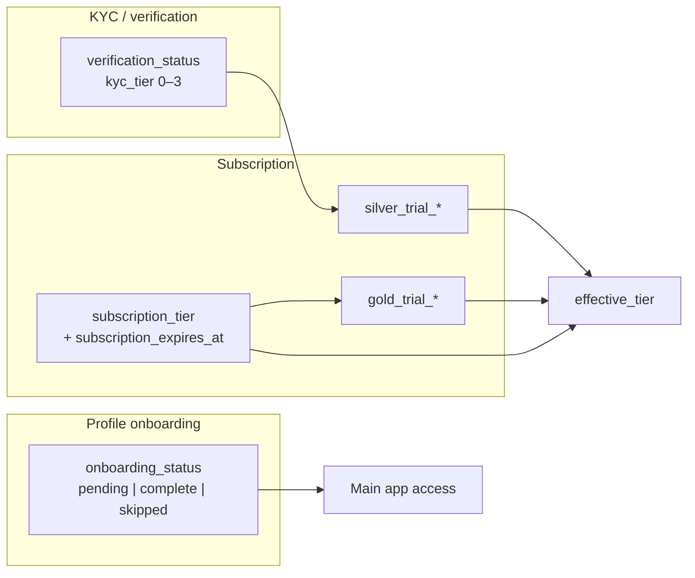
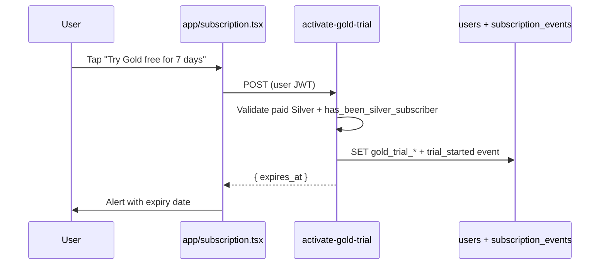
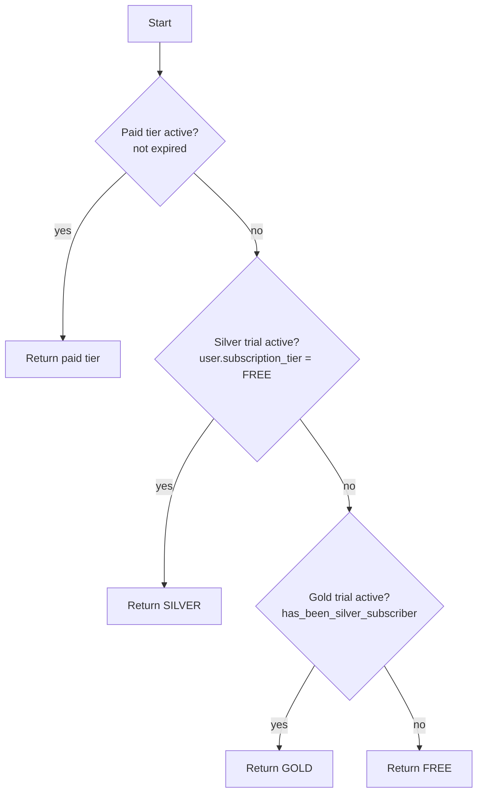
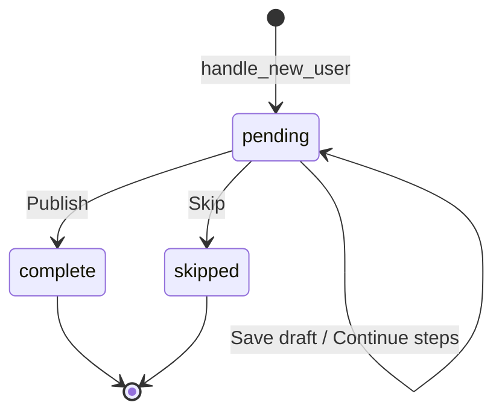
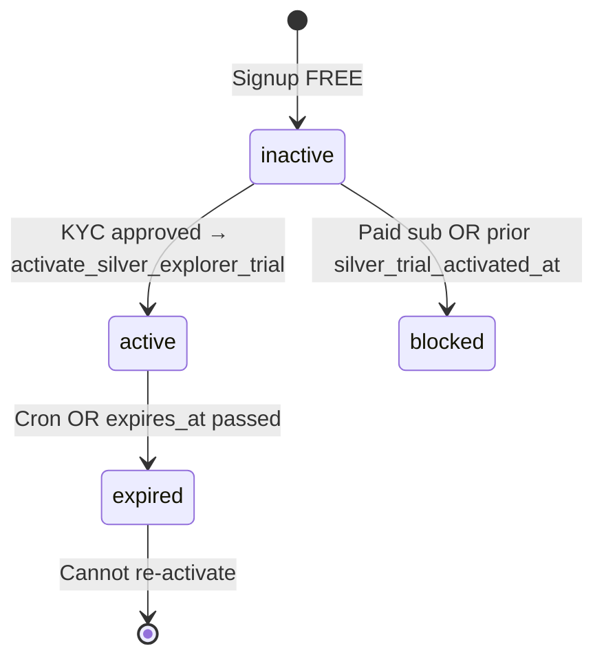
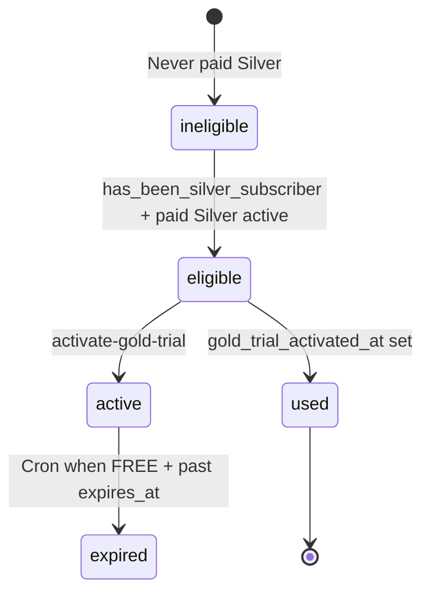
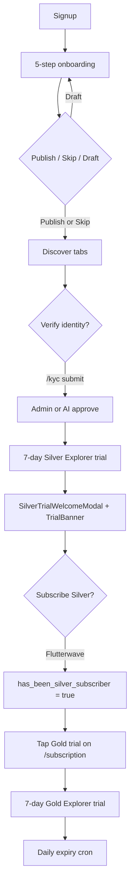

# LinkUp — Onboarding & Trials Userflow

This document is the **authoritative reference** for every user journey related to **profile onboarding** (the 5-step wizard), **post-signup routing**, **identity verification (KYC)**, and **subscription trials** (Silver Explorer + Gold Explorer) in LinkUp — across mobile screens, edge functions, DB triggers, and admin tooling.

**Terminology note:** “Onboarding” in LinkUp means **profile setup** (`profiles.onboarding_status`), not app tutorial slides. **Trials** are time-limited **subscription tier previews** stored on `users` — separate from **KYC tier** (`kyc_tier`, trust/verification) and separate from **legacy Paystack `premium_until`**.

**Related docs**

| Doc | Scope |
|-----|--------|
| [LINKUP-USERFLOW.md](./LINKUP-USERFLOW.md) | High-level app journeys |
| [DISCOVERY-BROWSING-USERFLOW.md](./DISCOVERY-BROWSING-USERFLOW.md) | Discover tab after onboarding; trial banners |
| [VISIBILITY-AND-PROMOTION-USERFLOW.md](./VISIBILITY-AND-PROMOTION-USERFLOW.md) | Boost quota unlocked by effective tier |
| [EMAIL_VERIFICATION_SETUP.md](./EMAIL_VERIFICATION_SETUP.md) | Email confirm → onboarding routing |
| [BACKLOG-PRIORITY.md](./BACKLOG-PRIORITY.md) | Unwired `SoftKycPrompt` (#17) |

**Tip:** Mermaid diagrams paste into [Mermaid Live Editor](https://mermaid.live).

---

## How to read this document

| If you need… | Go to… |
|--------------|--------|
| Auth → onboarding → tabs routing | **§1 Entry & routing** |
| 5-step profile wizard | **§2 Profile onboarding** |
| Skip / draft / publish outcomes | **§3 Onboarding outcomes** |
| KYC vs onboarding vs trials | **§4 Concepts** |
| Silver Explorer trial (7-day) | **§5 Silver trial** |
| Gold Explorer trial (7-day) | **§6 Gold trial** |
| Effective tier & permissions | **§7 Effective tier** |
| Trial UI surfaces | **§8 Trial UI** |
| Subscription screen & paid tiers | **§9 Membership & checkout** |
| Expiry cron & audit log | **§10 Expiry & events** |
| Legacy premium (Paystack) | **§11 Legacy premium** |
| Notifications | **§12 Notifications** |
| Admin tooling | **§13 Admin** |
| Backend reference | **§14 Backend reference** |
| Screen inventory | **§15 Screen inventory** |
| State machines | **§16 State machines** |
| Known gaps | **§17 Known gaps** |

---

## Table of contents

1. **§1** — Entry & routing  
2. **§2** — Profile onboarding  
3. **§3** — Onboarding outcomes  
4. **§4** — Concepts (onboarding vs KYC vs trials)  
5. **§5** — Silver Explorer trial  
6. **§6** — Gold Explorer trial  
7. **§7** — Effective tier & permissions  
8. **§8** — Trial UI surfaces  
9. **§9** — Membership & checkout  
10. **§10** — Expiry & subscription events  
11. **§11** — Legacy premium (Paystack)  
12. **§12** — Notifications  
13. **§13** — Admin  
14. **§14** — Backend reference  
15. **§15** — Screen inventory  
16. **§16** — State machines  
17. **§17** — Known gaps  

---

## §1 Entry & routing

### §1.1 First launch decision tree



### §1.2 Routing SSOT

**File:** `lib/auth/postAuthNavigation.ts`

| Function | Behavior |
|----------|----------|
| `needsOnboarding(profile)` | `true` if no profile **or** `onboarding_status === 'pending'` |
| `postAuthHref(profile)` | `/onboarding` if needs onboarding, else `/(tabs)` |
| `fetchProfileForPostAuth(userId)` | Retries profile fetch while `handle_new_user` finishes |
| `resolvePostAuthHref(userId)` | Async wrapper for post-login navigation |

**Important:** `skipped` and `complete` both enter tabs. Only `pending` blocks main app.

### §1.3 Gate points

| Gate | File | Rule |
|------|------|------|
| Root redirect | `app/index.tsx` | Session → `postAuthHref(profile)` |
| Tabs layout | `app/(tabs)/_layout.tsx` | No session → login; `pending` → `/onboarding` |
| Onboarding screen | `app/onboarding/index.tsx` | If already `complete` or `skipped` → redirect to tabs |
| Email callback | `app/auth/callback.tsx` | Confirms email/OAuth; then normal auth routing |

### §1.4 Auth routes

| Route | File | Purpose |
|-------|------|---------|
| `/(auth)/login` | `app/(auth)/login.tsx` | Login via `AuthScreen` |
| `/(auth)/signup` | `app/(auth)/signup.tsx` | Signup via `AuthScreen` |
| `/(auth)/forgot-password` | `app/(auth)/forgot-password.tsx` | Reset request |
| `/(auth)/forgot-password-sent` | `app/(auth)/forgot-password-sent.tsx` | Confirmation |
| `/(auth)/reset-password` | `app/(auth)/reset-password.tsx` | New password (recovery) |
| `/auth/callback` | `app/auth/callback.tsx` | Deep link handler |

**Auth UI:** `components/auth/AuthScreen.tsx` — email/password, Google OAuth, phone section.

### §1.5 Signup side effects

**Trigger:** `handle_new_user()` (latest: `20260521120000_fix_signup_handle_new_user.sql`)

On `auth.users` INSERT:
1. INSERT `public.users` row (defaults: `subscription_tier = FREE`, `kyc_tier = 0`, trial columns null)
2. INSERT `public.profiles` row with `display_name` from metadata; **`onboarding_status` defaults to `pending`**

Client then routes to `/onboarding` via `postAuthHref`.

---

## §2 Profile onboarding

**Route:** `/onboarding`  
**File:** `app/onboarding/index.tsx`  
**Layout:** `app/onboarding/_layout.tsx` (headerless stack)

### §2.1 Five steps

Constants: `lib/onboarding/constants.ts` — `ONBOARDING_TOTAL_STEPS = 5`

| Step | Label | Subtitle | Key fields / actions |
|------|-------|----------|----------------------|
| **0** | Basics | Name, birthday, one photo | Display name, birth date, 18+ toggle, min photos (`PROFILE_MIN_PHOTOS_ONBOARDING`), **required intro video** |
| **1** | Personality | Bio, tags, prompts | Bio, interest tags, languages, meeting intent, Hinge-style prompts |
| **2** | Preferences | Location & discovery prefs | Location search/GPS, gender, show-me, age range, radius, profile visibility |
| **3** | Safety | Quick tips | Safety tips list; contacts import **stub** (alert only) |
| **4** | Preview | Profile card preview | `ProfileCardPreview`; Publish / Save draft / Edit from step 1 |

### §2.2 Step validation (Continue enabled when)

| Step | Requirements |
|------|----------------|
| 0 | Name ≥1 char, min photos, intro video, 18+ confirmed, age ≥18 |
| 1 | Bio + tags (per existing `canContinue2` rules in screen) |
| 2 | Valid profile location (`hasValidProfileLocation`) |
| 3 | Safety acknowledgment |
| 4 | N/A (action buttons) |

### §2.3 Persistence

**Per-step save:** `lib/onboarding/persist.ts` → `saveOnboardingStep()`
- Updates `profiles` columns + `preferences` JSONB
- Uploads photos/video via `persistProfileMediaFromDraft`
- Runs **non-blocking** initial AI screening → `preferences.initial_profile_screening`, `ai_trust_score`
- Persists resume index: `preferences.onboarding_step` (0–4)

**Resume after sign-out:** On re-login, wizard restores step from `preferences.onboarding_step` when status is still `pending`.

**Finalize:** `finalizeOnboarding()` — modes `publish` | `draft` | `skip` (see **§3**).

**Hydrate:** `lib/onboarding/hydrate.ts` — `draftFromProfile`, video patch fetch.

**Types:** `types/onboarding.ts` — `OnboardingDraft`, `defaultOnboardingDraft`.

### §2.4 UI components

| Component | Path |
|-----------|------|
| Progress | `components/onboarding/OnboardingProgress.tsx`, `OnboardingStickyProgress.tsx` |
| Photos | `components/onboarding/PhotoUploader.tsx` + `ProfilePhotoGallery` |
| Video | `components/profile/ProfileVideoUploader.tsx` |
| Tags / prompts | `TagSelector.tsx`, `PromptSelector.tsx` |
| Preview | `ProfileCardPreview.tsx` |
| Location | `components/profile/ProfileLocationSection.tsx` |
| Theme | `components/onboarding/onboardingTheme.ts` |

### §2.5 Post-onboarding soft KYC flag

On **skip**, **publish**, and **save draft**, onboarding calls:

```typescript
await markSoftKycPromptPending(); // lib/verification/softPromptStorage.ts
```

**Gap:** `consumeSoftKycPromptPending()` is never called — `SoftKycPrompt` modal is **unwired**. See **§17**. Discover uses `PlansKycBanner` instead for similar intent.

### §2.6 Re-entry for edits

**Route:** `/settings/edit-profile` (`app/settings/edit-profile.tsx`)  
Reuses onboarding field components for profile updates **after** onboarding is complete/skipped.

---

## §3 Onboarding outcomes

| Action | `onboarding_status` | Tabs access | Resume step | Notes |
|--------|---------------------|-------------|-------------|-------|
| **Publish** | `complete` | Yes | Cleared from preferences | Requires location + min photos + video |
| **Save draft** | `pending` | **No** (still gated) | Kept; `preferences.profile_draft = true` | User stays in onboarding gate until publish or skip |
| **Skip** | `skipped` | Yes | Cleared | Saves current draft first, then skips |
| **Abandon mid-flow** | `pending` | Blocked from tabs | `onboarding_step` persisted | Resume on next login |

**Navigation after finish/skip:** `router.replace('/(tabs)')` — Discover feed.

**AI screening:** Non-blocking on every save/finalize; does not block publish.

---

## §4 Concepts (onboarding vs KYC vs trials)



| System | Primary fields | Purpose |
|--------|----------------|---------|
| **Profile onboarding** | `profiles.onboarding_status`, `preferences.onboarding_step` | Minimum profile before Discover |
| **KYC (Tier 1)** | `users.verification_status`, `users.kyc_tier`, `verification_requests` | Trust, hard gates on plans/escrow |
| **Paid subscription** | `users.subscription_tier`, `subscription_expires_at`, Flutterwave fields | Paid SILVER/GOLD/PLATINUM |
| **Silver trial** | `silver_trial_activated_at`, `silver_trial_expires_at` | 7-day SILVER preview after KYC approval |
| **Gold trial** | `gold_trial_activated_at`, `gold_trial_expires_at` | 7-day GOLD preview for ex-Silver subscribers |
| **Effective tier** | Derived (client + server) | Feature gates, badges, mood rules |
| **Legacy premium** | `users.premium_until` | Old Paystack packs — **parallel**, not merged |

**Critical product rule:** Finishing onboarding does **not** start a subscription trial. **Silver trial requires KYC approval** (admin or AI pass).

---

## §5 Silver Explorer trial

### §5.1 Rules

| Property | Value |
|----------|-------|
| Duration | **7 days** |
| Trigger | **Automatic** — DB trigger on verification approval |
| Eligibility | `subscription_tier = FREE`, `silver_trial_activated_at IS NULL`, `subscription_expires_at IS NULL` |
| One-time | Yes — `silver_trial_activated_at` prevents re-issue |
| Payment | No card required |

### §5.2 Server activation

**Function:** `activate_silver_explorer_trial(p_user_id)`  
**Migration:** `20260605120000_subscription_tier_system.sql`

Called from `trg_verification_request_apply_user_status()` when `verification_requests.status` becomes:
- `admin_approved`, or
- `ai_pass`

Side effects:
1. SET `silver_trial_activated_at = now()`, `silver_trial_expires_at = now() + 7 days`
2. INSERT `subscription_events` — `event_type = 'trial_started'`, `to_tier = 'SILVER'`, metadata `trial_type: silver_7_day`

Also sets `users.verification_status = verified`, `kyc_tier = GREATEST(kyc_tier, 1)`.

### §5.3 KYC path (prerequisite)

**Route:** `/kyc` — `app/kyc/index.tsx`  
7-step wizard: document type → ID capture → liveness video → consent → submit.

**Submit:** `lib/verification/submitVerification.ts` → INSERT `verification_requests`.

**Outcomes:**
- Admin approves/rejects via `app/admin/index.tsx` KYC queue
- AI pass path: `20260513140000_plans_publish_trust_ai_pass_and_backfill.sql`

### §5.4 Member-visible UX after Silver trial starts

| Surface | File | Behavior |
|---------|------|----------|
| Welcome modal (once) | `SilverTrialWelcomeModal.tsx` | Shown on Discover if active Silver trial + AsyncStorage key not set |
| Trial banner | `TrialBanner.tsx` | Countdown + “Upgrade →” → `/subscription` |
| Membership hero | `MembershipHero.tsx` | Shows trial status on `/subscription` |
| Tier card | `SubscriptionTierCard.tsx` | “Trial — Nd left” on SILVER row |
| Profile badge | `profiles.subscription_badge` | Synced to `SILVER` via DB trigger |

**AsyncStorage key:** `silver_trial_welcome_seen_{userId}`

---

## §6 Gold Explorer trial

### §6.1 Rules

| Property | Value |
|----------|-------|
| Duration | **7 days** |
| Trigger | **Manual** — user taps on `/subscription` |
| Eligibility | `has_been_silver_subscriber = true`, **active paid SILVER**, `gold_trial_activated_at IS NULL` |
| One-time | Yes |
| **Platinum trial** | **Not implemented** |

### §6.2 Activation flow



**Edge function:** `supabase/functions/activate-gold-trial/index.ts`

**Eligibility errors:**
- `403 gold_trial_ineligible` — not paid Silver or never subscribed
- `409 gold_trial_used` — already activated once

### §6.3 `has_been_silver_subscriber`

Set **`true`** on first successful **paid Silver** via Flutterwave webhook:

**File:** `supabase/functions/flutterwave-webhook/index.ts`

This flag unlocks Gold trial eligibility even after paid Silver lapses (for effective tier resolution).

### §6.4 Gold trial UX gaps

- **No** welcome modal (unlike Silver)
- Success feedback: **Alert only** on subscription screen
- **Effective tier while paid Silver:** Server returns **paid SILVER first** — Gold trial may not elevate permissions until user is `FREE` again (see **§7**, **§17**)

---

## §7 Effective tier & permissions

### §7.1 Resolution order (client + server mirror)

**Client:** `lib/subscription/effectiveTier.ts` → `resolveClientEffectiveTier()`  
**Server:** `supabase/functions/_shared/permissions.ts` → `resolveEffectiveTier()`  
**DB display badge:** `resolve_user_display_tier(p_user_id)`



### §7.2 Permission enforcement

**Authoritative gate:** `permission-service` edge function + `lib/subscription/checkPermission.ts` (with cache invalidation on tier changes).

**Matrix:** `PERMISSIONS` in `permissions.ts` — e.g. `discover.advanced_filters` requires SILVER+.

**Also tier-scoped:**
- `MOOD_PLAN_RULES` — window hours, cooldown, reach by tier
- `BOOST_QUOTA` — monthly boost/spotlight counters
- `GROUP_PLAN_CAPS` — guest limits for GOLD/PLATINUM hosts

### §7.3 Helper functions (UI)

| Function | Purpose |
|----------|---------|
| `hasActiveSilverTrial(user)` | FREE + unexpired `silver_trial_expires_at` |
| `hasActiveGoldTrial(user)` | Unexpired `gold_trial_expires_at` |
| `trialDaysRemaining(expiresAt)` | Ceiling days left |

### §7.4 Profile badge sync

**Trigger:** `tr_users_sync_subscription_badge` on `users` UPDATE of tier/trial columns  
**Result:** `profiles.subscription_badge` = SILVER | GOLD | PLATINUM | NULL  
**UI:** `TierBadge` on discovery cards, profiles, group chat info, etc.

---

## §8 Trial UI surfaces

| Surface | Location | When shown |
|---------|----------|------------|
| `TrialBanner` | Discover feed header (`app/(tabs)/index.tsx`) | Active Silver or Gold trial; not dismissed; no active paid sub |
| `SilverTrialWelcomeModal` | Discover (same file) | First session after Silver trial starts |
| `MembershipHero` | `/subscription` | Trial/subscriber status summary |
| `SubscriptionTierCard` trial notes | `/subscription` | Per-tier trial CTA or “Nd left” |
| Gold trial CTA | `/subscription` GOLD card | “Try Gold free for 7 days” when eligible |
| `UpgradePrompt` / paywalls | Various gated features | When `checkPermission` fails |

**Trial banner dismiss:** Session-local state (`trialBannerDismissed`) — reappears next app open.

**Discover integration:** `app/(tabs)/index.tsx` loads `dbUser` via `AuthContext` including all trial timestamp fields.

---

## §9 Membership & checkout

**Route:** `/subscription` — `app/subscription.tsx`

### §9.1 Tiers

`FREE | SILVER | GOLD | PLATINUM` — pricing in `lib/subscription/pricing.ts`, labels in `featureLabels.ts`.

### §9.2 Checkout flow

1. User selects tier + billing cycle (`BillingCycleToggle`: monthly / annual)
2. `supabase.functions.invoke('create-subscription', { user_id, tier, billing_cycle })`
3. Opens Flutterwave payment link in browser
4. Webhook (`flutterwave-webhook`) activates paid tier + sets expiry

### §9.3 Cancel

`cancel-subscription` edge function — auto-renew off; access until period end.

### §9.3 Legacy redirect

`app/premium/index.tsx`, `app/premium/checkout.tsx` → redirect to `/subscription`.

---

## §10 Expiry & subscription events

### §10.1 Daily cron

**Migration:** `20260605130000_subscription_expiry_cron.sql`  
**Job name:** `check-subscription-expiry`  
**Schedule:** `5 0 * * *` (00:05 UTC daily)  
**Edge function:** `supabase/functions/check-subscription-expiry/index.ts`

**Auth:** Bearer `SUPABASE_SERVICE_ROLE_KEY` (hosted cron may need vault URL pattern update — see goodwill/evidence purge notes).

### §10.2 Expiry actions

| Condition | Action |
|-----------|--------|
| Paid sub expired (`subscription_expires_at < now`) | `subscription_tier → FREE`, log `subscription_expired` |
| Silver trial expired + `subscription_tier = FREE` | Null `silver_trial_expires_at`, log `trial_expired` |
| Gold trial expired + `subscription_tier = FREE` | Null `gold_trial_expires_at`, log `trial_expired` |

**Gap:** Gold trial expiry cron only runs when `subscription_tier = FREE` — users on paid Silver with expired Gold trial timestamps may retain stale `gold_trial_expires_at` until downgrade.

### §10.3 Audit table: `subscription_events`

| `event_type` | When |
|--------------|------|
| `trial_started` | Silver auto or Gold manual |
| `trial_expired` | Cron clears trial |
| `subscription_created` / `renewed` / `upgraded` / `downgraded` / `cancelled` / `expired` | Flutterwave lifecycle |
| `payment_failed` / `payment_succeeded` | Webhook |

**RLS:** Users SELECT own rows; INSERT service_role only.  
**App UI:** **Not exposed** — no in-app subscription history screen.

---

## §11 Legacy premium (Paystack)

Parallel system — **not merged** with subscription trials.

| Aspect | Legacy | New tiers |
|--------|--------|-----------|
| Column | `users.premium_until` | `subscription_tier`, trials |
| Checkout | Paystack (`paystack-webhook-premium`) | Flutterwave |
| Dev helper | `lib/premium/applyPurchase.ts` | — |
| Boost credits | `users.boost_credits` | `boost_quota` table |
| Profile UI | `app/(tabs)/profile.tsx` may show `premium_until` | `/subscription`, `MembershipHero` |

Completing onboarding or KYC does **not** affect `premium_until`.

---

## §12 Notifications

| Event | In-app notification | Push / email |
|-------|---------------------|--------------|
| Finish onboarding | None | None |
| Email verification | Routes via callback doc | Per `EMAIL_VERIFICATION_SETUP.md` |
| KYC submitted | `verification_submitted` | Possible via notification pipeline |
| KYC approved | `verification_updated` / admin flow | — |
| Silver trial started | **None** | **None** — welcome modal only |
| Gold trial started | **None** | **None** — Alert only |
| Trial expiring / expired | **None** | **None** — cron logs `subscription_events` only |
| Paid subscription | `premium_activated` (legacy naming may apply) | Webhook-dependent |

**Gap:** No `credit_expiring`-style UX for trials; no dedicated notification types for trial lifecycle.

---

## §13 Admin

| Capability | Onboarding / trials role |
|------------|-------------------------|
| KYC queue | **Indirect Silver trial** — approving request triggers `activate_silver_explorer_trial` |
| User edit | Account status, verification, boost credits — **no trial date override** |
| Manual Silver/Gold trial grant | **Not available** |
| View `subscription_events` | **Not available** in admin UI |
| Extend / revoke trial | **Not available** |

**Admin route:** `app/admin/index.tsx` — KYC tab is the only onboarding-adjacent trial lever.

---

## §14 Backend reference

### §14.1 Key columns on `users`

| Column | Purpose |
|--------|---------|
| `subscription_tier` | FREE / SILVER / GOLD / PLATINUM |
| `subscription_expires_at` | Paid access end |
| `billing_cycle` | monthly / annual |
| `silver_trial_activated_at`, `silver_trial_expires_at` | Silver Explorer |
| `gold_trial_activated_at`, `gold_trial_expires_at` | Gold Explorer |
| `has_been_silver_subscriber` | Gold trial eligibility flag |
| `verification_status`, `kyc_tier` | Trust (separate from subscription) |
| `premium_until` | Legacy Paystack |

### §14.2 Key columns on `profiles`

| Column | Purpose |
|--------|---------|
| `onboarding_status` | pending / complete / skipped |
| `preferences.onboarding_step` | Resume index 0–4 |
| `preferences.profile_draft` | Draft mode flag |
| `preferences.initial_profile_screening` | AI screening snapshot |
| `subscription_badge` | Denormalized tier badge for feed |

### §14.3 DB functions

| Function | Purpose |
|----------|---------|
| `activate_silver_explorer_trial(uuid)` | Issue 7-day Silver trial |
| `resolve_user_display_tier(uuid)` | Badge / display tier |
| `trg_verification_request_apply_user_status()` | KYC outcome + Silver trial |
| `trg_sync_profile_subscription_badge()` | Sync badge on user update |
| `handle_new_user()` | Signup profile creation |

### §14.4 Edge functions

| Function | Purpose |
|----------|---------|
| `activate-gold-trial` | Manual Gold trial |
| `check-subscription-expiry` | Daily expiry sweep |
| `create-subscription` | Flutterwave checkout |
| `flutterwave-webhook` | Paid tier activation |
| `cancel-subscription` | Cancel auto-renew |
| `permission-service` | Server effective tier + feature gates |

### §14.5 Migration index

| Migration | Onboarding / trials content |
|-----------|----------------------------|
| `20240409000000_profile_onboarding_columns.sql` | `onboarding_status`, profile fields |
| `20260521120000_fix_signup_handle_new_user.sql` | Signup trigger |
| `20260520100000_profiles_location_label.sql` | Location for onboarding |
| `20240420000000_verification_request_sync.sql` | Verification requests |
| `20260513140000_plans_publish_trust_ai_pass_and_backfill.sql` | AI pass → verified |
| `20260605120000_subscription_tier_system.sql` | **Core:** trials, events, triggers, badge |
| `20260605130000_subscription_expiry_cron.sql` | Expiry cron registration |

---

## §15 Screen inventory

| Screen / component | Path | Role |
|--------------------|------|------|
| Entry redirect | `app/index.tsx` | Auth → onboarding vs tabs |
| Login / signup | `app/(auth)/*.tsx` | Account creation |
| Auth callback | `app/auth/callback.tsx` | Email/OAuth confirm |
| Onboarding wizard | `app/onboarding/index.tsx` | 5-step profile setup |
| Tabs gate | `app/(tabs)/_layout.tsx` | Blocks pending onboarding |
| Discover | `app/(tabs)/index.tsx` | Trial banner + Silver welcome |
| Edit profile | `app/settings/edit-profile.tsx` | Post-onboarding edits |
| KYC wizard | `app/kyc/index.tsx` | Identity verification → Silver trial |
| Subscription | `app/subscription.tsx` | Tiers, Gold trial, checkout |
| Trial banner | `components/TrialBanner.tsx` | Countdown CTA |
| Silver welcome | `components/subscription/SilverTrialWelcomeModal.tsx` | One-time modal |
| KYC banner | `components/plans/PlansKycBanner.tsx` | Soft verify nudge on Discover |
| Soft KYC modal | `components/kyc/SoftKycPrompt.tsx` | **Unwired** |
| Membership hero | `components/subscription/MembershipHero.tsx` | Subscription status |
| Tier cards | `components/subscription/SubscriptionTierCard.tsx` | Per-tier CTAs |
| Admin KYC | `app/admin/index.tsx` | Approve → Silver trial |
| Auth context | `contexts/AuthContext.tsx` | Loads user + trial fields |

---

## §16 State machines

### §16.1 `onboarding_status`



### §16.2 Silver trial lifecycle



### §16.3 Gold trial lifecycle



---

## §17 Known gaps

| # | Gap | Severity | Detail |
|---|-----|----------|--------|
| 1 | **`SoftKycPrompt` unwired** | Medium | `markSoftKycPromptPending` set; `consumeSoftKycPromptPending` never called |
| 2 | **No Platinum trial** | N/A | Product not defined in schema |
| 3 | **No trial notifications** | Medium | No push/in-app on start or expiry |
| 4 | **Gold trial vs paid Silver effective tier** | High | Paid SILVER wins over active Gold trial in `resolveEffectiveTier` |
| 5 | **Gold trial expiry cron scope** | Medium | Only clears when `subscription_tier = FREE` |
| 6 | **Contacts import stub** | Low | Onboarding step 3 alert only |
| 7 | **Dual premium systems** | Medium | `premium_until` vs Flutterwave tiers coexist |
| 8 | **Silver trial requires KYC** | Product | Easy to miss — onboarding alone gives no trial |
| 9 | **No admin trial controls** | Low | No grant/extend/revoke UI |
| 10 | **No Gold welcome modal** | Low | Silver has modal; Gold has Alert only |
| 11 | **`subscription_events` not in app** | Low | Audit only |
| 12 | **Expiry cron auth on hosted** | Ops | May need vault URL + secret pattern (like other crons) |
| 13 | **Draft mode still gated** | Product | `pending` + draft cannot use tabs until publish or skip |

---

## Appendix A — End-to-end first-time member journey



---

## Appendix B — Member FAQ

| Question | Answer |
|----------|--------|
| “Do I get a free trial when I sign up?” | **Not automatically.** Silver trial starts after **identity verification is approved**. |
| “Does skipping onboarding block the app?” | **No** — skip enters Discover. Draft keeps you gated until publish or skip. |
| “How long are trials?” | **7 days** each (Silver and Gold). |
| “Can I get Silver trial twice?” | **No** — one-time per account. |
| “When can I try Gold?” | After you’ve **paid for Silver at least once** and are currently on an **active paid Silver** plan. |
| “Does Gold trial work while I’m on paid Silver?” | **Permissions use paid tier first** — Gold trial may not unlock Gold features until you’re Free again. |
| “Where do I upgrade?” | `/subscription` from trial banner, profile, or paywalls. |

---

*Generated from repository analysis. Update when Platinum trial, trial notifications, admin trial tools, or SoftKycPrompt wiring ships.*
