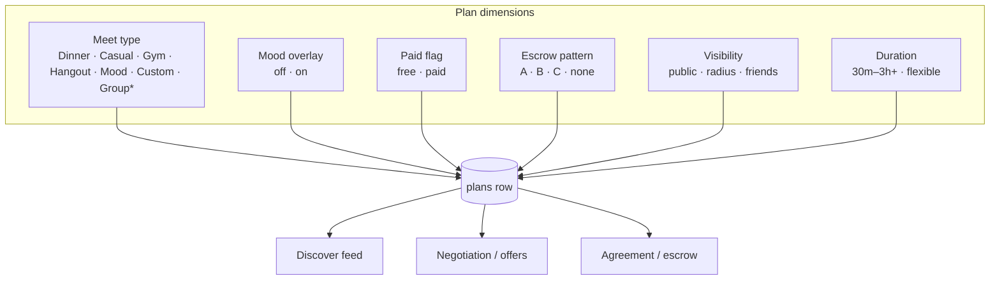
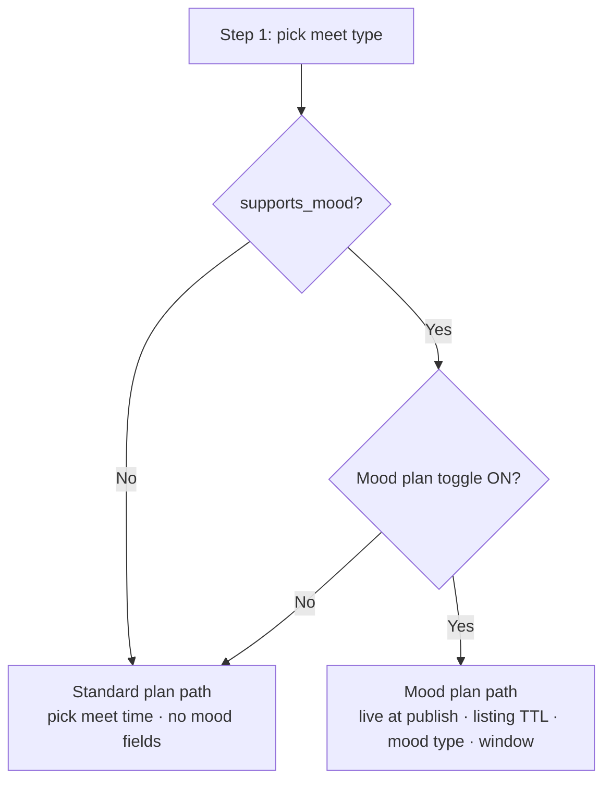
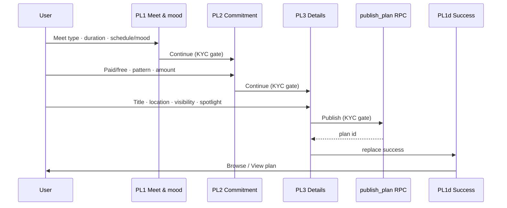
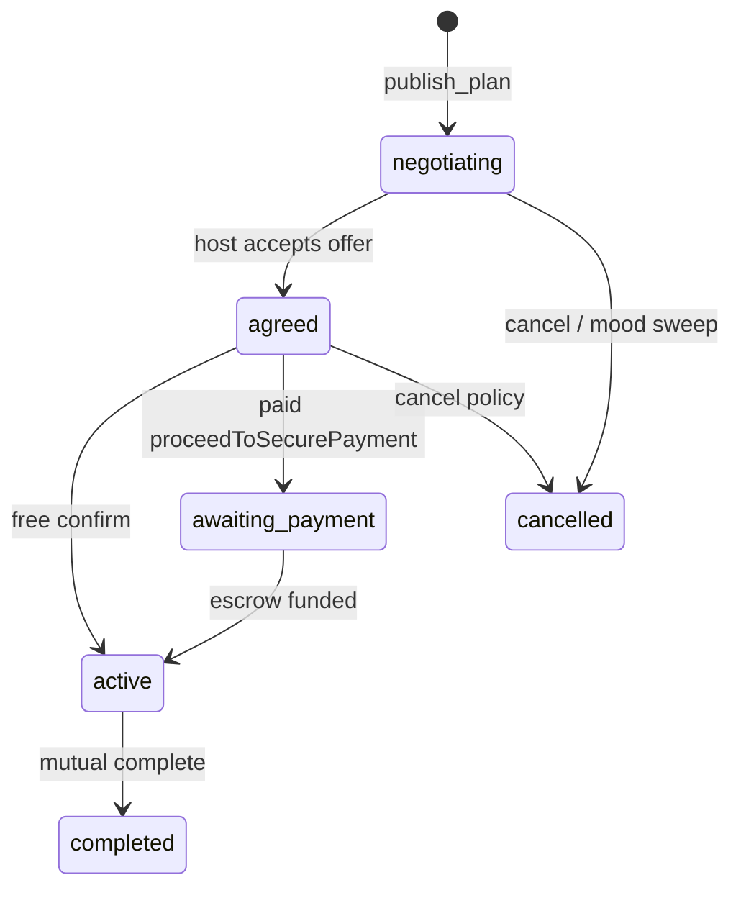

# LinkUp — Plan Types & Plan Creation Userflow

This document describes **every plan type dimension** active in the app today and the **full create-plan wizard** (`/plan/create/*`). It is the authoritative reference for product, UX, and engineering gates around plan creation.

**Related docs:** General app journeys live in [LINKUP-USERFLOW.md](./LINKUP-USERFLOW.md) (§5.6 plans, §5.8 agreement, §5.9 escrow). Subscription tiers are defined in `supabase/migrations/20260605120000_subscription_tier_system.sql` and `supabase/functions/_shared/permissions.ts`.

**Tip:** Mermaid diagrams paste into [Mermaid Live Editor](https://mermaid.live).

---

## How to read this document

| If you need… | Go to… |
|--------------|--------|
| What “plan type” means in LinkUp | **§1 Taxonomy** |
| Seeded meet-type catalog (Dinner, Mood, etc.) | **§2 Meet types** |
| Mood plans (short-lived Discover boost) | **§3 Mood plans** |
| Paid vs free, escrow patterns A/B/C | **§4 Commitment & escrow** |
| Step-by-step create wizard | **§5 Creation wizard** |
| Who can create / publish | **§6 Access gates** |
| What happens after publish | **§7 Post-publish lifecycle** |
| Discover placement rules | **§8 Discover surfacing** |
| Screen & route inventory | **§9 Screen inventory** |

---

## Table of contents

1. **§1** — Plan taxonomy (dimensions that combine into a plan)  
2. **§2** — Meet types (catalog, custom, group)  
3. **§3** — Mood plans (overlay on Mood-capable meet types)  
4. **§4** — Commitment & escrow (paid/free, patterns, limits)  
5. **§5** — Plan creation wizard (PL1 → PL1d)  
6. **§6** — Access gates (KYC, subscription, KYC tier)  
7. **§7** — Post-publish lifecycle by plan shape  
8. **§8** — Discover surfacing & expiry  
9. **§9** — Screen inventory & code map  

---

## §1 Plan taxonomy

A LinkUp **plan** is not a single enum. It is assembled from **independent dimensions** that combine at publish time:

| Dimension | Storage | User chooses in wizard | Notes |
|-----------|---------|------------------------|-------|
| **Meet type** | `plans.meet_type_id` → `meet_types` | Step 1 — chip selector (+ custom modal) | Drives default duration, allowed escrow patterns, mood support |
| **Mood overlay** | `plans.is_mood_plan` + mood metadata columns | Step 1 — only if meet type `supports_mood` | Short listing window; urgency in Discover; live-at-publish scheduling |
| **Paid vs free** | `plans.is_paid` | Step 2 — toggle | Free clears escrow fields at DB layer |
| **Escrow pattern** | `plans.escrow_pattern`, `host_contribution_bps` | Step 2 — when paid | A host funds · B split · C guest funds |
| **Commitment amount** | `starting_price_cents`, `budget_*` | Step 2 — when paid | Min ₦7,000; auto `budget_tier` badge |
| **Schedule** | `plans.scheduled_at` | Step 1 — datetime picker (standard) or “right now” (mood) | Mood plans always publish with `scheduled_at = now()` |
| **Duration** | `plans.duration_minutes` | Step 1 — chips | Optional (`null` = flexible) |
| **Story & place** | `title`, `description`, `location_*` | Step 3 | Location optional but geocoded when set |
| **Visibility** | `plans.visibility` | Step 3 | `public` · `radius` · `friends` |
| **Spotlight** | `spotlight_enabled`, `boosted_until` | Step 3 — premium subscribers | 4h boost (standard) or 6h (mood + premium) |

**Published status:** All new plans start as `status = 'negotiating'` (via `publish_plan` RPC).

\* **Group** meet type: client gate exists (`slug === 'group'`) but the catalog seed does not yet include a `group` row — see **§2.3**.

---

## §2 Meet types

Meet types live in `public.meet_types` (dynamic catalog, not a Postgres enum). The app loads active types via `fetchActiveMeetTypes()` and renders them in **Step 1**.

### §2.1 Seeded catalog (production defaults)

| Name | Slug | Default duration | Escrow allowed | Allowed patterns | Default pattern | Supports mood | Sort |
|------|------|------------------|----------------|------------------|-----------------|---------------|------|
| **Mood** | `mood` | 240 min | Yes | A, C | A | **Yes** | 5 |
| **Dinner** | `dinner` | 180 min | Yes | A, B | A | No | 10 |
| **Casual** | `casual` | 90 min | Yes | A, B | A | No | 20 |
| **Gym** | `gym` | 60 min | Yes | A, B | B | No | 30 |
| **Hangout** | `hangout` | 120 min | Yes | A, B | A | No | 40 |

Source: `supabase/migrations/20260215100000_meet_types_plans_escrow_v2.sql`.

**Behavior when user picks a meet type:**

1. `meet_type_id` is set on the draft.
2. `duration_minutes` defaults to `default_duration_minutes`.
3. `escrow_pattern` defaults to `default_pattern` (if paid).
4. If the type does **not** `supports_mood`, any mood overlay is cleared.

**Server guard (`trg_plans_financial_guard`):**

- Paid plans require `escrow_pattern` ∈ `meet_types.allowed_patterns`.
- Mood plans require `supports_mood = true` and non-null `mood_expires_at`.
- Meet types with `allows_escrow = false` cannot be published as paid (none of the seeded types disable escrow).

### §2.2 Standard mutual plans (Dinner, Casual, Gym, Hangout)

These are the default **1:1 mutual meetup** shapes:

| Aspect | Behavior |
|--------|----------|
| Scheduling | User picks future **meet time** (cannot be in the past). |
| Mood overlay | Not available — `MoodPlanFieldsSection` hidden. |
| Escrow patterns | **A** (host funds) and **B** (split) only. |
| Discover | Main swipe/list deck (not mood timeline). |
| Negotiation window | No automatic `negotiation_expires_at` (unlike mood). |
| Permission key | `mutual_plan.host` — all tiers (FREE through PLATINUM). |

### §2.3 Group plans (partial — gate only)

| Aspect | Current state |
|--------|----------------|
| Catalog | No `group` slug in seed migration — must be added by admin/seed before it appears in UI. |
| Client gate | Selecting a meet type with `slug === 'group'` calls `checkPermission(userId, 'group_plan.host')`. |
| Required tier | **Gold** or **Platinum** (`group_plan.host` in permissions matrix). |
| Caps (when live) | GOLD: 5 free guests / unlimited premium guests; PLATINUM: 10 free / unlimited premium (`GROUP_PLAN_CAPS`). |
| Guest join | `group_plan.join_as_guest` — all tiers. |
| Multi-city | `group_plan.multi_city` — Platinum only (not wired in create wizard yet). |

If group is not in the catalog, users cannot reach the gate today — document this so engineers know the hook is ready.

### §2.4 Custom (user-owned) meet types

Users tap **New** on Step 1 → modal → name (e.g. “Board games night”).

| Field | Value on insert (`insertUserMeetType`) |
|-------|----------------------------------------|
| `slug` | `u-{slugified-name}-{entropy}` |
| `default_duration_minutes` | 120 |
| `allows_escrow` | true |
| `allowed_patterns` | A, B, **C** (all three) |
| `default_pattern` | A |
| `supports_mood` | **false** |
| `created_by` | current user |
| Icon | Inferred from title (`inferMeetTypeIcon`) |

Custom types behave like **standard mutual plans** for mood and escrow — full pattern C is allowed at the catalog level, but **Pattern C still requires Gold+ subscription** and **Tier 2 KYC** at publish/agreement (see **§4.3**, **§6**).

---

## §3 Mood plans

A **mood plan** is not a separate meet-type slug in the wizard — it is an **overlay** toggled on Step 1 when the selected meet type has `supports_mood = true`. Today only the seeded **Mood** meet type qualifies.

### §3.1 Mood vs standard (decision)

### §3.2 Mood-only fields (Step 1)

When `draft.isMoodPlan === true`:

| Field | Draft key | Options / rule |
|-------|-----------|----------------|
| **Goes live** | — | Fixed copy: “Right now” — mood plans start at publish, not a future scheduler. |
| **Mood type** | `moodType` | chill · spontaneous · active · social · premium · late_night · adventure |
| **Time window** | `moodWindow` | now · within_1h · tonight · weekend · custom |
| **Custom window** | `moodCustomStart`, `moodCustomEnd` | Required if `custom`; end > start |
| **Listing duration** | `moodListingHours` | 1h · 3h · 6h · 12h · 24h (default **3h**) |

Computed at publish (client, then stored):

| DB column | Meaning |
|-----------|---------|
| `mood_expires_at` | When plan drops from mood-first ordering (`min(listing end, meet−10m, meet)`) |
| `mood_start_time` / `mood_end_time` | Social window bounds from preset |
| `urgency_level` | `happening_now` · `ending_soon` · `tonight_only` · `last_spot` |
| `negotiation_expires_at` | **+2 hours** from publish for mood rows |
| `auto_expiry_at` | Same as `mood_expires_at` (DB trigger sync) |
| `scheduled_at` | **Now** at publish (`moodPlanScheduledNow()`) |

### §3.3 Mood escrow patterns

Mood meet type seed allows patterns **A** and **C** only (not B). Default **A** (host funds).

### §3.4 Mood tier rules (subscription metadata)

`mood_plan.activate` is allowed on **all tiers** (no client check on toggle today). Tier-specific **rules** exist server-side for product limits:

| Tier | Listing window cap | Cooldown | Reach | Can extend |
|------|-------------------|----------|-------|------------|
| FREE | 24h | 14 days | city | No |
| SILVER | 36h | 5 days | city_adjacent | No |
| GOLD | 48h | 3 days | city_widest | Yes (1×) |
| PLATINUM | 48h | 0 days | all_cities | Yes (unlimited) |

`mood_plan.extend` (Gold+) — permission exists; **extend UI not yet in create wizard** (post-publish / plan management).

### §3.5 Mood expiry lifecycle

1. **Discover:** Expired mood rows filtered out (`isPlanMoodWindowClosed`).
2. **Sweep:** `sweep_expired_mood_plans` RPC (cron / edge `plan-mood-expiry-sweep`) sets `is_expired`, may cancel negotiating mood plans.
3. **Edit:** Creator cannot edit after mood window ends — policy suggests **duplicate plan** (`duplicate_plan_for_creator` RPC).

---

## §4 Commitment & escrow

Step 2 (`/plan/create/commitment`) configures **paid vs free** and escrow shape. Step 2 copy references Flutterwave-backed escrow (funds held until meetup completes).

### §4.1 Free plans

| Aspect | Behavior |
|--------|----------|
| Toggle | **Paid plan** switch **off** |
| DB | `is_paid = false`; `escrow_pattern`, `host_contribution_bps`, price fields cleared by trigger |
| Agreement path | Host accepts offer → **Confirm plan** → `status = active` (no escrow) |
| Minimum amount | N/A |

### §4.2 Paid plans

| Aspect | Behavior |
|--------|----------|
| Toggle | **Paid plan** switch **on** |
| Amount | **Commitment amount (NGN)** — required, min **₦7,000** (`MIN_ESCROW_CENTS`) |
| Budget tier | Auto: `< ₦25k` → low · `< ₦150k` → mid · else high |
| Max (Tier 1) | ₦5,000,000 — amounts above require Tier 2 (enforced at agreement / escrow) |

**Smart hints** (UI only, by amount):

- &lt; ₦8k — coffee & chill range copy  
- ₦8k–₦25k — dinner meetup range  
- ₦25k+ — premium social copy  

### §4.3 Escrow patterns

| Pattern | Label | Who pays at escrow | Host share (B) | Meet-type seed | Subscription permission |
|---------|-------|-------------------|----------------|----------------|-------------------------|
| **A** | Host funds | Host (creator) | — | All seeded types | `escrow.pattern_a` — all tiers |
| **B** | Split | Both (host first per product rules) | Slider 10%–90% (`host_contribution_bps`, default 50%) | Dinner, Casual, Gym, Hangout, Custom | `escrow.pattern_b` — Silver+ |
| **C** | Guest funds | Guest (accepted bidder) | — | Mood, Custom | `escrow.pattern_c` — Gold+ |

**Pattern C extra gate:** Host **and** guest need `users.kyc_tier >= 2` at publish (client alert on Step 3) and again at `proceedToSecurePayment`.

**Party resolution at escrow** (`resolveEscrowParties`):

- **A:** payer = host, payee = guest; host pays 100%  
- **B:** split by `host_contribution_bps`  
- **C:** payer = guest, payee = host; guest pays 100%  

### §4.4 Mood paid escrow timing

When a paid mood plan reaches agreement, escrow funding deadline is **1 hour** (vs **24 hours** for standard plans).

---

## §5 Plan creation wizard

**Route stack:** `app/plan/create/_layout.tsx` wraps `PlanDraftProvider` (in-memory draft + AsyncStorage auto-save every ~450ms, key `linkup_plan_draft_v3`).

**Progress labels:** Meet & mood → Commitment → Details.

### §5.1 Entry points

| Entry | Route / action |
|-------|----------------|
| Discover **+ FAB** | `router.push('/plan/create')` |
| Chat empty / plan CTA | `/plan/create` |
| Profile / other CTAs | May deep-link to create (same stack) |

Unauthenticated users are redirected by auth shell before reaching the wizard.

### §5.2 Flow overview

### §5.3 PL1 — Meet & schedule (`/plan/create/index`)

**Screen ID:** PL1a  

| Section | Required | Validation |
|---------|----------|------------|
| Meet type | Yes | `meetTypeId` set (defaults to Dinner on load) |
| Duration | No | 30 / 60 / 90 / 120 / 180 min or **Flexible** (`null`) |
| Meet time | Yes (standard) | Future datetime; platform date/time pickers |
| Goes live | Mood only | Informational — no picker |
| Mood plan block | If toggle on | Mood type, window, listing hours; custom window valid |

**Continue button:** Disabled until step valid. On press → **KYC hard gate** if unverified → else `router.push('/plan/create/commitment')`.

**Mood pre-publish normalization:** `applyMoodPlanLiveNow()` runs before leaving step (mood path) and again at publish.

### §5.4 PL2 — Commitment (`/plan/create/commitment`)

**Screen ID:** PL1b  

| Section | When | Validation on Continue |
|---------|------|------------------------|
| Trust explainer | Always | — |
| Paid toggle | Always | — |
| Pattern A/B/C | Paid | Pattern selected (defaults A when paid on) |
| Split slider | Pattern B | 10%–90% host share |
| Amount NGN | Paid | Numeric, ≥ ₦7,000 |

Back-navigation guard: missing meet type/time → alert + `router.back()`.

### §5.5 PL3 — Details & publish (`/plan/create/details`)

**Screen ID:** PL1c  

| Section | Required | Notes |
|---------|----------|-------|
| Title | Yes | Quick-example chips available |
| Description | No | Moderation sample on publish |
| Location | No | Search geocode + current location |
| Spotlight | Premium only | Toggle; tease → `/subscription` for free users |
| Visibility | Yes (default public) | public · radius · friends |

**Publish** calls `supabase.rpc('publish_plan', { payload })` with full row (see `details.tsx` insert payload).

**Post-publish:**

1. AI moderation sample persisted (`persistModerationAfterSend`).  
2. Draft cleared (`reset()`).  
3. Navigate to **PL1d Success** with `planId`.

**Publish failures:** RLS / `user_may_create_plan` → user-facing alert with verification + migration hints.

### §5.6 PL1d — Success (`/plan/create/success`)

| Action | Destination |
|--------|-------------|
| Browse plans | `/(tabs)` Discover |
| View your plan | `/plan/[id]` |

Copy: “It’s on the feed. You’ll get offers here and in negotiation.”

### §5.7 Draft persistence & resume

| Behavior | Detail |
|----------|--------|
| Auto-save | Entire `PlanDraft` to AsyncStorage on change |
| Hydrate | On wizard mount, restores saved draft |
| Reset | On successful publish + success screen `useEffect` |
| Default schedule | Tomorrow 19:00 if empty |

Users can leave mid-wizard and return — draft survives app restarts.

---

## §6 Access gates

Plan creation uses **progressive verification** — browsing is open; **publish** is blocked without trust.

### §6.1 KYC / verification (hard gate)

**Client:** `requiresVerificationGate()` on Continue (Steps 1–2) and Publish (Step 3) → `VerificationHardGateModal`.

**Server:** `publish_plan` → `user_may_create_plan(auth.uid())` must be true:

- Admin, **or**
- `users.verification_status = 'verified'`, **or**
- `profiles.verified_badge = true`, **or**
- Latest `verification_requests.status` ∈ `admin_approved`, `ai_pass`

Unverified users see the gate; they **cannot** publish even if they bypass UI.

### §6.2 Subscription gates (create-time)

| Feature | Permission | Tiers | Enforced where |
|---------|------------|-------|----------------|
| Host standard / mood plan | `mutual_plan.host`, `mood_plan.activate` | All | Not client-gated (all tiers) |
| Host group plan | `group_plan.host` | Gold, Platinum | Meet type select (`slug === 'group'`) |
| Escrow pattern B | `escrow.pattern_b` | Silver+ | **Not** client-gated in wizard — server/product should align |
| Escrow pattern C | `escrow.pattern_c` | Gold+ | **Not** client-gated in wizard — Pattern C allowed in UI if meet type allows |
| Spotlight on publish | Premium subscriber | `isPremiumSubscriber()` | Step 3 toggle |
| Privacy visibility | `privacy.plan_creation` | Platinum | **Not** wired to visibility picker yet |

### §6.3 KYC tier (identity depth)

Separate from verification status:

| Rule | Requirement |
|------|-------------|
| Pattern C at publish | Host `kyc_tier >= 2` (client check Step 3) |
| Pattern C at escrow | Host **and** guest `kyc_tier >= 2` |
| High escrow amounts | &gt; ₦5M blocked at agreement (Tier 2 “coming soon” message) |

---

## §7 Post-publish lifecycle by plan shape

All plans publish as **`negotiating`**. Divergence after that:

### §7.1 Standard free plan

1. Guest sends offer (`/plan/[id]/negotiate`) — guest must be verified to send.  
2. Host accepts → `/plan/[id]/agreement`.  
3. **Confirm plan** → `status = active`.  
4. Messaging / meet execution per general userflow.

### §7.2 Standard paid plan

1. Offers negotiate on price (starting price is anchor).  
2. Host accepts → agreement summary.  
3. **Proceed to payment** → escrow row created, `awaiting_payment`.  
4. Payer funds via Flutterwave (`/escrow/[id]`).  
5. Funded → `active` → complete / release / dispute paths.

### §7.3 Mood plan (free or paid)

Same as above **plus:**

| Aspect | Mood-specific |
|--------|----------------|
| Discover | Mood timeline carousel + boosted sort while `mood_expires_at` in future |
| Negotiation | `negotiation_expires_at` = publish + 2h |
| Escrow funding | 1h deadline after agreement |
| Expiry | Removed from feed; `is_expired`; edit locked |

### §7.4 Custom meet type plan

Identical wizard to standard mutual plan unless user later gets a mood-capable type. Custom types allow patterns A/B/C at catalog level.

### §7.5 Group plan (when catalog exists)

Same wizard; meet-type select blocked for non-Gold hosts. Guest caps apply at offer/agreement layer (permissions metadata) — full group UX may extend beyond current MVP screens.

---

## §8 Discover surfacing

| Plan shape | Primary surface | Sorting notes |
|------------|-----------------|---------------|
| Standard | Swipe deck / list mode | Feed filters, distance, presence |
| Mood (live) | **Mood timeline** + eligible in main deck | Mood rows prioritized; sorted by `mood_expires_at` |
| Mood (expired) | Hidden | Filtered client-side + DB sweep |
| Spotlight / premium boost | Elevated placement | `boosted_until` set on publish if premium + toggle |

**Visibility:**

| Value | Intent |
|-------|--------|
| `public` | Global Discover |
| `radius` | Within user discovery radius |
| `friends` | Connections only (friends feature tightens automatically when shipped) |

---

## §9 Screen inventory & code map

### §9.1 Wizard screens

| ID | Route | File |
|----|-------|------|
| PL1a | `/plan/create` | `app/plan/create/index.tsx` |
| PL1b | `/plan/create/commitment` | `app/plan/create/commitment.tsx` |
| PL1c | `/plan/create/details` | `app/plan/create/details.tsx` |
| PL1d | `/plan/create/success` | `app/plan/create/success.tsx` |
| Layout | `/plan/create/*` | `app/plan/create/_layout.tsx` |

### §9.2 Key components & libs

| Concern | Location |
|---------|----------|
| Draft state | `contexts/PlanDraftContext.tsx`, `types/planDraft.ts` |
| Draft storage | `lib/plans/planDraftStorage.ts` |
| Meet type selector | `components/plans/create/MeetTypeSelectorSection.tsx` |
| Mood fields | `components/plans/create/MoodPlanFieldsSection.tsx` |
| Escrow form | `components/plans/create/CommitmentEscrowForm.tsx` |
| Location | `components/plans/create/PlanLocationSection.tsx` |
| Mood math | `lib/plans/moodPlanComputations.ts`, `lib/plans/moodPlanStart.ts` |
| Publish RPC | `supabase/migrations/20260515120000_publish_plan_rpc.sql` |
| Financial guard | `supabase/migrations/20260518100000_trg_plans_financial_guard_bypass_meet_types_rls.sql` |
| Agreement / escrow | `lib/plans/planAgreementActions.ts`, `app/plan/[id]/agreement.tsx` |
| Permissions | `supabase/functions/_shared/permissions.ts`, `lib/subscription/checkPermission.ts` |

### §9.3 Publish payload (reference)

Critical fields sent from `details.tsx` → `publish_plan`:

- Identity: `creator_id` from `auth.uid()` (RPC), not client payload  
- `meet_type_id`, `title`, `description`, `scheduled_at`  
- `is_paid`, `starting_price_cents`, `escrow_pattern`, `host_contribution_bps`, `budget_tier`  
- `is_mood_plan`, `mood_expires_at`, `mood_type`, `mood_start_time`, `mood_end_time`  
- `urgency_level`, `negotiation_expires_at`, `duration_minutes`  
- `visibility`, `location_label`, `latitude`, `longitude`  
- `spotlight_enabled`, `boosted_until`  
- `status`: `negotiating` (default)

---

## Appendix A — Quick matrix: plan shape at a glance

| Shape | Meet type | Mood | Paid | Patterns | Discover | Negotiation TTL |
|-------|-----------|------|------|----------|----------|-----------------|
| Dinner mutual | dinner | off | optional | A, B | Standard deck | None auto |
| Gym split | gym | off | optional | A, B (default B) | Standard deck | None auto |
| Mood spontaneous | mood | on | optional | A, C | Mood timeline | 2h |
| Custom free hang | user custom | off | free | — | Standard deck | None auto |
| Group (future) | group | off | optional | per seed | Standard + caps | TBD |

---

## Appendix B — Maintenance

When changing plan behavior, update **this file** and cross-check:

1. `meet_types` seed / migrations  
2. `trg_plans_financial_guard`  
3. `publish_plan` RPC column list  
4. `PlanDraft` type + storage serializer  
5. `permissions.ts` tier matrix  
6. [LINKUP-USERFLOW.md](./LINKUP-USERFLOW.md) §5.6–§5.9 for downstream negotiate / escrow copy  

*Last aligned to codebase: plan create wizard, Flutterwave escrow, subscription tier system (Identity Phase 1).*
