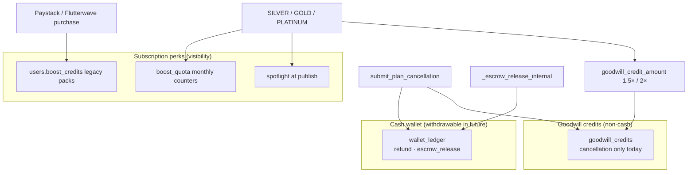
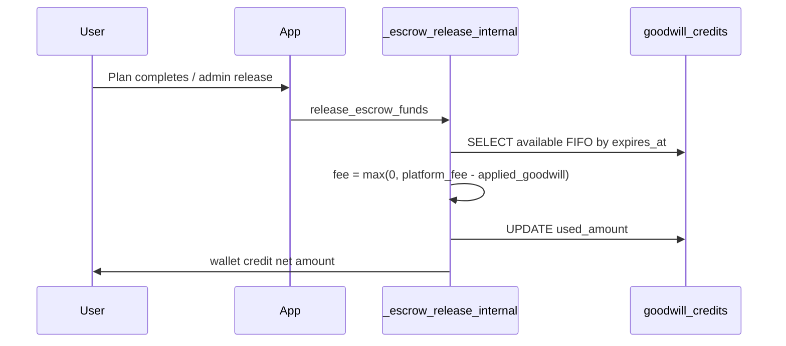
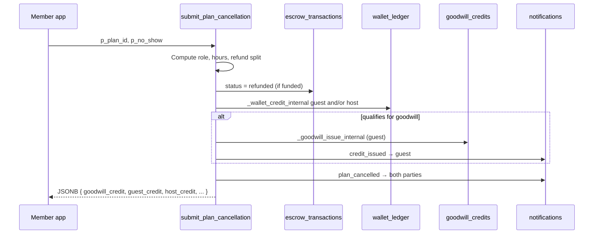
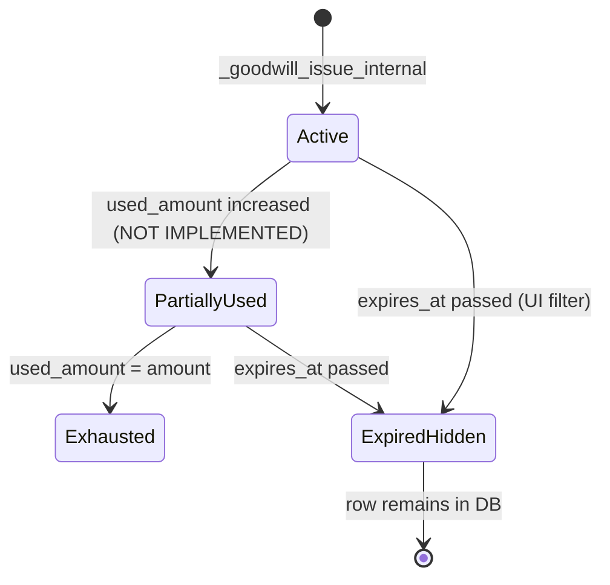
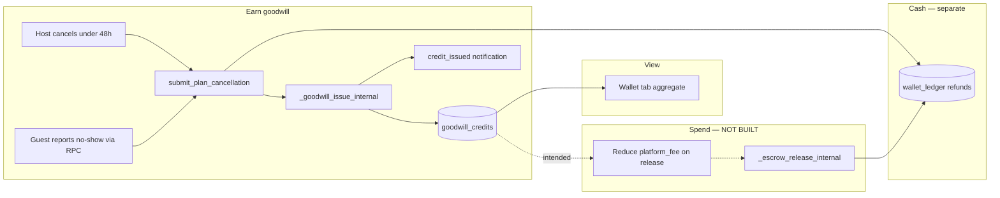

# LinkUp — Rewards & Goodwill Credit Userflow

This document is the **authoritative reference** for every user journey related to **goodwill credits**, the **cash wallet ledger**, and **subscription perk “credits”** (boost packs, monthly boost quota, spotlight) in LinkUp — across mobile screens, server RPCs, notifications, and admin tools.

**Terminology note:** There is **no** standalone “rewards” or loyalty-points program in the codebase. Compensation for unfair cancellations is implemented as **goodwill credits** (non-cash). Premium subscribers receive separate **visibility perks** (boost quota, legacy `boost_credits` packs) that are **not** stored in `goodwill_credits`.

**Related docs**

| Doc | Scope |
|-----|--------|
| [ESCROW-LOGIC.md](./ESCROW-LOGIC.md) | Escrow funding, release, platform fees, cancellation refunds (§16) |
| [SUPPORT-AND-DISPUTE-RESOLUTION-USERFLOW.md](./SUPPORT-AND-DISPUTE-RESOLUTION-USERFLOW.md) | Disputes (no goodwill issuance on resolve today) |
| [VISIBILITY-AND-PROMOTION-USERFLOW.md](./VISIBILITY-AND-PROMOTION-USERFLOW.md) | Boost quota, spotlight, discovery promotion |
| [LINKUP-USERFLOW.md](./LINKUP-USERFLOW.md) | High-level wallet tab mention |
| [PRD-VS-CODEBASE.md](./PRD-VS-CODEBASE.md) | Product vs implementation gaps (fee offset) |

**Tip:** Mermaid diagrams paste into [Mermaid Live Editor](https://mermaid.live).

---

## How to read this document

| If you need… | Go to… |
|--------------|--------|
| Goodwill vs cash vs boost credits | **§1 Concepts** |
| Where members see balances | **§2 Wallet tab** |
| How goodwill is earned | **§3 Earning goodwill** |
| Tier multipliers (Gold / Platinum) | **§4 Tier multipliers** |
| How goodwill should be spent (product promise) | **§5 Spending & fee offset** |
| Expiry rules | **§6 Expiry** |
| Cancellation → refund + goodwill flow | **§7 Cancellation userflow** |
| Cash wallet ledger (refunds, releases) | **§8 Cash wallet ledger** |
| Platform fees (what goodwill would offset) | **§9 Platform fees** |
| Premium boost credits & monthly quota | **§10 Subscription perks (not goodwill)** |
| Policy copy surfaces in the app | **§11 Policy & education UI** |
| Notifications | **§12 Notifications** |
| Admin tooling | **§13 Admin** |
| Tables, RPCs, migrations | **§14 Backend reference** |
| Screen & file inventory | **§15 Screen inventory** |
| State & data model | **§16 State machines** |
| Gaps & unwired features | **§17 Known gaps** |

---

## Table of contents

1. **§1** — Concepts  
2. **§2** — Wallet tab (`/(tabs)/wallet`)  
3. **§3** — Earning goodwill  
4. **§4** — Tier multipliers  
5. **§5** — Spending & fee offset  
6. **§6** — Expiry  
7. **§7** — Cancellation userflow  
8. **§8** — Cash wallet ledger  
9. **§9** — Platform fees  
10. **§10** — Subscription perks (boost credits & quota)  
11. **§11** — Policy & education UI  
12. **§12** — Notifications  
13. **§13** — Admin  
14. **§14** — Backend reference  
15. **§15** — Screen inventory  
16. **§16** — State machines  
17. **§17** — Known gaps  

---

## §1 Concepts

LinkUp separates **three money-adjacent systems** that users may colloquially call “credits” or “rewards”:



| System | Primary table / field | Cash? | Withdrawable? | Typical earn path |
|--------|----------------------|-------|---------------|-------------------|
| **Cash wallet** | `wallet_ledger` | Yes (NGN cents) | Not in MVP UI | Escrow refund on cancel, escrow release to payee |
| **Goodwill credits** | `goodwill_credits` | No | Never | Host cancel &lt;48h before meetup; guest reports host no-show |
| **Boost credits (legacy)** | `users.boost_credits` | N/A | N/A | Legacy Paystack premium packs (`bonusBoostCredits`) |
| **Monthly boost quota** | `boost_quota` | N/A | N/A | Subscription tier (SILVER/GOLD/PLATINUM) |
| **Spotlight window** | `plans.boosted_until` | N/A | N/A | Free promotion window at publish for SILVER+ |

**Product copy promise (goodwill):** Credits “offset platform fees on future escrows” and “apply to fees automatically.” **Server-side fee offset is not implemented** — see **§5** and **§17**.

---

## §2 Wallet tab

**Route:** `/(tabs)/wallet`  
**File:** `app/(tabs)/wallet.tsx`  
**Skeleton:** `components/wallet/WalletSkeleton.tsx`

### §2.1 Entry points

| From | Navigation |
|------|------------|
| Bottom tab bar | Wallet tab (`app/(tabs)/_layout.tsx`) |
| Profile tab | **Balance & credits** row → subtitle “Balance, refunds, goodwill” (`app/(tabs)/profile.tsx`) |

### §2.2 Screen layout

1. **Hero** — “Your money hub” / Wallet explainer  
2. **Available balance card** — sum of `wallet_ledger` credits minus debits (NGN)  
3. **Goodwill credits card** — aggregate remaining non-expired goodwill  
4. **Withdrawals card** — MVP placeholder (“Not enabled in this MVP”)  
5. **Recent activity** — last 80 `wallet_ledger` rows only (**goodwill rows are not listed here**)

### §2.3 Data queries (client)

```typescript
// wallet_ledger — all types, ordered newest first
supabase.from('wallet_ledger').select('*').eq('user_id', user.id).order('created_at', { ascending: false }).limit(80)

// goodwill_credits — non-expired only
supabase.from('goodwill_credits').select('*').eq('user_id', user.id)
  .gt('expires_at', new Date().toISOString())
  .order('expires_at', { ascending: true }).limit(40)
```

### §2.4 Balance calculations

| Display | Formula |
|---------|---------|
| Available balance | Σ(credit rows) − Σ(debit rows) on `wallet_ledger` |
| Goodwill remaining | Σ `max(amount - used_amount, 0)` over fetched goodwill rows |

**UI copy on goodwill card:**  
“Issued when a host cancels within 48h or no-shows. Offsets platform fees on future escrows · not cash · expires 60 days from issue.”

### §2.5 What the wallet tab does **not** show

- Per-goodwill line items (source, issue date, expiry date, `tier_at_award`)
- Goodwill usage history (`used_amount` changes)
- `financial_events` audit trail
- `cancellations` history with `goodwill_credit_amount`

---

## §3 Earning goodwill

### §3.1 Only issuance path

All goodwill enters the system through **`_goodwill_issue_internal`** (SECURITY DEFINER). Clients cannot INSERT into `goodwill_credits`.

**Callers today:** `submit_plan_cancellation` only, with `source = 'cancellation'`.

**Schema allows but unused sources:** `dispute_resolution`, `promo`.

### §3.2 Qualification rules (server — current v2)

Implemented in `submit_plan_cancellation` (`20260610000007_dispute_priority_sla.sql`):

Goodwill is evaluated **after** refund split is computed. It is issued to the **guest only** (`v_guest_id`).

| Condition | Goodwill? |
|-----------|-------------|
| **Host** cancels with **&lt; 48 hours** until meetup (`v_hours < 48`, not no-show) | Yes |
| **Guest** cancels with **`p_no_show = true`** (host no-show report path) | Yes |
| Host cancels 72h+ before meetup | No (may get `strike_added` warning notification only) |
| Guest voluntary cancel (not no-show) | No |
| Mutual cancel (`vote_mutual_plan_cancel`) | No (`goodwill_credit_amount = 0`) |
| Dispute resolution (admin) | No |
| Promo / marketing | No |

**Client mirror:** `lib/plans/cancellationPolicy.ts` → `qualifiesForGoodwillCredit()` matches the same 48h / no-show rules for copy and future previews.

### §3.3 Base amount formula (before tier multiplier)

```
base = LEAST(3000, GREATEST(200, FLOOR(guest_credit_cents * 0.08)))
```

| Input | Meaning |
|-------|---------|
| `guest_credit_cents` | Guest’s **cash refund** from the cancellation split (`v_guest_credit`), not total escrow |
| Min | ₦2.00 (200 cents) |
| Max | ₦30.00 (3000 cents) |
| Rate | 8% of guest refund |

**Final amount:** `goodwill_credit_amount(guest_id, base)` — see **§4**.

### §3.4 Side effects on issue

When `_goodwill_issue_internal` runs:

1. **INSERT** `goodwill_credits` row  
   - `expires_at = now() + 60 days`  
   - `used_amount = 0`  
   - `tier_at_award = users.subscription_tier` at issue time  
2. **INSERT** `financial_events` with `event_type = 'goodwill_issued'`  
3. **INSERT** notification `credit_issued` to recipient  

Also on cancel: **INSERT** `cancellations` row with `goodwill_credit_amount` snapshot.

### §3.5 Historical note (v1 policy — superseded)

Original `submit_plan_cancellation` in `20260221120000_wallet_cancellations_compliance.sql` used a **fee-based** goodwill formula for late host cancel (&lt;6h) and guest cancel paths. **Superseded** by v2 (`20260529120000`) and tier patch (`20260610000007`). Do not reference v1 amounts in product copy.

---

## §4 Tier multipliers

**RPC:** `goodwill_credit_amount(p_user_id, p_base_amount_cents)`  
**Migration:** `20260610000007_dispute_priority_sla.sql`

Uses `users.subscription_tier` at **award time** (not effective tier with trials — server reads raw column).

| Tier | Multiplier on base |
|------|-------------------|
| **PLATINUM** | **2.0×** |
| **GOLD** | **1.5×** |
| **FREE**, **SILVER**, trials | **1.0×** (base only) |

**Example:** Base ₦20.00 (2000 cents) → Gold guest receives ₦30.00 goodwill; Platinum receives ₦40.00.

**Stored on row:** `goodwill_credits.tier_at_award` (TEXT).  
**TypeScript gap:** `DbGoodwillCredit` in `types/database.ts` does not yet include `tier_at_award`.

**Client preview gap:** `goodwillCreditCents()` in `cancellationPolicy.ts` returns **base only** — UI previews understate Gold/Platinum awards unless tier multiplier is applied client-side.

---

## §5 Spending & fee offset

### §5.1 Product promise

- Wallet screen: “Offsets platform fees on future escrows”  
- Notification `credit_issued`: “It applies to fees automatically.”  
- Policy rows: “fee offset · 60-day expiry”

### §5.2 Implementation status: **NOT BUILT**

| Expected behavior | Status |
|-------------------|--------|
| On escrow release, reduce `platform_fee_cents` by available goodwill | **Missing** |
| Increment `goodwill_credits.used_amount` when applied | **Never updated anywhere** |
| `wallet_ledger` entry with `source = 'goodwill'` for fee offset | **Enum exists; no INSERT** |
| Partial apply across multiple goodwill rows (FIFO by expiry) | **Missing** |
| Show fee before/after on escrow release UI | **Missing** |

**Release path today:** `_escrow_release_internal` (`20260610000003_escrow_server_tier_gates.sql`) computes full fee via `platform_fee_cents_for_amount`, credits payee net of **full** fee — does not read `goodwill_credits`.

### §5.3 Intended future flow (reference design)



Until this exists, goodwill is **display-only compensation**.

---

## §6 Expiry

| Rule | Implementation |
|------|----------------|
| Lifetime | **60 days** from issue (`expires_at` default / set in `_goodwill_issue_internal`) |
| UI filter | Wallet query `.gt('expires_at', now())` — expired rows hidden from balance |
| Balance math | Expired rows excluded from fetch → drop out of aggregate |
| Background job | **None** — no cron to archive, notify, or delete expired rows |
| `used_amount` on expiry | Unused portion effectively lost (no reclamation) |

**Expired rows remain in DB** for audit; members simply stop seeing them in the wallet sum.

---

## §7 Cancellation userflow

Primary member journey that creates goodwill.

### §7.1 Entry: Agreement screen

**Route:** `/plan/[id]/agreement`  
**File:** `app/plan/[id]/agreement.tsx`

| Action | RPC / behavior |
|--------|----------------|
| Host or guest taps cancel (confirmed) | `submit_plan_cancellation(p_plan_id, p_no_show: false)` |
| Host supersede pending offers (host only) | `plan_offers` → `superseded` before RPC |
| On success | Navigate to discovery feed |

**Gap:** App **always** passes `p_no_show: false`. Guest cannot trigger host no-show goodwill from the agreement UI.

**Policy display:** `<CancellationSummaryCard />` rendered **without** `outcome` prop — user never sees post-cancel goodwill amount on this screen.

### §7.2 Edge function (alternate entry — unused by app)

**Function:** `supabase/functions/plan-cancel/index.ts`  
**POST:** `{ "plan_id": "<uuid>", "no_show": true|false }`  
**Auth:** User JWT → RPC as caller  

Supports `no_show: true` for guest host-no-show path. **No mobile screen calls this function today.**

### §7.3 Server sequence (funded escrow)



### §7.4 Refund matrix (cash — context for goodwill base)

**Client SSOT for copy:** `lib/plans/cancellationPolicy.ts`  
**Server:** `submit_plan_cancellation` in `20260610000007`

| Actor | Scenario | Guest cash | Host cash |
|-------|----------|------------|-----------|
| Guest | Cancel anytime | 0 | 100% |
| Guest | Host no-show (`p_no_show`) | 100% | 0 |
| Host | Cancel 72h+ | 0% of host pool | 100% |
| Host | Cancel 48–72h | 30% | 70% |
| Host | Cancel 24–48h | 50% | 50% |
| Host | Cancel &lt;24h | 70% | 30% |

**Pattern B:** Matrix applies to **host-paid portion**; guest’s own funded share returns to guest on host cancel.

**Goodwill** is computed from **`v_guest_credit`** after this split — not from total escrow.

### §7.5 Mutual cancel (no goodwill)

**RPC:** `vote_mutual_plan_cancel`  
**Migrations:** `20260221120000`, `20260610000005_fix_mutual_cancel_refund.sql`  

Both parties vote; refunds cash per pattern rules; **`goodwill_credit_amount = 0`**.  
**No app UI** calls this RPC today.

### §7.6 Pre-funding cancel

If escrow is `pending_funding` or absent: cancel updates plan/offer only — **no wallet credits, no goodwill**.

---

## §8 Cash wallet ledger

Goodwill is separate from cash, but cancellations often produce **both**.

### §8.1 Table: `wallet_ledger`

| Column | Notes |
|--------|--------|
| `type` | `credit` \| `debit` |
| `source` | `escrow_release` \| `refund` \| `fee` \| `adjustment` \| `goodwill` (unused) |
| `amount` | Cents, always positive; sign from `type` |
| `reference_id` | Escrow id, plan id fragment, etc. |

**RLS:** SELECT own or admin; INSERT only via SECURITY DEFINER internals.

### §8.2 Credit sources members see in activity list

| `source` | Typical trigger |
|----------|-----------------|
| `refund` | `submit_plan_cancellation`, dispute admin refund, cancellation matrix |
| `escrow_release` | `_escrow_release_internal`, auto-release sweep |
| `fee` | Platform fee debit on release (if logged) |
| `adjustment` | Manual admin (rare) |
| `goodwill` | **Never written** |

### §8.3 Internal helper

**`_wallet_credit_internal(p_user_id, p_amount, p_source, p_reference, p_meta)`**  
Also fires `wallet_updated` notification and `append_financial_event`.

---

## §9 Platform fees

What goodwill is **intended** to offset.

**RPC:** `platform_fee_cents_for_amount(p_amount_cents)`  
**Mirrors:** `lib/plans/planFinancialConfig.ts`

| Escrow gross (NGN) | Fee (bps) |
|--------------------|-----------|
| &lt; ₦50,000 | 7% |
| ₦50,000 – ₦499,999 | 6% |
| ≥ ₦500,000 | 5% |

Fee is deducted on **escrow release** to payee (`_escrow_release_internal`), not on cancellation refunds.

**Tier subscription does not reduce platform fee bps** — only goodwill (when implemented) would reduce effective fee.

---

## §10 Subscription perks (not goodwill)

Documented here because users and PRD may refer to “rewards” — these are **visibility perks**, not `goodwill_credits`.

### §10.1 Monthly boost quota (`boost_quota` table)

**Migration:** `20260605120000_subscription_tier_system.sql`  
**Client:** `lib/subscription/boostQuota.ts`, permission service metadata

| Tier | 24h boosts / month | Spotlight / month |
|------|-------------------|-------------------|
| FREE | 0 | 0 |
| SILVER | 4 | 3 |
| GOLD | 8 | 10 |
| PLATINUM | Unlimited (-1) | Unlimited (-1) |

Used when member applies post-publish boost or profile spotlight (see [VISIBILITY-AND-PROMOTION-USERFLOW.md](./VISIBILITY-AND-PROMOTION-USERFLOW.md)).

### §10.2 Legacy `users.boost_credits`

**Field:** `users.boost_credits` (integer)  
**Earn:** Legacy Paystack premium tiers — `lib/premium/applyPurchase.ts` adds `bonusBoostCredits` from `lib/premium/catalog.ts`  
**Spend:** `lib/premium/boostPlan.ts` decrements when using legacy boost path  

| Pack | Bonus boost credits |
|------|---------------------|
| Weekly | +1 |
| Monthly | +4 |
| Quarterly | +12 |

**Admin:** `AdminUsersPanel` can patch `boost_credits` manually.

### §10.3 Publish spotlight window (free at publish)

SILVER+ plans may receive initial `boosted_until` at publish without consuming monthly quota — separate from goodwill.

### §10.4 Goodwill tier multiplier overlap

Gold / Platinum **subscription tier** increases **goodwill award size** (§4) but does not add boost credits or wallet cash.

---

## §11 Policy & education UI

Where members **read about** goodwill before earning.

| Surface | File | Content |
|---------|------|---------|
| Plan create — escrow step | `components/plans/create/EscrowTrustExplainerCard.tsx` | `COMMITMENT_CANCELLATION_POLICY_ROWS` incl. goodwill row |
| Plan edit sheet | `components/plans/PlanCreatorEditSheet.tsx` | Same explainer card |
| Pre-agreement modal | `components/plans/agreement/PreAgreementFullscreenModal.tsx` | `AGREEMENT_CANCELLATION_POLICY_GROUPS` → “Credits & mutual” |
| Agreement screen | `components/plans/CancellationSummaryCard.tsx` | Full policy table; optional outcome block (usually empty) |
| Wallet tab | `app/(tabs)/wallet.tsx` | Goodwill card hint text |

**Policy SSOT:** `lib/plans/cancellationPolicy.ts`

Key exported constants:

- `CANCELLATION_POLICY_TABLE_ROWS` — full matrix  
- `COMMITMENT_CANCELLATION_POLICY_ROWS` — plan create highlights  
- `AGREEMENT_CANCELLATION_POLICY_GROUPS` — grouped pre-agreement copy  
- `qualifiesForGoodwillCredit()`, `goodwillCreditCents()`, `computeCancellationSplit()` — client previews (**tier multiplier not in preview**)

---

## §12 Notifications

| Type | When | Recipient | Title / body | Deep link |
|------|------|-----------|--------------|-----------|
| **`credit_issued`** | `_goodwill_issue_internal` | Guest (goodwill recipient) | “Goodwill credit” / applies to fees automatically | **None** — payload `{}` |
| **`plan_cancelled`** | End of `submit_plan_cancellation` | Host + guest | Plan cancelled — check app for refund details | `plan_id` in payload |
| **`wallet_updated`** | `_wallet_credit_internal` (cash) | Credited user | “Wallet update” | No wallet href |
| **`strike_added`** | Host cancel 72h+ band | Host | Cancellation logged warning | `plan_id` |

### §12.1 Inbox categorization gaps

- `credit_issued` **not** listed in `lib/notifications/categories.ts` PAYMENTS tab — falls through to default **activity** tab via `notificationTab()` fallback  
- `lib/notifications/navigateFromNotification.ts` — no `credit_issued` → `/wallet` routing  
- `lib/notifications/notificationIcon.ts` — no dedicated icon for `credit_issued`

---

## §13 Admin

| Capability | Status |
|------------|--------|
| View member `goodwill_credits` | Possible via SQL / service role; **no admin UI panel** |
| Issue manual goodwill (`promo` source) | **No RPC exposed** — would require direct DB or new admin RPC |
| Adjust `used_amount` | **No UI** |
| View `financial_events` goodwill_issued | **No UI** (audit table only) |
| Edit `users.boost_credits` | **Yes** — `AdminUsersPanel` |
| Dispute resolve → goodwill | **No** — admin resolve moves cash only |

---

## §14 Backend reference

### §14.1 Core tables

| Table | Purpose |
|-------|---------|
| `goodwill_credits` | Non-withdrawable compensation ledger |
| `cancellations` | Per-cancel audit incl. `goodwill_credit_amount` |
| `wallet_ledger` | Cash credits/debits |
| `financial_events` | Append-only audit (`goodwill_issued`, `escrow_refunded`, …) |
| `withdrawals` | Phase-ready; MVP disabled in UI |

### §14.2 Key RPCs

| RPC | Grants | Goodwill role |
|-----|--------|---------------|
| `_goodwill_issue_internal` | service_role only (REVOKE PUBLIC) | **Only issuer** |
| `goodwill_credit_amount` | service_role only | Tier multiplier |
| `submit_plan_cancellation` | authenticated | Qualifies + calls issuer |
| `vote_mutual_plan_cancel` | authenticated | Never issues goodwill |
| `admin_resolve_plan_dispute` | authenticated admin | Cash only |
| `admin_resolve_escrow_dispute` | authenticated admin | Cash only |
| `_escrow_release_internal` | internal | Full platform fee; no goodwill |
| `_wallet_credit_internal` | internal | Cash ledger |

### §14.3 Edge functions

| Function | Goodwill |
|----------|----------|
| `plan-cancel` | Wraps `submit_plan_cancellation` incl. optional `no_show` |
| All others | No goodwill logic |

### §14.4 Migration file index

| Migration | Path | Goodwill-related changes |
|-----------|------|-------------------------|
| Foundation | `20260221120000_wallet_cancellations_compliance.sql` | Tables, v1 cancel + `_goodwill_issue_internal` |
| Cancellation v2 | `20260529120000_cancellation_refund_policy_v2.sql` | Host timing matrix, new base formula |
| Mutual cancel | `20260610000005_fix_mutual_cancel_refund.sql` | `goodwill_credit_amount = 0` |
| Tier multiplier | `20260610000007_dispute_priority_sla.sql` | `goodwill_credit_amount()`, `tier_at_award`, latest cancel RPC |
| Platform fee + release | `20260610000003_escrow_server_tier_gates.sql` | Fee bps (offset target) |
| Dispute admin | `20260610000013_support_dispute_gaps.sql` | Wallet actions; no goodwill |

---

## §15 Screen inventory

| Screen / component | Path | Goodwill / rewards role |
|--------------------|------|-------------------------|
| Wallet tab | `app/(tabs)/wallet.tsx` | Display aggregate goodwill + cash |
| Wallet skeleton | `components/wallet/WalletSkeleton.tsx` | Loading state |
| Profile → wallet link | `app/(tabs)/profile.tsx` | Navigation |
| Agreement | `app/plan/[id]/agreement.tsx` | Cancel → RPC; policy card |
| Cancellation summary | `components/plans/CancellationSummaryCard.tsx` | Policy + optional outcome |
| Policy rows | `components/plans/CancellationPolicyRows.tsx` | Shared table renderer |
| Escrow trust explainer | `components/plans/create/EscrowTrustExplainerCard.tsx` | Create-flow policy |
| Pre-agreement modal | `components/plans/agreement/PreAgreementFullscreenModal.tsx` | Grouped policy |
| Cancellation policy lib | `lib/plans/cancellationPolicy.ts` | SSOT copy + math |
| Premium catalog | `lib/premium/catalog.ts` | Legacy boost credit packs |
| Boost plan spend | `lib/premium/boostPlan.ts` | Legacy boost_credits decrement |
| Boost quota | `lib/subscription/boostQuota.ts` | Monthly tier limits |
| Admin users | `components/admin/AdminUsersPanel.tsx` | Edit `boost_credits` only |

---

## §16 State machines

### §16.1 Goodwill credit row lifecycle



### §16.2 `used_amount` transitions

**No code path updates `used_amount` today** — all non-expired rows stay at `used_amount = 0` until expiry.

### §16.3 Source enum

| `source` value | Issued in production? |
|----------------|----------------------|
| `cancellation` | Yes |
| `dispute_resolution` | No |
| `promo` | No |

---

## §17 Known gaps

| # | Gap | Severity | Detail |
|---|-----|----------|--------|
| 1 | **Fee offset not implemented** | Critical | `used_amount` never updated; release ignores goodwill |
| 2 | **`wallet_ledger.source = 'goodwill'` unused** | High | Enum placeholder only |
| 3 | **No dispute goodwill** | High | `dispute_resolution` source unused; admin resolve has no goodwill |
| 4 | **No promo goodwill** | Medium | `promo` source unused; no admin issue UI |
| 5 | **Guest no-show UI missing** | High | `p_no_show` only via `plan-cancel` edge; agreement always `false` |
| 6 | **Mutual cancel UI missing** | Medium | RPC exists; no app wiring; zero goodwill by design |
| 7 | **Cancellation outcome not shown** | Medium | RPC returns `goodwill_credit`; agreement doesn’t pass to `CancellationSummaryCard` |
| 8 | **Client tier preview** | Medium | `goodwillCreditCents()` omits Gold/Platinum multiplier |
| 9 | **No goodwill line-item history** | Medium | Wallet shows aggregate only |
| 10 | **`credit_issued` navigation** | Low | No deep link to wallet; not in PAYMENTS filter |
| 11 | **`tier_at_award` in TypeScript** | Low | DB column not on `DbGoodwillCredit` type |
| 12 | **Expiry automation** | Low | Passive UI filter only; no sweep / expiry notification |
| 13 | **Admin goodwill tools** | Low | No view/issue/adjust panel |
| 14 | **“Rewards” program** | N/A | No loyalty/referral points; name not used in code |
| 15 | **Withdrawals** | MVP | UI stub; table exists |

---

## Appendix A — End-to-end journey map



---

## Appendix B — Goodwill vs boost credits vs cash (member FAQ)

| Question | Answer in app today |
|----------|---------------------|
| “I got a goodwill credit — can I withdraw it?” | **No.** Non-cash; wallet copy says not cash. |
| “When does it apply?” | **Not yet** on release — product copy ahead of implementation. |
| “Does Platinum get more goodwill?” | **Yes** — 2× multiplier on base when guest tier is Platinum. |
| “Are boost credits the same as goodwill?” | **No.** Boost credits = plan visibility (`users.boost_credits` / monthly quota). |
| “Does dispute resolution give goodwill?” | **No** — only cash refund / release via admin RPCs. |
| “How long do I have?” | **60 days** from issue; then hidden from wallet balance. |

---

## Appendix C — RPC return payload (cancellation)

`submit_plan_cancellation` returns JSONB including:

| Field | Meaning |
|-------|---------|
| `goodwill_credit` | Final cents issued (0 if none) |
| `guest_credit` | Cash refund to guest wallet |
| `host_credit` | Cash refund to host wallet |
| `cancel_type` | `early` \| `late` \| `no_show` |
| `band` | Host timing band when applicable |

App agreement screen **does not read** this response for display today.

---

*Generated from repository analysis. Update when fee-offset logic, dispute goodwill, promo issuance, or wallet history UI is implemented.*
