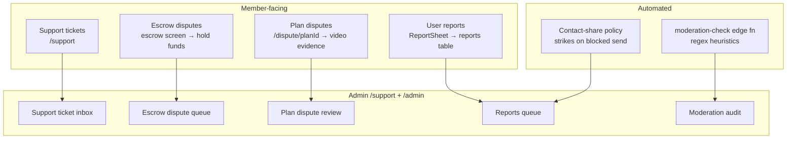
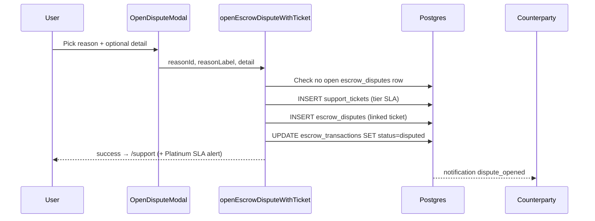
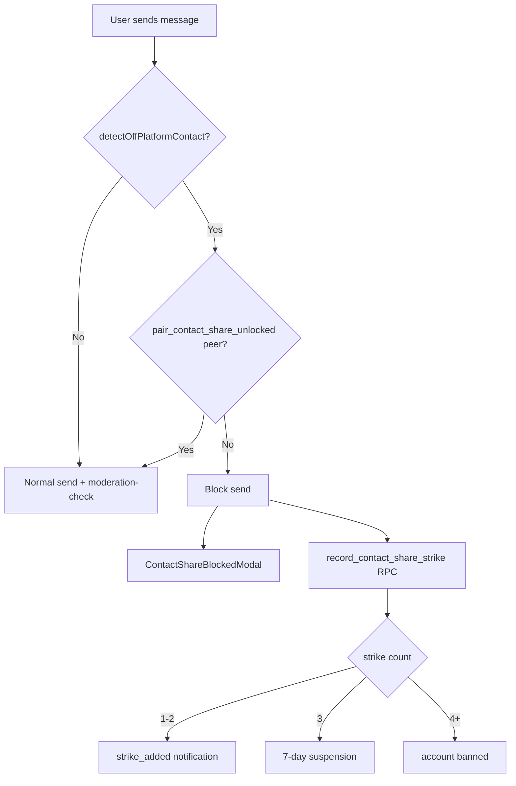
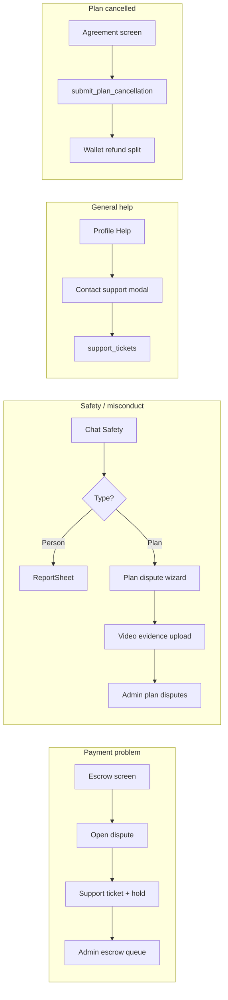

# LinkUp — Support & Dispute Resolution Userflow

This document is the **authoritative reference** for every user journey related to **help, support tickets, disputes, safety reports, contact policy, moderation, and resolution** in LinkUp — across mobile screens, admin tools, server RPCs, and notifications.

**Related docs**

| Doc | Scope |
|-----|--------|
| [ESCROW-LOGIC.md](./ESCROW-LOGIC.md) | Escrow funding, release, cancellation refunds, escrow disputes (§17) |
| [MESSAGING-CHAT-USERFLOW.md](./MESSAGING-CHAT-USERFLOW.md) | Chat safety sheet, contact-share blocking, strikes |
| [NOTIFICATIONS-AND-WEBHOOKS.md](./NOTIFICATIONS-AND-WEBHOOKS.md) | Push/email pipeline for dispute and report types |
| [PAYMENT_REMINDER_AUTOMATION.md](./PAYMENT_REMINDER_AUTOMATION.md) | Pre-funding nudges (not dispute-specific) |
| [LINKUP-USER-GUIDE.md](./LINKUP-USER-GUIDE.md) | User-facing product guide |

**Tip:** Mermaid diagrams paste into [Mermaid Live Editor](https://mermaid.live).

---

## How to read this document

| If you need… | Go to… |
|--------------|--------|
| What “support” vs “dispute” vs “report” mean | **§1 Concepts** |
| Profile → Help & support screen | **§2 Support hub** |
| Payment hold disputes (escrow) | **§3 Escrow disputes** |
| Safety disputes with video evidence (plans) | **§4 Plan disputes** |
| Harassment / scam reports (not full dispute) | **§5 User reports** |
| Off-platform contact blocking & strikes | **§6 Contact policy** |
| Automated message moderation | **§7 Moderation** |
| Cancellation refunds (resolution without dispute) | **§8 Cancellation & refunds** |
| Fund release & auto-release (dispute interaction) | **§9 Escrow release** |
| Admin resolution center | **§10 Admin tools** |
| Notifications & deep links | **§11 Notifications** |
| Platinum / tier SLA on disputes | **§12 Tier benefits** |
| Status enums & state machines | **§13 State machines** |
| Tables, RPCs, edge functions | **§14 Backend reference** |
| Screen & file inventory | **§15 Screen inventory** |
| Gaps & unwired features | **§16 Known gaps** |

---

## Table of contents

1. **§1** — Concepts  
2. **§2** — Support hub (`/support`)  
3. **§3** — Escrow disputes (payment hold)  
4. **§4** — Plan disputes (video evidence)  
5. **§5** — User reports (`reports` table)  
6. **§6** — Contact-share policy & strikes  
7. **§7** — Automated moderation  
8. **§8** — Cancellation & refunds  
9. **§9** — Escrow release & auto-release  
10. **§10** — Admin resolution tools  
11. **§11** — Notifications & deep links  
12. **§12** — Tier benefits & SLA  
13. **§13** — State machines  
14. **§14** — Backend reference  
15. **§15** — Screen inventory  
16. **§16** — Known gaps  

---

## §1 Concepts

LinkUp implements **three overlapping trust/support layers** plus automated guardrails:



| Layer | Primary tables | User goal | Funds affected? |
|-------|----------------|-----------|-----------------|
| **Support tickets** | `support_tickets` | General help, bugs, account issues | No (unless escalated manually) |
| **Escrow disputes** | `escrow_disputes` + linked ticket | Payment wrong / meetup issue while money in escrow | **Yes** — escrow → `disputed`, release blocked |
| **Plan disputes** | `disputes` + `dispute_evidence` | Safety, misconduct, scam with video proof | **No automatic payout** — admin metadata only |
| **User reports** | `reports` | Quick flag on profile/chat/plan | No |

**Important:** Escrow disputes and plan disputes are **separate systems**. A user with a payment problem should use the **escrow screen**; a user reporting misconduct on a shared plan uses the **plan dispute wizard** (video required).

---

## §2 Support hub

**Route:** `/support`  
**File:** `app/support.tsx`  
**Entry points:**

| From | Navigation |
|------|------------|
| Profile tab | **Help & support** (`app/(tabs)/profile.tsx`) |
| Disputes screen | **Support & help** link at bottom |
| Escrow screen header | Help icon → `/support` (`EscrowScreenHeader`) |
| After opening escrow dispute | Auto-redirect to `/support` |
| Privacy settings copy | Points users to Help & support for reports |
| Admin ban notification | `data.href: '/support'` |

### §2.1 Screen layout

1. **Lead block** — “Support & help” kicker + subtitle  
2. **Quick help cards** (tap → alert with body text, except verification → `/kyc`):
   - Payment issues — explains escrow hold + dispute from escrow screen  
   - Account verification — navigates to KYC  
   - Safety & reports — encourages ticket with details  
3. **Contact support** CTA — opens modal  
4. **Your tickets** — tabs **Open** (`open`, `in_progress`) / **Resolved** (`resolved`, `closed`)  
5. **View escrow disputes** link → `/disputes`

### §2.2 Contact support modal

| Field | Options / behaviour |
|-------|---------------------|
| Topic chips | Payment & escrow · Account & verification · Safety & reports · Bug or app issue · Something else |
| Body | Required free text |
| Submit | `INSERT support_tickets` with `user_id`, `subject`, `body` |
| Success | Alert “We’ve received your message…”; ticket list refreshes |

**Note:** Manual tickets do **not** set tier SLA fields (`queue_priority`, `sla_deadline`) — those are stamped only when opened via **escrow dispute** flow (`openEscrowDisputeWithTicket`).

### §2.3 Ticket statuses (member view)

| DB status | UI label | Open tab? |
|-----------|----------|-----------|
| `open` | Open | Yes |
| `in_progress` | In progress | Yes |
| `resolved` | Resolved | No (Resolved tab) |
| `closed` | Closed | No (Resolved tab) |

Members **cannot** change ticket status or add replies in-app — read-only list with subject, status pill, and last updated date.

---

## §3 Escrow disputes

**Purpose:** Hold escrow funds while LinkUp reviews a payment/meetup disagreement.

**Files:** `lib/escrow/escrowActions.ts` · `components/escrow/OpenDisputeModal.tsx` · `lib/escrow/disputeReasons.ts` · `app/escrow/[id].tsx`

### §3.1 Entry points

| Entry | Condition |
|-------|-----------|
| Escrow detail **Open dispute** ghost button | Escrow `funded` and not already `disputed` |
| Same button (alternate placement) | Plan `completed` but funds not yet released, not disputed |
| Disputes list → escrow row | Navigates back to `/escrow/[id]` |

**Who can open:** Either escrow party (`payer_id` or `payee_id`). RLS: `opened_by = auth.uid()`.

### §3.2 Open dispute flow



**Guided reasons** (`ESCROW_DISPUTE_REASONS`):

| ID | Label |
|----|-------|
| `no_show` | The other person did not show up |
| `misrepresented` | Plan details were misrepresented |
| `unsafe` | Safety or comfort concern |
| `payment` | Payment or amount issue |
| `other` | Something else |

**Duplicate guard:** If an `escrow_disputes` row exists with status `open` or `under_review`, submit returns error *“A dispute is already in progress for this escrow.”*

### §3.3 Side effects on open

| Entity | Change |
|--------|--------|
| `support_tickets` | New row; subject `Escrow dispute — {reasonLabel}`; body includes plan/escrow IDs |
| `escrow_disputes` | `status = open`; linked `support_ticket_id` |
| `escrow_transactions` | `status = disputed` (from `pending_funding` or `funded`) |
| Counterparty | Push/in-app `dispute_opened` (high priority) |

### §3.4 Escrow dispute statuses

| Status | Meaning |
|--------|---------|
| `open` | Just filed |
| `under_review` | Admin reviewing (manual status update) |
| `resolved` | Closed — admin marked resolved |
| `dismissed` | Closed without action |

### §3.5 Member UX while disputed

- **Disputed banner** on escrow screen  
- **Release funds** blocked (`release_escrow_funds` raises `escrow_disputed` / `escrow_dispute_open`)  
- **Auto-release** blocked (`sweep_completed_plan_auto_release` skips escrows with open disputes)  
- Timeline shows dispute step (`buildEscrowTimeline`)  
- User tracks row on `/disputes` → Escrow filter → tap → `/escrow/[id]`

### §3.6 Resolution (current behaviour)

**No automated refund or release on admin resolve.** Admin **Mark resolved** (`app/admin/index.tsx`) only updates:

- `escrow_disputes.status = resolved`
- `admin_resolution = 'Resolved in app'`
- `resolved_at = now()`

Escrow row **remains** `status = disputed` unless manually handled outside the app. See **§16 Known gaps**.

---

## §4 Plan disputes

**Purpose:** Structured safety/trust report on a **specific shared plan** with mandatory short video evidence.

**Route:** `/dispute/[planId]`  
**File:** `app/dispute/[planId].tsx`  
**Submit:** `lib/trust/submitPlanDispute.ts`

### §4.1 Entry points

| Entry | Path |
|-------|------|
| Chat → Safety sheet → **Report an issue with the plan** | `/dispute/{planId}` when `canPlanDispute` |
| Group chat info → plan dispute shortcut | Same, when `planId` known |
| `ReportSheet` → plan content type | Offers “Open plan dispute” after report |
| Disputes list → plan row tap | `/dispute/{planId}` (re-opens wizard — **no read-only detail view**) |

**Eligibility:** User must be plan counterparty with **accepted offer** (`accepted_offer_id` → bidder). RLS enforces reporter is party on plan.

### §4.2 Six-step wizard

| Step | Screen | Action |
|------|--------|--------|
| **1** | Intro | Trust copy: confidential; staff-only access |
| **2** | Category | Pick one category (required) |
| **3** | Video | Record **5–15 seconds** via `expo-camera`; optional GPS attach |
| **4** | Additional evidence | Optional note + up to 8 images from library |
| **5** | Review & submit | Confirm category, video, note |
| **6** | Confirmation | “Under review” — push notification promised; Done → back |

**Categories** (`PlanDisputeCategory`):

| ID | Label | Hint |
|----|-------|------|
| `payment_issue` | Payment issue | Escrow, pricing, checkout |
| `no_show` | No-show | Someone didn’t arrive |
| `misconduct` | Misconduct | Uncomfortable or unsafe behavior |
| `scam` | Scam | Deceptive or fraudulent behavior |
| `other` | Other | General review |

### §4.3 Submit pipeline

1. `INSERT disputes` — `status = pending`, category, reporter note  
2. Upload video → `private_disputes` bucket → `{disputeId}/video-{ts}.mp4`  
3. `INSERT dispute_evidence` type `video` with metadata (duration, optional lat/lng)  
4. Optional images → same bucket + evidence rows type `image`  
5. On upload failure → **delete** dispute row (rollback)

**Storage:** `private_disputes` — 50 MB limit; mp4, images, pdf. RLS: reporter, reported party, admin read; reporter insert.

### §4.4 Plan dispute statuses (member list on `/disputes`)

| Status | UI colour | Meaning |
|--------|-----------|---------|
| `pending` | Purple | Awaiting review |
| `reviewing` | Purple | Admin added notes / actively reviewing |
| `resolved` | Green | Closed with resolution metadata |
| `rejected` | Red | Not upheld |

**Resolution enum** (admin only, **no wallet effect**): `refund` · `partial` · `none`

### §4.5 Evidence retention

Trigger `trg_dispute_resolved_retention` sets `purge_after` on evidence when dispute resolves/rejects. Function `purge_dispute_evidence_due()` exists but **is not scheduled** — see §16.

### §4.6 Priority review flag

DB column `disputes.priority_review` set `true` when reporter has legacy premium subscription (`disputes_set_priority_review` trigger). **Admin UI does not sort/filter by this flag today.**

---

## §5 User reports

**Purpose:** Lightweight flag for harassment, fake profiles, scams — **without** video dispute workflow.

**Component:** `components/trust/ReportSheet.tsx`  
**Submit:** `lib/trust/submitReport.ts` → `reports` table

### §5.1 Entry points

| Surface | `contentType` |
|---------|---------------|
| Chat safety sheet → Report this person | `user` or `message` |
| Profile (where wired) | `profile` |
| Plan context | `plan` (+ optional link to plan dispute) |

### §5.2 Report flow (3 steps)

1. **Reason** — scam · fake profile · harassment · inappropriate · other  
2. **Note** — optional context  
3. **Done** — confirmation; if `contentType === 'plan'` and `contentId` set, CTA to open plan dispute wizard

### §5.3 Report statuses

| Status | Admin action |
|--------|--------------|
| `pending` | Default on insert |
| `reviewed` | Manual (optional intermediate) |
| `resolved` | Admin marks resolved |

**On insert:** `tr_reports_notify_admins` → all admins get `report_submitted` notification → deep link `/admin`.

### §5.4 Admin report actions

From `app/admin/index.tsx` Reports tab:

| Action | Effect |
|--------|--------|
| Mark resolved | `reports.status = resolved` |
| Warn user | `create_notification` to reported user |
| Ban user | Sets account restricted + notification with `/support` href |

---

## §6 Contact-share policy & strikes

**Purpose:** Prevent off-platform contact exchange before both parties confirm plan completion — reduces scam/fraud bypass of escrow.

**Files:** `lib/messaging/contactSharePolicy.ts` · `components/trust/ContactShareBlockedModal.tsx` · RPC `record_contact_share_strike` · RPC `pair_contact_share_unlocked`

### §6.1 Detection

`detectOffPlatformContact(text)` flags:

- Email addresses  
- Nigerian phone patterns (+234, 0-prefix mobile)  
- WhatsApp, Telegram, Instagram, Snapchat keywords/URLs  
- Long international `+` number runs  

### §6.2 Send-time enforcement (1:1 and group chat)



### §6.3 Contact unlock (completion acks)

Both parties must insert `plan_completion_acks` after plan `completed`:

- `confirmMeetupComplete` calls `insertPlanCompletionAck`  
- When **both** acks exist for the plan pair → `pair_contact_share_unlocked(peer_id) = true`  
- Until then, contact-share attempts accrue strikes  

**Distinct from disputes:** This is **proactive policy**, not a user-filed ticket.

### §6.4 Strike ladder (`user_strikes`)

| Strike # | Account effect | Notification |
|----------|----------------|--------------|
| 1–2 | Warning | `strike_added` |
| 3 | `suspended` 7 days | `user_suspended` |
| 4+ | `banned` | `user_banned` |

Members cannot read/write `user_strikes` directly — RPC only.

---

## §7 Automated moderation

**Edge function:** `supabase/functions/moderation-check/index.ts`  
**Client invoke:** `lib/trust/persistModeration.ts` (after chat message send)

### §7.1 Heuristic flags

| Pattern | Flag | Severity |
|---------|------|----------|
| Self-harm phrases | `abuse` | high |
| Scam / off-app money | `scam` | high |
| Explicit keywords | `explicit` | medium |
| Very long text | `spam` | low |

### §7.2 Actions

- Inserts `moderation_logs` row (admin-only read)  
- High severity → may auto-hide message content  
- Notifies all admins: `moderation_flagged` → `/admin`  

**Not a member-facing dispute** — feeds admin Moderation tab audit queue.

---

## §8 Cancellation & refunds

**Purpose:** Resolve plan breakdown **without** opening a formal dispute — automated wallet splits per policy.

**Primary RPC:** `submit_plan_cancellation`  
**Client:** `app/plan/[id]/agreement.tsx`  
**Policy copy:** `lib/plans/cancellationPolicy.ts` · `CancellationSummaryCard`  
**Edge wrapper:** `supabase/functions/plan-cancel/index.ts`

### §8.1 Cancellable plan statuses

`agreed` · `awaiting_payment` · `active`

### §8.2 Host cancel — guest refund share (of host-funded pool)

| Hours before meetup | Guest receives |
|---------------------|----------------|
| ≥ 72h | 0% |
| 48–72h | 30% |
| 24–48h | 50% |
| < 24h | 70% |

Host cancel in late bands may add **host cancellation strikes** (`_record_plan_cancellation_strikes`).

### §8.3 Guest cancel

Guest cancel → host receives 100% of funded legs (guest forfeits guest-paid share return logic per pattern).

### §8.4 No-show path

Guest reports host no-show → guest receives 100%; host strikes; goodwill credit may apply.

### §8.5 Goodwill credits

Non-cash `goodwill_credits` issued when:

- Host cancels with < 48h notice, or  
- Guest confirms host no-show  

Amount tier-multiplied via `goodwill_credit_amount` (Platinum 2×, Gold 1.5×).

### §8.6 Effects

- Escrow → `refunded`  
- Wallet credits via `_wallet_credit_internal`  
- Plan → `cancelled`; offer → `declined`  
- Both parties notified (`plan_cancelled`)

**Mutual cancel:** `vote_mutual_plan_cancel` — full refund to `payer_id` only (Pattern B/C caveat — see ESCROW-LOGIC §16).

---

## §9 Escrow release & auto-release

Disputes **block** both manual and automatic release paths.

### §9.1 Manual release

**Who:** Payee side after plan `completed`  
**Client:** `releaseEscrowFunds` → RPC `release_escrow_funds`  
**Checks:**

- Plan status must be `completed`  
- Escrow not `disputed`  
- No open `escrow_disputes` (`open` / `under_review`)  
- Credits payee wallet net of platform fee  

### §9.2 Auto-release (24h)

**Cron:** `auto-release-sweep` edge function → `sweep_completed_plan_auto_release()`  
**Schedule:** Hourly (`0 * * * *`) via pg_cron migration `20260610000006_auto_release_cron.sql`  
**Conditions:**

- Plan `completed` ≥ 24h ago (`completed_at`)  
- Escrow `funded` or `active`  
- **No open escrow dispute**  
- No open escrow dispute row in `open`/`under_review`  

On success: `_escrow_release_internal(..., auto_released=true)`; UI shows “Automatically released” banner when `metadata.auto_released`.

---

## §10 Admin resolution tools

**Route:** `/admin` (admin role required)  
**File:** `app/admin/index.tsx`

### §10.1 Dashboard stats

| Stat | Source |
|------|--------|
| KYC pending | Verification queue |
| Reports | `reports.status = pending` |
| Plan disputes | `pending` + `reviewing` |
| Escrow open | escrow_disputes open/under_review |
| Support tickets open | `open` + `in_progress` |
| Moderation high | `moderation_logs.severity = high` |

### §10.2 Tabs

| Tab | Function |
|-----|----------|
| **KYC** | Identity verification queue |
| **Reports** | User reports — resolve, warn, ban |
| **Moderation** | Automated flag audit log |
| **Disputes** | Plan disputes + escrow disputes (same tab, two sections) |
| **Support** | Support ticket inbox |
| **Users** | User management |
| **Plans** | Plan suppression / admin tools |

### §10.3 Plan dispute admin workflow

1. Open row → loads `dispute_evidence` (signed URLs for video/images)  
2. Edit internal notes → saves + sets `status = reviewing`  
3. Resolve buttons call `admin_resolve_plan_dispute`:
   - **Resolved** + resolution `refund` | `partial` | `none`  
   - **Rejected**  
4. Inserts `dispute_admin_actions` audit row  

**No financial RPC** triggered by resolve buttons.

### §10.4 Escrow dispute admin workflow

- Lists reason, escrow amount, plan/escrow IDs, opener, linked ticket  
- **Mark resolved** — direct UPDATE on `escrow_disputes` only  
- Does **not** change `escrow_transactions.status` or trigger refund/release  

### §10.5 Support tickets admin workflow

**Component:** `AdminSupportTicketModal` — **read-only**

- Shows status, priority, subject, body, member ID, created date  
- **No** status change, replies, or assignment in app  

### §10.6 Report admin workflow

- View reporter → reported IDs, reason, note  
- **Resolve** · **Warn** · **Ban** (notification + account status)  

---

## §11 Notifications & deep links

**Router:** `lib/notifications/navigateFromNotification.ts`

| Type | Recipients | Deep link |
|------|------------|-----------|
| `dispute_opened` | Escrow counterparty | `/support` (also `escrowId` in payload → `/escrow/[id]`) |
| `dispute_created` | Reporter, reported, admins | `disputeId` → `/disputes` |
| `dispute_updated` | Reporter, reported | `/disputes` |
| `dispute_resolved` | Reporter (plan disputes) | `/disputes` |
| `report_submitted` | Admins | `/admin` |
| `moderation_flagged` | Admins | `/admin` |
| `strike_added` | Offender | Inbox |
| `user_suspended` / `user_banned` | Offender | Inbox |
| `plan_cancelled` | Host + guest | Plan/agreement context |
| `credit_issued` | Goodwill recipient | Wallet-related |

**Email templates** (`notification-email`): `dispute_opened`, `report_submitted`.

**Category grouping** (`lib/notifications/categories.ts`): dispute/escrow types → **payments** category.

**Privacy:** Plan dispute confirmation copy states sensitive details are **not** included in push body.

---

## §12 Tier benefits & SLA

Applied when opening **escrow disputes** via `openEscrowDisputeWithTicket`:

| Tier | Ticket priority | Queue priority | SLA |
|------|-----------------|----------------|-----|
| PLATINUM | `urgent` | 1 | 36h deadline (`sla_hours=36`, `sla_deadline` set) |
| GOLD | `high` | 2 | — |
| SILVER | `normal` | 3 | — |
| FREE | `low` | 4 | — |

**Member-facing:** Platinum users see alert after escrow dispute submit: *“reviewed within 36 hours.”*

**Unwired permissions:**

| Key | Tier | Status |
|-----|------|--------|
| `concierge.support` | PLATINUM | Defined in permissions matrix; **no dedicated support UI** |

**Admin gap:** `queue_priority` and `sla_deadline` are stored but **not displayed** in admin support/dispute queues.

---

## §13 State machines

### §13.1 Escrow status

```
pending_funding → funded/active → released
                              ↘ disputed → (manual admin resolve — escrow may stay disputed)
                              ↘ refunded (cancellation)
                              ↘ cancelled
```

### §13.2 Escrow dispute

```
open → under_review → resolved | dismissed
```

### §13.3 Support ticket

```
open → in_progress → resolved | closed
```

### §13.4 Plan dispute

```
pending → reviewing → resolved | rejected
```

### §13.5 User report

```
pending → reviewed → resolved
```

### §13.6 Contact strikes

```
active → (strike 3) suspended (7d) → (strike 4) banned
```

---

## §14 Backend reference

### §14.1 Core tables

| Table | Purpose |
|-------|---------|
| `support_tickets` | Member help requests + auto-created escrow dispute tickets |
| `escrow_disputes` | Payment hold disputes linked to escrow |
| `disputes` | Plan-scoped safety disputes |
| `dispute_evidence` | Video/image/text evidence for plan disputes |
| `dispute_admin_actions` | Admin audit log on plan dispute resolve |
| `reports` | Generic user/content reports |
| `moderation_logs` | Automated moderation audit |
| `user_strikes` | Contact-policy strike ladder |
| `plan_completion_acks` | Dual confirmation for contact unlock |
| `cancellations` | Cancellation records |
| `goodwill_credits` | Non-cash compensation |
| `wallet_ledger` | Refunds and release credits |

### §14.2 Key RPCs

| RPC | Role |
|-----|------|
| `openEscrowDisputeWithTicket` (client) | Ticket + escrow dispute + escrow disputed |
| `release_escrow_funds` | Manual release after completion |
| `_escrow_release_internal` | Core release + wallet credit |
| `sweep_completed_plan_auto_release` | 24h auto-release cron |
| `submit_plan_cancellation` | Cancellation refunds + strikes + goodwill |
| `vote_mutual_plan_cancel` | Mutual cancel refund |
| `admin_resolve_plan_dispute` | Admin close plan dispute (metadata only) |
| `record_contact_share_strike` | Contact policy strike ladder |
| `pair_contact_share_unlocked` | Whether off-platform contact allowed |
| `purge_dispute_evidence_due` | Evidence retention sweep (unscheduled) |
| `goodwill_credit_amount` | Tier-multiplied goodwill |

### §14.3 Edge functions

| Function | Role |
|----------|------|
| `auto-release-sweep` | Cron → auto-release RPC |
| `plan-cancel` | JWT wrapper for cancellation RPC |
| `moderation-check` | Post-send content heuristics |
| `notification-email` | Email for dispute/report types |

**No edge function** for escrow dispute resolution or support ticket threading.

### §14.4 Migrations (chronological)

| Migration | Content |
|-----------|---------|
| `20240414000000_escrow_dispute_support_link.sql` | Ticket link on escrow disputes |
| `20240426000000_notification_engine_triggers.sql` | Escrow dispute counterparty notify |
| `20260210120000_trust_safety_audit.sql` | Reports, moderation_logs |
| `20260220120000_disputes_contact_policy_strikes.sql` | Plan disputes, strikes, contact unlock, admin resolve |
| `20260221120000_wallet_cancellations_compliance.sql` | Wallet, cancellation RPCs, priority_review |
| `20260529120000_cancellation_refund_policy_v2.sql` | Refund matrix v2 |
| `20260610000003_escrow_server_tier_gates.sql` | Release RPC + dispute blocks |
| `20260610000006_auto_release_cron.sql` | Auto-release sweep |
| `20260610000007_dispute_priority_sla.sql` | Tier SLA on tickets/escrow disputes |

### §14.5 RLS summary

| Resource | Policy summary |
|----------|----------------|
| `escrow_disputes` | Select: party or admin; Insert: opener; Update: admin |
| `support_tickets` | Select/insert own; update own or admin |
| `disputes` | Select: reporter, reported, admin; Insert: reporter + party check; Update: admin |
| `dispute_evidence` | Select: parties/admin; Insert: reporter; Delete: admin |
| `reports` | Select: reporter or admin; Insert: reporter; Update: admin |
| `user_strikes` | Select: self or admin; no client writes |
| `moderation_logs` | Admin read only |

---

## §15 Screen inventory

### §15.1 Member routes

| Route | File | Role |
|-------|------|------|
| `/support` | `app/support.tsx` | Help hub + tickets |
| `/disputes` | `app/disputes.tsx` | Resolution center (plan + escrow lists) |
| `/dispute/[planId]` | `app/dispute/[planId].tsx` | Plan dispute wizard (6 steps) |
| `/escrow/[id]` | `app/escrow/[id].tsx` | Fund, complete, release, open dispute |
| `/plan/[id]/agreement` | `app/plan/[id]/agreement.tsx` | Cancellation / refund |
| `/notifications` | `app/notifications.tsx` | Dispute/report notification inbox |
| `/chat/[id]` | `app/chat/[id].tsx` | Safety sheet, reports, contact block |
| `/chat/group/[id]` | `app/chat/group/[id].tsx` | Reports, contact policy |
| `/chat/group/[id]/info` | `app/chat/group/[id]/info.tsx` | Plan dispute shortcut |
| `/(tabs)/profile` | `app/(tabs)/profile.tsx` | Help & support, Disputes links |
| `/(tabs)/wallet` | `app/(tabs)/wallet.tsx` | Refund/release ledger (no dispute link) |
| `/settings/privacy` | `app/settings/privacy.tsx` | Points to support for reports |

### §15.2 Components

| Component | Path |
|-----------|------|
| `OpenDisputeModal` | `components/escrow/OpenDisputeModal.tsx` |
| `EscrowTimeline` | `components/escrow/EscrowTimeline.tsx` |
| `EscrowStatusBadge` | `components/escrow/EscrowStatusBadge.tsx` |
| `ReportSheet` | `components/trust/ReportSheet.tsx` |
| `ChatSafetyEntrySheet` | `components/trust/ChatSafetyEntrySheet.tsx` |
| `ContactShareBlockedModal` | `components/trust/ContactShareBlockedModal.tsx` |
| `CancellationSummaryCard` | `components/plans/CancellationSummaryCard.tsx` |
| `AdminSupportTicketModal` | `components/admin/AdminSupportTicketModal.tsx` |

### §15.3 Lib modules

| Module | Path |
|--------|------|
| `openEscrowDisputeWithTicket` | `lib/escrow/escrowActions.ts` |
| `releaseEscrowFunds` | `lib/escrow/escrowActions.ts` |
| `confirmMeetupComplete` | `lib/escrow/escrowActions.ts` |
| `ESCROW_DISPUTE_REASONS` | `lib/escrow/disputeReasons.ts` |
| `buildEscrowTimeline` | `lib/escrow/buildEscrowTimeline.ts` |
| `submitPlanDisputeWithEvidence` | `lib/trust/submitPlanDispute.ts` |
| `submitUserReport` | `lib/trust/submitReport.ts` |
| `persistModerationAfterSend` | `lib/trust/persistModeration.ts` |
| `detectOffPlatformContact` | `lib/messaging/contactSharePolicy.ts` |
| `cancellationPolicy` | `lib/plans/cancellationPolicy.ts` |
| `navigateFromNotification` | `lib/notifications/navigateFromNotification.ts` |

---

## §16 Known gaps

Most items from the original gap list are **implemented** in migration `20260610000013_support_dispute_gaps.sql` and the associated app changes below.

| # | Original gap | Status |
|---|--------------|--------|
| 1 | Escrow resolve does not unfreeze funds | **Resolved** — `admin_resolve_escrow_dispute` + `EscrowDisputeResolveModal` (release / refund / split) |
| 2 | Plan dispute resolution metadata-only | **Resolved** — `admin_resolve_plan_dispute` credits wallets; admin partial % input |
| 3 | Support tickets read-only | **Resolved** — `ticket_replies`, `AdminSupportTicketModal`, `/support/ticket/[id]` |
| 4 | Evidence purge not scheduled | **Resolved** — `evidence-purge-sweep` edge function + weekly pg_cron |
| 5 | `concierge.support` unwired | **Resolved** — Platinum concierge card + modal on `/support` (`is_concierge` tickets) |
| 6 | `priority_review` unused in admin UI | **Open** — column exists; admin still uses `queue_priority` / SLA badges instead |
| 7 | SLA queue not shown in admin | **Resolved** — tickets & escrow disputes sorted by `queue_priority`; `SlaDeadlineBadge` |
| 8 | No plan dispute detail for filers | **Resolved** — `/dispute/[planId]/detail` read-only view |
| 9 | Group chat user report stub | **Resolved** — `ReportSheet` wired in group thread + info member long-press |
| 10 | No notification on escrow/plan resolve | **Resolved** — DB triggers `notify_escrow_dispute_resolved`, `notify_plan_dispute_reported_resolved` |
| 11 | Two dispute systems confuse users | **Mitigated** — payment topic disambiguation sheet + updated Payment issues copy on `/support` |
| 12 | ESCROW-LOGIC §24 partially stale | **Partial** — auto-release + wallet payout on release exist; keep ESCROW-LOGIC doc in sync separately |

**Deploy reminders:** apply migration `20260610000013`, deploy `evidence-purge-sweep`, confirm cron job in Supabase Dashboard → Integrations → Cron.

---

## Appendix A — End-to-end journey map



---

## Appendix B — When to use which flow

| Situation | Use |
|-----------|-----|
| Money stuck in escrow after meetup issue | **Escrow dispute** on `/escrow/[id]` |
| Scam / misconduct on a plan you attended | **Plan dispute** `/dispute/[planId]` (video required) |
| Harassment in chat (no plan context) | **Report** via Safety sheet |
| Bug, account, verification question | **Support ticket** `/support` |
| Want to cancel before/at meetup | **Cancellation** on agreement screen (not dispute) |
| Shared phone number too early in chat | **Blocked automatically** — strikes if repeated |

---

*Generated from repository analysis. Update when dispute resolution RPCs, admin tooling, or support ticket threading changes.*
