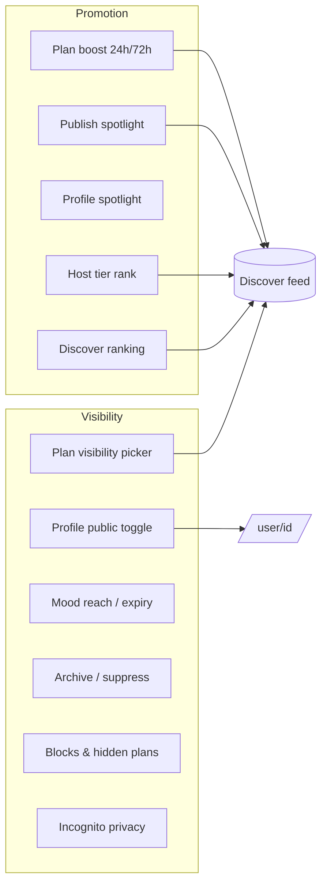
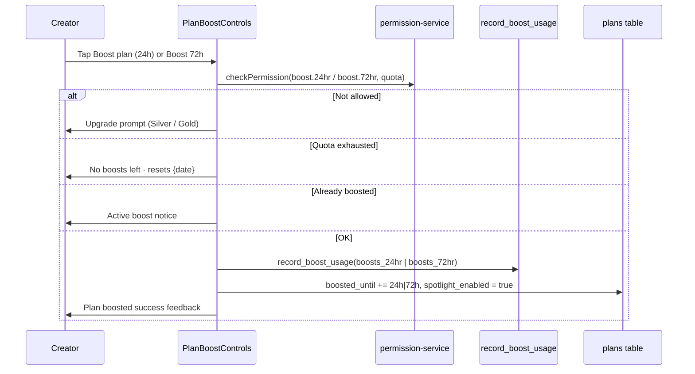
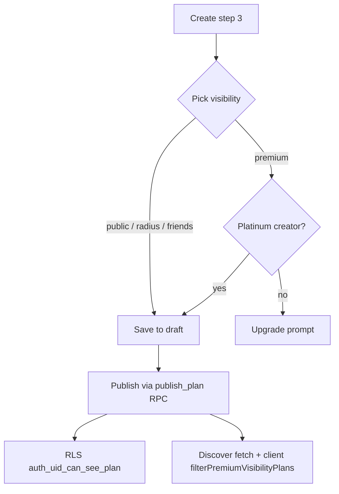
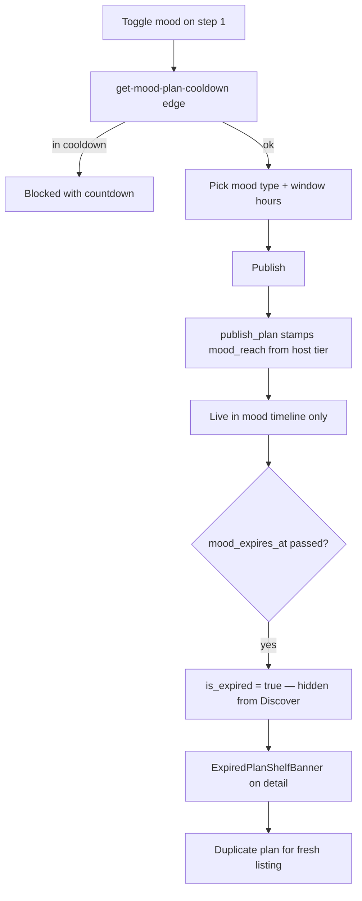
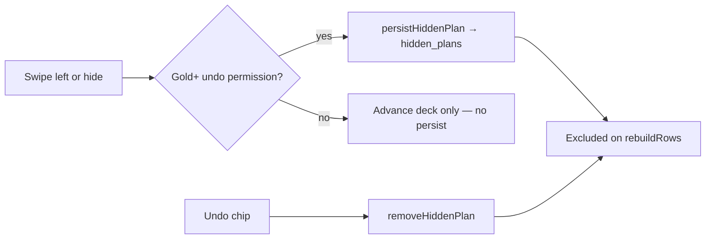
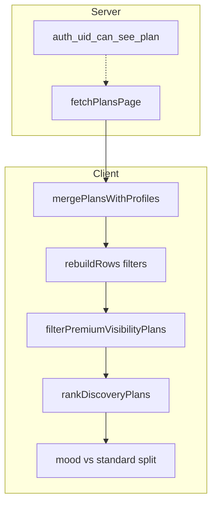
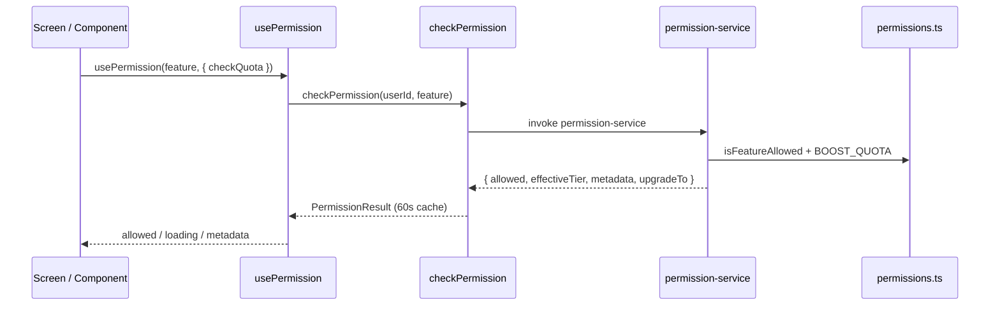

# LinkUp — Visibility & Promotion Userflow

This document is the **authoritative reference** for every user journey related to **who sees what** (visibility) and **how content is promoted or ranked** (promotion) in LinkUp — across Discover, plan creation, profile settings, subscription tiers, and backend enforcement.

**Related docs**

| Doc | Scope |
|-----|--------|
| [DISCOVERY-BROWSING-USERFLOW.md](./DISCOVERY-BROWSING-USERFLOW.md) | Discover tab UX, swipe/list, filters, travel mode, mood timeline |
| [PLAN-TYPES-USERFLOW.md](./PLAN-TYPES-USERFLOW.md) | Meet types, mood overlay, publish lifecycle |
| [LINKUP-USERFLOW.md](./LINKUP-USERFLOW.md) | End-to-end app journeys |
| [LINKUP-USER-GUIDE.md](./LINKUP-USER-GUIDE.md) | User-facing product guide |

**Tip:** Mermaid diagrams paste into [Mermaid Live Editor](https://mermaid.live).

---

## How to read this document

| If you need… | Go to… |
|--------------|--------|
| What “visibility” vs “promotion” mean here | **§1 Concepts** |
| Subscription tiers, quotas, permission keys | **§2 Permissions & quotas** |
| Plan boosts (24h / 72h) after publish | **§3 Plan boost** |
| Spotlight at publish time | **§4 Publish spotlight** |
| Profile spotlight (24h) | **§5 Profile spotlight** |
| How Discover orders plans | **§6 Discover ranking** |
| Who can see a plan (visibility picker) | **§7 Plan visibility** |
| Profile public / private toggle | **§8 Profile visibility** |
| Mood plan reach, expiry, shelf, extend | **§9 Mood plan visibility** |
| Archive, suppress, admin hide | **§10 Plan shelf & suppression** |
| What viewers see / hide in Discover | **§11 Discover filtering & hiding** |
| Travel mode & location | **§12 Travel & radius** |
| Presence & activity visibility | **§13 Presence visibility** |
| Platinum incognito & profile-view privacy | **§14 Platinum privacy** |
| Creator “who’s interested” surfaces | **§15 Host interest visibility** |
| Verification gates | **§16 Verification & visibility** |
| Block list feed exclusion | **§17 Blocks** |
| End-to-end data pipeline | **§18 Data pipeline** |
| Backend tables & RPCs | **§19 Backend reference** |
| Screen & file inventory | **§20 Screen inventory** |
| Gaps & unwired permissions | **§21 Known gaps** |
| Web parity | **§22 Web parity** |

---

## Table of contents

1. **§1** — Concepts  
2. **§2** — Permissions & quotas  
3. **§3** — Plan boost (24h / 72h)  
4. **§4** — Publish spotlight boost  
5. **§5** — Profile spotlight  
6. **§6** — Discover ranking & featured signals  
7. **§7** — Plan visibility at creation  
8. **§8** — Profile visibility (`is_profile_public`)  
9. **§9** — Mood plan visibility lifecycle  
10. **§10** — Plan shelf, archive & suppression  
11. **§11** — Discover filtering & pass/hide  
12. **§12** — Travel mode & discovery radius  
13. **§13** — Presence & activity visibility  
14. **§14** — Platinum privacy (incognito)  
15. **§15** — Host interest / engagement visibility  
16. **§16** — Verification gates  
17. **§17** — Block list  
18. **§18** — Complete data pipeline  
19. **§19** — Backend tables & RPCs  
20. **§20** — Screen inventory & code map  
21. **§21** — Known gaps & unwired permissions  
22. **§22** — Web parity notes  

---

## §1 Concepts

### §1.1 Visibility

**Visibility** answers: *who can see this content?*

| Surface | Control | Effect |
|---------|---------|--------|
| **Plan** | `plans.visibility` (`public`, `radius`, `friends`, `premium`) | RLS + Discover query inclusion |
| **Profile** | `profiles.is_profile_public` | Public profile page + `profile_views` logging |
| **Mood reach** | `plans.mood_reach` (stamped at publish from host tier) | Geographic reach for mood timeline |
| **Shelf states** | `archived_at`, `is_suppressed`, `is_expired` | Removes plan from public Discover |
| **Blocks** | `user_blocks` | Hides blocked creators’ plans from your feed |
| **Hidden plans** | `hidden_plans` (Gold+) | Your personal pass list |
| **Platinum privacy** | `incognito_browse_enabled`, `profile_view_privacy_enabled` | Skips engagement/view logging |
| **Presence** | `preferences.visibility` | Online / last-seen shown to others |

### §1.2 Promotion

**Promotion** answers: *how is this content elevated or prioritized?*

| Mechanism | Field / signal | Effect |
|-----------|----------------|--------|
| **Plan boost (24h / 72h)** | `plans.boosted_until`, `spotlight_enabled` | Higher sort position; boost badge on cards |
| **Publish spotlight** | `boosted_until` at publish (4h or 6h mood) | Initial featured window without quota (see §4) |
| **Profile spotlight** | `profiles.spotlight_until` | 24h profile promotion (stored; see §5 gap) |
| **Host tier rank** | `plans.host_tier_rank` | Server + client sort by subscription tier |
| **Mood timeline** | `is_mood_plan`, `mood_expires_at` | Mood rows surface in dedicated carousel (not swipe deck) |



---

## §2 Permissions & quotas

**Source of truth:** `supabase/functions/_shared/permissions.ts`  
**Client gate:** `hooks/usePermission.ts` → `lib/subscription/checkPermission.ts` → edge function `permission-service`  
**Quota consumption:** RPC `record_boost_usage(p_kind)` on table `boost_quota`

### §2.1 Tier permission matrix (visibility & promotion)

| Permission key | Minimum tier | User-facing feature |
|----------------|--------------|---------------------|
| `discover.standard_filters` | FREE | Distance, layout, mood vibe, host presence |
| `discover.advanced_filters` | SILVER | Price band, verified hosts only |
| `discover.wider_radius` | SILVER | **Permission only — no UI wired** |
| `plans.bookmark` | SILVER | Save plans |
| `boost.24hr` | SILVER | 24h plan boost + publish spotlight toggle |
| `spotlight.profile` | SILVER | Profile spotlight (web); mobile uses `boost.24hr` for publish |
| `plan.extended_window` | SILVER | **Permission only — no UI wired** |
| `mood_plan.extend` | GOLD | Extend mood plan (+24h) |
| `discover.travel_mode` | GOLD | Browse another city |
| `discover.undo_swipe` | GOLD | Undo pass / persist hidden plans |
| `plans.see_all_likes` | GOLD | Full interest list on plan detail |
| `boost.72hr` | GOLD | 72h plan boost |
| `privacy.plan_creation` | PLATINUM | `premium` plan visibility option |
| `privacy.incognito_browse` | PLATINUM | Incognito Discover browsing |
| `privacy.profile_view` | PLATINUM | Hide profile view notifications |
| `privacy.masked_activity` | PLATINUM | **Permission only — no UI wired** |
| `boost.unlimited` | PLATINUM | Unlimited boosts (quota RPC no-ops) |
| `spotlight.unlimited` | PLATINUM | Unlimited spotlights |

### §2.2 Monthly boost & spotlight quotas

From `BOOST_QUOTA` in `permissions.ts`:

| Tier | 24h boosts / month | 72h boosts / month | Spotlights / month |
|------|-------------------|-------------------|-------------------|
| FREE | 0 | 0 | 0 |
| SILVER | 4 | 0 | 3 |
| GOLD | 8 | 1 | 10 |
| PLATINUM | ∞ (`-1`) | ∞ (`-1`) | ∞ (`-1`) |

Quota resets on the **1st of each calendar month** (UTC). Labels use `getMonthResetLabel()` in `lib/subscription/boostQuota.ts`.

### §2.3 Mood plan rules by tier

From `MOOD_PLAN_RULES`:

| Tier | Max listing hours | Cooldown between mood posts | Reach stamp | Can extend |
|------|------------------|------------------------------|-------------|------------|
| FREE | 24 | 14 days | `city` | No |
| SILVER | 36 | 5 days | `city_adjacent` | No |
| GOLD | 48 | 3 days | `city_widest` | Yes (1×) |
| PLATINUM | 48 | 0 days | `all_cities` | Yes (unlimited) |

Reach multipliers (client): `lib/plans/moodReachFilter.ts` — `city` 1×, `city_adjacent` 1.5×, `city_widest` 2.5×, `all_cities` = global.

---

## §3 Plan boost (24h / 72h)

Post-publish promotion that marks a plan **featured in Discover** until `boosted_until`.

### §3.1 Entry points

| Entry | Route / component | Who |
|-------|-------------------|-----|
| Plan detail boost grid | `app/plan/[id]/index.tsx` → `PlanBoostControls` | Plan creator |
| Active boost notice | Same component — tap when already boosted | Plan creator |

### §3.2 User flow



| Step | Action | Detail |
|------|--------|--------|
| 1 | Open own plan | `/plan/[id]` |
| 2 | View boost grid | Below `PlanInterestedStrip` — 2-column grid with Interest + Manage offers |
| 3 | Tap **Boost plan (24h)** | Requires `boost.24hr` or legacy `users.boost_credits` |
| 4 | Tap **Boost 72h** | Requires `boost.72hr` (Gold+) |
| 5 | Quota check | `checkPermission` with `checkQuota: true` |
| 6 | Activate | `lib/premium/boostPlan.ts` → `activatePlanBoost()` |
| 7 | Result | `boosted_until` set; card shows flash badge in Discover |

### §3.3 Button labels (linkup-web parity)

From `lib/subscription/boostQuota.ts`:

**24h (`boost24Label`):**
- Locked: `Boost plan`
- Default: `Boost plan (24h)`
- With quota: `Boost plan (24h) · N left`
- Exhausted: `No boosts left · resets {date}`

**72h (`boost72Label`):**
- Locked: `Boost 72h`
- Default: `Boost plan (72h)`
- With quota: `Boost 72h · N left`
- Exhausted: `No 72h boosts left · resets {date}`

### §3.4 Edge cases & limits

| Condition | Behaviour |
|-----------|-----------|
| Plan already boosted | Buttons disabled; active boost banner shown |
| Mood window closed (`moodClosed`) | Boost disabled |
| FREE tier | Locked buttons with tier badge → upgrade |
| Legacy boost credit | `users.boost_credits` can fund one 24h boost without tier quota |
| Platinum | `record_boost_usage` returns immediately (unlimited) |
| One boost at a time per plan | Re-boost blocked until `boosted_until` expires |

### §3.5 Key files

| File | Role |
|------|------|
| `components/plans/PlanBoostControls.tsx` | UI + gating |
| `lib/premium/boostPlan.ts` | `activatePlanBoost`, legacy credits |
| `lib/subscription/boostQuota.ts` | Label helpers |
| `lib/plans/planBoost.ts` | `isPlanBoostActive()` |
| `components/plans/PlanBoostActiveModal.tsx` | Optional active-boost modal |

---

## §4 Publish spotlight boost

Initial promotion applied **at plan publish** (create wizard step 3).

### §4.1 Entry points

| Entry | File |
|-------|------|
| Create plan step 3 | `app/plan/create/details.tsx` — toggle **Spotlight this plan** |

### §4.2 Tier gate

- Mobile: `boost.24hr` (SILVER+) via `usePermission('boost.24hr')`
- FREE users see premium tease → `/subscription`

### §4.3 Duration rules

Computed in `details.tsx` at publish:

| Condition | `boosted_until` duration |
|-----------|-------------------------|
| Mood plan + subscriber | **6 hours** (even if toggle off — mood gets spotlight when eligible) |
| Standard plan + toggle on | **4 hours** |
| Toggle off | `boosted_until = null` |

```typescript
// app/plan/create/details.tsx (simplified)
const boostHours =
  draft.isMoodPlan && canSpotlight ? 6
  : canSpotlight && draft.spotlightBoost ? 4
  : 0;
```

### §4.4 User flow

1. Complete create wizard steps 1–2 (meet type, schedule, mood if applicable).
2. Step 3 → set title, location, **visibility**, optional spotlight toggle.
3. Tap **Publish** → `publish_plan` RPC with `spotlight_enabled`, `boosted_until`.
4. Plan appears in Discover with boost active until expiry.

### §4.5 Quota note

Publish spotlight sets `boosted_until` **without** calling `record_boost_usage`. This is a **free initial boost window** at publish for eligible subscribers — separate from monthly post-publish boost quota (§3).

### §4.6 Key files

| File | Role |
|------|------|
| `app/plan/create/details.tsx` | Toggle + duration logic |
| `supabase/migrations/20260515120000_publish_plan_rpc.sql` | Atomic publish |
| `supabase/migrations/20260610000002_plan_types_additions.sql` | `mood_reach`, `host_tier_rank` stamping |

---

## §5 Profile spotlight

24-hour promotion of the **user profile** (distinct from per-plan boost).

### §5.1 Entry points

| Entry | File |
|-------|------|
| Profile tab | `components/profile/ProfileSpotlightCard.tsx` on `app/(tabs)/profile.tsx` |

### §5.2 Tier & quota

| Permission | Tier | Quota field |
|------------|------|-------------|
| `spotlight.profile` | SILVER+ | `spotlights` via `record_boost_usage('spotlights')` |

Platinum skips quota RPC.

### §5.3 User flow

1. Open **Profile** tab.
2. See **Profile spotlight** card with monthly quota label.
3. Tap **Spotlight my profile** (or upgrade prompt if FREE).
4. Sets `profiles.spotlight_until` = now + 24h.
5. Card shows “Spotlight active until …”

### §5.4 Implementation gap

`profiles.spotlight_until` is **stored and displayed on Profile tab only**. As of this writing, **Discover feed ranking does not read `spotlight_until`** — profile spotlight does not reorder or badge plans in Discover. Treat as partial implementation until discover integration ships.

### §5.5 Key files

| File | Role |
|------|------|
| `components/profile/ProfileSpotlightCard.tsx` | UI + activation |
| `profiles.spotlight_until` column | `20260610000002_plan_types_additions.sql` |

---

## §6 Discover ranking & featured signals

How promoted and visible plans are **ordered** in the feed.

### §6.1 Server-side fetch order

`lib/plans/planFeedMerge.ts` → `fetchPlansPage()`:

```
ORDER BY host_tier_rank DESC, boosted_until DESC, created_at DESC
```

### §6.2 Client-side re-rank

`lib/plans/feedRanking.ts` → `rankDiscoveryPlans()`:

```
1. Mood plans first (soonest mood_expires_at)
2. Host tier rank (PLATINUM > GOLD > SILVER > FREE)
3. Active boost (boosted_until > now)
4. Distance from viewer (if coordinates known)
5. Recency (created_at)
```

### §6.3 UI “featured” signals

| Signal | Where shown |
|--------|-------------|
| Flash / boost badge | `DiscoverySwipeCard`, `PlanCard`, `BoostPill` |
| “Featured in Discover until …” | `PlanBoostControls` active banner |
| Host tier badge | Creator chip on cards |
| Mood urgency | `MoodPlanDiscoverPill`, mood timeline carousel |

### §6.4 Mood vs standard feed split

| Row type | Surfaces in |
|----------|-------------|
| `is_mood_plan = true` (live) | **Mood timeline carousel only** |
| Standard plans | Swipe deck + list view |

Mood rows are **excluded** from `standardDiscoverRows` in `app/(tabs)/index.tsx`.

### §6.5 Key files

| File | Role |
|------|------|
| `lib/plans/feedRanking.ts` | Client sort |
| `lib/plans/planFeedMerge.ts` | Server fetch + premium filter |
| `app/(tabs)/index.tsx` | Pipeline orchestration |
| `components/discovery/DiscoverySwipeCard.tsx` | Boost badge |

---

## §7 Plan visibility at creation

Controls **which viewers** can discover a plan.

### §7.1 Entry points

| Entry | File |
|-------|------|
| Create plan step 3 | `app/plan/create/details.tsx` → `VisibilityPickCard` |

### §7.2 Visibility options

| Value | Label | Who sees it in Discover | Tier gate |
|-------|-------|------------------------|-----------|
| `public` | Public | Everyone (standard discover query) | FREE |
| `radius` | Within radius | Everyone (included in query; distance filter separate) | FREE |
| `friends` | Friends only | Connected creators only (MVP) | FREE |
| `premium` | Gold & Platinum only | Viewers with `subscription_tier` GOLD or PLATINUM | **PLATINUM creator** (`privacy.plan_creation`) |

### §7.3 User flow



### §7.4 Enforcement layers

| Layer | Mechanism |
|-------|-----------|
| **RLS** | `auth_uid_can_see_plan(plan_id)` — premium requires viewer GOLD/PLATINUM |
| **Discover query** | `fetchPlansPage` — `public`/`radius` + own plans + `friends` via connections |
| **Client defence** | `filterPremiumVisibilityPlans()` strips `premium` rows for non-Gold viewers |
| **Friends MVP** | `lib/plans/discoverConnections.ts` — connections = agreed/active/completed plan partners |

### §7.5 Friends visibility detail

`fetchConnectedCreatorIds(viewerUserId)` returns creators the viewer has met through:
- Hosted plans with accepted offers (bidder = connection)
- Guest accepted offers on others’ plans (creator = connection)

**Not** a full social graph — label in UI notes “once friends ship, this tightens automatically.”

### §7.6 Key files

| File | Role |
|------|------|
| `components/plans/create/VisibilityPickCard.tsx` | Picker UI |
| `app/plan/create/details.tsx` | Options + Platinum gate |
| `lib/plans/discoverConnections.ts` | Friends connection set |
| `lib/plans/planFeedMerge.ts` | Query + premium filter |
| `supabase/migrations/20260610000002_plan_types_additions.sql` | `auth_uid_can_see_plan` premium branch |

---

## §8 Profile visibility (`is_profile_public`)

Controls whether your **profile page** is publicly viewable.

### §8.1 Entry points

| Entry | File |
|-------|------|
| Edit profile | `app/settings/edit-profile.tsx` — “Profile visible” switch |
| Onboarding | `app/onboarding/index.tsx` |
| Delete account flow | Sets `is_profile_public: false` |

### §8.2 User flow

1. Settings → **Edit profile** → toggle **Profile visible**.
2. Save via `lib/profile/saveEditProfile.ts`.
3. When `false`:
   - `/user/[id]` shows locked / private state for other users
   - `profile_views` insert skipped
4. **Does not hide creator’s plans from Discover** — only the profile surface.

### §8.3 Backend

- Column: `profiles.is_profile_public` (default `true`)
- RLS: others SELECT profile only if public, self, or admin

### §8.4 Key files

| File | Role |
|------|------|
| `app/settings/edit-profile.tsx` | Toggle |
| `app/user/[id].tsx` | Private profile UX |
| `lib/profile/saveEditProfile.ts` | Persist |

---

## §9 Mood plan visibility lifecycle

Short-lived plans with tier-gated **reach**, **cooldown**, **expiry**, and optional **extension**.

### §9.1 Entry points

| Entry | File |
|-------|------|
| Create step 1 | `MoodPlanFieldsSection` when meet type `supports_mood` |
| Discover mood timeline | `MoodTimelineCarousel` in `app/(tabs)/index.tsx` |
| Plan detail (creator) | Extend mood button, `ExpiredPlanShelfBanner` |
| Plan management | `app/settings/plan-management.tsx` — expired section, duplicate |

### §9.2 Activation flow



### §9.3 Geographic reach

Stamped at publish from creator tier (`mood_reach` column). Filtered client-side:

`lib/plans/moodReachFilter.ts` → `moodReachVisibleToViewer(plan, viewer, lat, lng, radiusKm)`

| Reach | Radius multiplier |
|-------|-------------------|
| `city` | 1× viewer `radius_km` |
| `city_adjacent` | 1.5× |
| `city_widest` | 2.5× |
| `all_cities` | No distance cap |

Creator always sees own mood plan regardless of reach.

### §9.4 Expiry & shelf

| State | Discover | Plan detail actions |
|-------|----------|---------------------|
| Live (`mood_expires_at > now`) | Mood timeline | Boost, negotiate, extend (Gold+) |
| Expired (`is_expired` or window closed) | Hidden | Shelf banner; boost/negotiate paused |
| Duplicated | New plan row | Fresh listing via `duplicate_plan_for_creator` RPC |

`ExpiredPlanShelfBanner` copy: *“editing, negotiation, escrow, and boosts are paused for this thread.”*

### §9.5 Extend mood (Gold+)

| Step | Detail |
|------|--------|
| Permission | `mood_plan.extend` (GOLD+) |
| Action | `extendMoodPlan` → edge `extend-mood-plan` |
| Effect | +24h to `mood_expires_at`, increments `extension_count` |
| Limits | GOLD: 1 extension; PLATINUM: unlimited |

### §9.6 Cooldown

Edge function `get-mood-plan-cooldown` enforces days-between-mood-posts per tier (§2.3).

### §9.7 Key files

| File | Role |
|------|------|
| `components/plans/create/MoodPlanFieldsSection.tsx` | Create UI |
| `lib/plans/moodPlanCooldown.ts` | Cooldown client |
| `lib/plans/moodReachFilter.ts` | Reach filter |
| `lib/plans/planExpiry.ts` | `isPlanMoodWindowClosed` |
| `lib/plans/moodPlanCooldown.ts` / `extendMoodPlan` | Extension |
| `components/plans/ExpiredPlanShelfBanner.tsx` | Shelf UX |
| `supabase/functions/extend-mood-plan/` | Extension edge |
| `supabase/migrations/20260516120000_plan_mood_expiry_lifecycle.sql` | Expiry sweep |

---

## §10 Plan shelf, archive & suppression

Removing plans from **public Discover** without deleting.

### §10.1 Entry points

| Actor | Entry | Action |
|-------|-------|--------|
| Creator | `app/settings/plan-management.tsx` | Archive / unarchive |
| Creator | Plan detail (expired mood) | Duplicate for re-list |
| Admin | `AdminPlansPanel` | Suppress (`is_suppressed`) |

### §10.2 Visibility effects

| Field / action | Discover feed | Who can still access |
|----------------|---------------|---------------------|
| `archived_at` set | Hidden | Creator in plan management |
| `is_suppressed` | Hidden | Creator + admin |
| `is_expired` (mood) | Hidden from others | Creator (shelf) + admin |
| Moderation flag | May set `is_suppressed` | Per moderation policy |

Discover query filters: `.eq('is_suppressed', false).is('archived_at', null)` plus mood/expiry OR clauses.

### §10.3 User flow (archive)

1. Settings → **Plan management**.
2. Select plan → **Archive**.
3. Confirm via `PlanShelfActionConfirmModal`.
4. `archived_at` timestamp set → plan drops from Discover.
5. **Unarchive** restores to active management sections.

### §10.4 Key files

| File | Role |
|------|------|
| `app/settings/plan-management.tsx` | Creator shelf hub |
| `components/plans/PlanShelfActionConfirmModal.tsx` | Confirm archive/delete |
| `components/admin/AdminPlansPanel.tsx` | Admin suppress |

---

## §11 Discover filtering & pass/hide

Controls **what the viewer sees** in their feed (inbound visibility).

### §11.1 Entry points

| Entry | File |
|-------|------|
| Discover header **Filter** | `components/plans/PlansFilterSheet.tsx` |
| Swipe left / list long-press | Pass / hide plan |
| Undo chip (header) | Gold+ undo last hide |

### §11.2 Filter controls & tiers

| Control | Permission | Storage |
|---------|------------|---------|
| Swipe vs list layout | FREE | Session / UI state |
| Max distance | FREE | `preferences.feed_filters.maxDistanceKm` |
| Mood vibe chips | FREE | Session filter |
| Host presence (online/offline) | FREE | `feed_filters.hostPresence` |
| Min / max price | SILVER (`discover.advanced_filters`) | `feed_filters` |
| Verified hosts only | SILVER | `feed_filters.verifiedHostsOnly` |
| Undo pass / persist hide | GOLD (`discover.undo_swipe`) | `hidden_plans` table |

### §11.3 Pass / hide flow



- Cap: **200** hidden plans per user (`lib/plans/hiddenPlans.ts`)
- Free tier: swipe left advances without DB persist

### §11.4 Verified hosts filter

When `verifiedHostsOnly` active, `rebuildRows` drops rows where `!creatorProfile.verified_badge`.

### §11.5 Key files

| File | Role |
|------|------|
| `components/plans/PlansFilterSheet.tsx` | Filter UI + gates |
| `lib/discovery/parseStoredFeedFilters.ts` | Load/save prefs |
| `lib/plans/hiddenPlans.ts` | Hidden plan persistence |
| `app/(tabs)/index.tsx` | `rebuildRows` filter application |

---

## §12 Travel mode & discovery radius

### §12.1 Discovery radius (`radius_km`)

| Entry | File |
|-------|------|
| Edit profile slider | `app/settings/edit-profile.tsx` (1–100 km, default 50) |
| Onboarding | Same field |

**Effects:**
- Default max distance in filter sheet
- Base for mood reach multipliers (§9.3)
- Distance sort in `rankDiscoveryPlans`

**Gap:** `discover.wider_radius` (SILVER+) has no UI beyond the profile slider.

### §12.2 Travel mode (Gold+)

| Entry | File |
|-------|------|
| Discover header location pill | → `/settings/travel` |
| Profile settings row | `app/settings/travel.tsx` |

**Permission:** `discover.travel_mode` (GOLD+)

**Storage:** `profiles.preferences.travel_mode = { label, latitude, longitude } | null`

**User flow:**
1. Gold+ opens travel screen.
2. Search city or tap preset (Lagos, Abuja, Port Harcourt).
3. Save → Discover uses travel pin for distance sort/filter.
4. Header shows `{city} · Travel`.
5. **Clear travel mode** restores home/GPS.

**Location resolution order:** travel pin → GPS → profile lat/lng (see `DISCOVERY-BROWSING-USERFLOW.md` §8).

### §12.3 Key files

| File | Role |
|------|------|
| `app/settings/travel.tsx` | Travel mode UI |
| `app/(tabs)/index.tsx` | `effectiveLat` / `effectiveLng` resolution |

---

## §13 Presence & activity visibility

How users control **online / last-seen** visibility to others.

### §13.1 Entry points

| Entry | File |
|-------|------|
| Profile → **Notifications & visibility** | `app/settings/notifications.tsx` |

### §13.2 Settings

| Toggle | Storage key | Discover impact |
|--------|-------------|-----------------|
| Show online status | `preferences.visibility.show_online_status` | Host presence filter + card dots |
| Show last seen | `preferences.visibility.show_last_seen` | Same |
| Read receipts | `preferences.visibility.read_receipts` | Chat only — SILVER+ (`messaging.read_receipts`) |
| Share typing indicator | `preferences.visibility.share_typing_indicator` | Chat only |

### §13.3 Fairness rule

`lib/presence/visibilityPrefs.ts`:

> If the viewer hides **both** online status and last seen, they **cannot see others’** presence in Discover host-presence filter.

Typing indicators require **both** users to allow sharing (`typingVisibleToViewer`).

### §13.4 Key files

| File | Role |
|------|------|
| `app/settings/notifications.tsx` | Toggles |
| `lib/presence/visibilityPrefs.ts` | Fairness helpers |
| `lib/presence/derivePresenceUi.ts` | Card / header presence UI |

---

## §14 Platinum privacy (incognito)

Platinum-only controls that reduce **your visibility in engagement logs**.

### §14.1 Entry points

| Entry | File |
|-------|------|
| Privacy & safety | `app/settings/privacy.tsx` |
| Discover header | **Incognito** chip when active |

### §14.2 Settings

| Toggle | Permission | Column | Effect |
|--------|------------|--------|--------|
| Incognito browsing | `privacy.incognito_browse` | `incognito_browse_enabled` | Skip `plan_engagements` view recording |
| Profile view privacy | `privacy.profile_view` | `profile_view_privacy_enabled` | Skip `profile_views` recording |

### §14.3 User flows

**Incognito browsing:**
1. Platinum → Privacy & safety → enable **Incognito browsing**.
2. Discover header shows Incognito chip.
3. `recordPlanView` skipped (`shouldSkipPlanViewRecording`).
4. Incognito user IDs filtered from host interest lists (`fetchIncognitoUserIds`).

**Profile view privacy:**
1. Enable toggle → others don’t see you viewed their profile.
2. `shouldSkipProfileViewRecording` on `/user/[id]`.

### §14.4 Key files

| File | Role |
|------|------|
| `app/settings/privacy.tsx` | Toggle UI |
| `lib/plans/incognitoEngagement.ts` | Skip logic + incognito ID fetch |
| `lib/plans/planEngagement.ts` | `recordPlanView` respects incognito |
| `app/plan/[id]/interest.tsx` | Filters incognito from interest list |

---

## §15 Host interest / engagement visibility

What **creators** can see about who engaged with their plan.

### §15.1 Entry points

| Entry | Route | Tier |
|-------|-------|------|
| Plan detail strip | `PlanInterestedStrip` | Preview avatars (all creators) |
| Interest button | `/plan/[id]/interest` | **GOLD+** (`plans.see_all_likes`) |
| Interest grid button | Plan detail creator grid | Same gate |

### §15.2 Data source

Table `plan_engagements`:
- `kind: 'view'` — plan detail opens
- `kind: 'save'` — bookmarked plans

Incognito viewers excluded from interest surfaces.

### §15.3 User flow

1. Guest browses plan → view recorded (unless incognito).
2. Creator opens plan detail → sees avatar strip of recent engagers.
3. Gold+ taps **Interest** → full list at `/plan/[id]/interest`.
4. FREE/Silver sees locked Interest button → `/subscription`.

### §15.4 Key files

| File | Role |
|------|------|
| `components/plans/PlanInterestedStrip.tsx` | Avatar preview |
| `app/plan/[id]/interest.tsx` | Full list |
| `lib/plans/planEngagement.ts` | Record view/save |

---

## §16 Verification gates

Verification affects **who can publish and offer** — not default Discover browsing visibility.

### §16.1 Gated actions

| Action | Gate | Entry |
|--------|------|-------|
| Create plan (FAB) | `requiresVerificationGate` | Discover FAB → `VerificationHardGateModal` |
| Make offer | Same | Plan detail offer CTA |
| Send media in chat | Verification required | Chat composer |
| Verified hosts **filter** | `verified_badge` on creator | Filter sheet (Silver+) — filter only |

### §16.2 Discover browse

Unverified users **can browse** Discover. `PlansKycBanner` upsells verification without blocking the feed.

### §16.3 Key files

| File | Role |
|------|------|
| `lib/verification/access.ts` | Gate logic |
| `components/kyc/VerificationHardGateModal.tsx` | Block modal |
| `components/plans/PlansKycBanner.tsx` | Discover upsell banner |

---

## §17 Block list

### §17.1 Entry points

| Entry | File |
|-------|------|
| Privacy & safety | `app/settings/privacy.tsx` — blocked accounts list |
| Public profile | `/user/[id]` — block action |

### §17.2 Effect on visibility

- `user_blocks` loaded on Discover mount.
- `rebuildRows` excludes plans where `creator_id` is in blocked set.
- Blocked users cannot appear in your plans feed.

---

## §18 Complete data pipeline

End-to-end flow from database to rendered Discover rows:

```
fetchPlansPage()
  │  RLS + query filters:
  │    status IN (negotiating, active)
  │    is_suppressed = false, archived_at IS NULL
  │    mood expiry OR (own plan)
  │    is_expired = false OR own plan
  │    visibility: public | radius | own | friends(connected)
  │  ORDER BY host_tier_rank, boosted_until, created_at
  ▼
mergePlansWithProfiles()
  ▼
rebuildRows()  [app/(tabs)/index.tsx]
  │  Filter: mood closed, suppressed, archived, hidden, blocked
  │  Filter: mood reach (tier-stamped geographic)
  │  Filter: client feed_filters (price, distance, verified hosts)
  ▼
filterPremiumVisibilityPlans(viewerTier)
  ▼
rankDiscoveryPlans(lat, lng)
  │  mood first → tier → boost → distance → recency
  ▼
split:
  moodTimelineRows  (is_mood_plan, live)
  standardDiscoverRows  (non-mood → swipe deck / list)
  ▼
presence filter (host online/offline)
mood vibe filter (timeline)
search filter (list mode)
```



---

## §19 Backend tables & RPCs

### §19.1 Core tables

| Table | Visibility / promotion columns |
|-------|-------------------------------|
| `plans` | `visibility`, `boosted_until`, `spotlight_enabled`, `host_tier_rank`, `mood_reach`, `mood_expires_at`, `is_mood_plan`, `is_expired`, `archived_at`, `is_suppressed` |
| `profiles` | `radius_km`, `is_profile_public`, `spotlight_until`, `incognito_browse_enabled`, `profile_view_privacy_enabled`, `preferences` (travel, feed_filters, visibility) |
| `boost_quota` | `boosts_24hr_used`, `boosts_72hr_used`, `spotlights_used` per `month_year` |
| `hidden_plans` | Per-user pass list (cap 200) |
| `plan_engagements` | `view` / `save` for interest surfaces |
| `profile_views` | Profile view log (privacy-gated) |
| `user_blocks` | Blocker → blocked feed exclusion |

### §19.2 Key RPCs & edge functions

| RPC / function | Role |
|----------------|------|
| `publish_plan(payload)` | Atomic publish; stamps `mood_reach`, `host_tier_rank` |
| `record_boost_usage(p_kind)` | Increment monthly quota (`boosts_24hr`, `boosts_72hr`, `spotlights`) |
| `auth_uid_can_see_plan(plan_id)` | RLS visibility including premium tier |
| `duplicate_plan_for_creator` | Re-list expired mood plan |
| `sweep_expired_mood_plans` | Cron expiry sweep |
| `get-mood-plan-cooldown` | Mood activation cooldown |
| `extend-mood-plan` | Mood window extension (+24h) |
| `permission-service` | Tier + quota permission checks |

---

## §20 Screen inventory & code map

### §20.1 Promotion surfaces

| Screen | Route | Promotion features |
|--------|-------|-------------------|
| Discover | `/(tabs)/index` | Ranking, boost badges, mood timeline |
| Create plan details | `/plan/create/details` | Publish spotlight, visibility picker |
| Plan detail | `/plan/[id]` | Boost 24h/72h grid, extend mood |
| Profile tab | `/(tabs)/profile` | Profile spotlight card |
| Subscription | `/subscription` | Upgrade prompts |

### §20.2 Visibility settings surfaces

| Screen | Route | Visibility features |
|--------|-------|---------------------|
| Edit profile | `/settings/edit-profile` | `radius_km`, `is_profile_public` |
| Travel mode | `/settings/travel` | Travel pin (Gold+) |
| Notifications & visibility | `/settings/notifications` | Online, last seen, read receipts |
| Privacy & safety | `/settings/privacy` | Blocks, incognito, profile-view privacy |
| Plan management | `/settings/plan-management` | Archive shelf, duplicate expired |

### §20.3 Core libraries

| Library path | Responsibility |
|--------------|----------------|
| `lib/premium/boostPlan.ts` | Plan boost activation |
| `lib/subscription/boostQuota.ts` | Boost label copy |
| `lib/subscription/checkPermission.ts` | Permission client |
| `lib/plans/feedRanking.ts` | Discover sort |
| `lib/plans/planFeedMerge.ts` | Fetch + merge + premium filter |
| `lib/plans/moodReachFilter.ts` | Mood geographic reach |
| `lib/plans/incognitoEngagement.ts` | Platinum privacy skips |
| `lib/plans/hiddenPlans.ts` | Pass/hide persistence |
| `lib/plans/discoverConnections.ts` | Friends visibility connections |
| `lib/plans/planEngagement.ts` | View/save recording |
| `lib/presence/visibilityPrefs.ts` | Presence fairness |
| `supabase/functions/_shared/permissions.ts` | Tier matrices |

---

## §21 Known gaps & unwired permissions

| Item | Status | Notes |
|------|--------|-------|
| `profiles.spotlight_until` | **Partial** | Stored + Profile UI; **not used in Discover ranking** |
| `discover.wider_radius` | **Unwired** | Permission exists; no UI beyond profile `radius_km` slider |
| `plan.extended_window` | **Unwired** | Permission exists; no feature surface |
| `privacy.masked_activity` | **Unwired** | Permission exists; no toggle |
| `friends` visibility | **MVP** | Uses plan-connection graph, not full friends system |
| Publish spotlight quota | **By design?** | Does not call `record_boost_usage` — free window at publish |
| Web profile spotlight | **Missing** | No `ProfileSpotlightCard` equivalent in linkup-web |

---

## §22 Web parity notes

| Feature | Mobile (Expo) | Web (linkup-web) |
|---------|---------------|------------------|
| Plan boost 24h / 72h | ✅ `PlanBoostControls` | ✅ |
| Publish spotlight | ✅ (`boost.24hr`) | ✅ (`spotlight.profile`) |
| Profile spotlight card | ✅ | ❌ Missing |
| Travel mode | ✅ | ✅ `TravelModeScreen` |
| Platinum privacy | ✅ | ✅ `PrivacyScreen` |
| Discover ranking | ✅ `feedRanking.ts` | ✅ |
| Premium plan visibility | ✅ | ✅ `premiumVisibilityFilter.ts` |
| Hidden plans (Gold+) | ✅ | ✅ |
| Incognito engagement | ✅ | ✅ |
| Mood timeline / reach | ✅ | ✅ |
| `discover.wider_radius` | ❌ | ❌ |
| `privacy.masked_activity` | ❌ | ❌ |

---

## Appendix A — Permission check flow



---

## Appendix B — Boost vs spotlight comparison

| Aspect | Plan boost (§3) | Publish spotlight (§4) | Profile spotlight (§5) |
|--------|-----------------|------------------------|------------------------|
| Target | Single plan | Single plan at publish | User profile |
| Duration | 24h or 72h | 4h (6h mood) | 24h |
| Quota consumed | Yes (`record_boost_usage`) | No | Yes (`spotlights`) |
| Min tier | SILVER (24h), GOLD (72h) | SILVER | SILVER |
| Discover effect | `boosted_until` ranking + badge | Same fields at publish | **None today** |
| Entry | Plan detail | Create step 3 | Profile tab |

---

*Last updated: 2026-06-11 — generated from codebase review of LinkUp mobile app and linkup-web sibling.*
